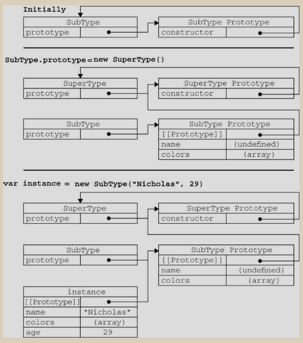

### __The inheritation implements of javascript__
#### 1. _class-inheritation_  
>类式继承 - 子类的原型对象  
>类式继承的缺点：  
>子类的原型是父类的实例对象，因为父类的所有属性都是引用类型，所以如果父类的属性在一个某一个子类中被更改的话，其它子类所继承的这个父类也会受影响，所有继承父类的子类的属性都会改变。  
>继承是通过实例化父类再赋值给子类的原型，所以创建子类对象的时候无法传参到父类构造函数，导致父类构造函数不能被初始化，只能在子类的构造函数中初始化子类的相关属性。  
#### 2._prototype-inheritation_  
>原型式继承 - 洁净的继承者  
>其实是对类式继承的一个封装，类式继承的缺点同样存在为寄生组合式继承做铺垫。  

#### 3._constructor-inheritation_  
>构造函数继承 - 创建即继承  
>在子类的构造函数中执行父类函数, 利用call/apply改变了函数的执行上下文，不涉及原型，没有子类共享属性的问题，各个子类的属性都是单独的，不能共享，这样违背了代码复用的原则，增加了程序额外的运行开销。  
#### 4._combination-inheritation_  
>组合式继承 - 将优点为我所用  
>组合式继承结合了构造函数继承和类式继承的优点,并且子类的更改不会影响到父类，子类通过指定原型是父类的实例对象，实现对父类原型链的共享，同时子类的构造函数同样会复制父类的构造函数在自己的上下文里执行，所以可以传入参数初始化父类属性。在子类构造里通过this['attr']也可以派生子类的新添属性而不会覆盖父类属性。组合式继承是目前比较好的方法，只是父类的构造函数会在子类里面执行两次。  
#### 5._parasitic-inheritation_  
>寄生式继承 - 基于原型式继承  
>对原型式继承进行了二次封装，并在第二次封装的过程中对继承的对象进行了二次拓展，这样新创建的对象不仅有父类中的属性和方法而且还添加了新的属性和方法。  
#### 6._parasiticCombination-inheritation_  
>寄生组合式继承 - 终极继承方法  
>所谓寄生组合式继承， 即通过借用构造函数来继承属性， 通过原型链的混成形式来继承方法。
结合了寄生式继承和构造函数继承，同时改善了 组合式继承的 父类构造函数执行两遍的缺点，是最佳的解决方案。  
#### 7._multi-inheritation_
>多继承 - 属性复制  
