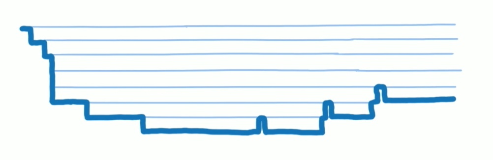
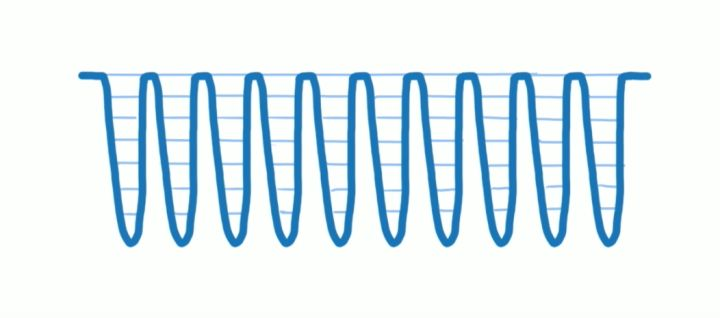
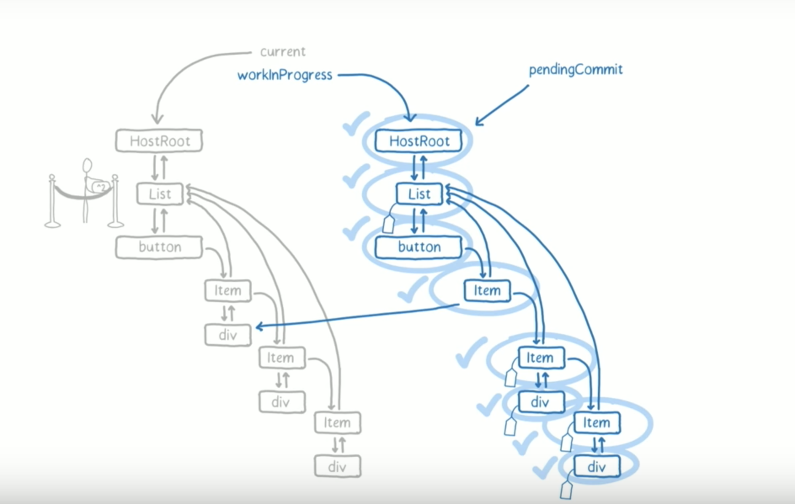

### 面试阶段分析
----------

1. 一面主要是针对基础知识，面试官会根据你的简历对各个知识点进行考察，需要有扎实的基础，提升对基础知识的熟悉度。
2. 二面面试官会考察你知识掌握的深入程度，会根据你的个人项目，深挖其中的技术点。比如如果项目中用了React的话可能问你React diff算法、React性能优化等等，所以需要对个人项目所涉及到的技术点有深入研究和理解。
3. 三面四面也会根据你的项目对你提问，需要熟知自己项目的闪光点以及一些尚待优化之处。除此之外面试官可能会出一些实际生产环境下的场景题，考察你的思维逻辑、技术积累和应变能力。

### 个人介绍
----------

#### 重点

1. 我最突出的技能是什么  
Js的多维运用
2. 我在哪方面的知识掌握是最全面的  
Js的多维运用
3. 我性格上最大的优势是什么  
对技术的热情和对问题孜孜不倦的深挖实践
4. 我最擅长的事情是什么  
擅长从工作中分析总结，制定对某类问题的解决方法，编写效率工具
5. 我有哪些成就和贡献  
...

#### 描述在上一家公司的工作经历
在前一个公司，我们使用React/Mobx/Node.js/Electron等技术，我主要负责一个存储集群产品的前端开发迭代、中间层维护和通用打包脚本编写这些。也曾担任过一个SMB客户端产品主要开发工作，负责项目搭建、架构优化以及多文件分片上传模块编写。

#### 范例
面试官，你好，我叫xx，毕业于xx大学xx专业，三年工作经验。在前一个公司主要负责一个存储集群产品的前端开发、中间层维护和通用打包脚本编写这些，也担任过一个SMB客户端产品主要开发工作，负责项目搭建、架构优化以及多文件分片上传模块编写。  
自己比较擅长从日常工作中分析总结，制定对某类问题的解决方法，编写效率工具。  
在技术方面比较熟悉React/Node开发，对前端客户端技术Electron也有涉猎，平时会更新技术博客和Github。


### 要点：HTML/CSS
----------

#### BFC，块级格式化上下文。
```sh
1) BFC 就是块级格式上下文，是页面盒模型布局中的一种 CSS 渲染模式，
相当于一个独立的容器，里面的元素和外部的元素相互不影响。创建 BFC 的方式有：
  html 根元素
　float 浮动
  overflow 不为 visiable
  position值不为static，relative
  display 为Table布局、Flex布局、inline-block、Grid布局

2) BFC 主要的作用是：
  清除浮动（不会和浮动元素重叠）
  防止同一 BFC 容器中的相邻元素间的外边距重叠问题
  多列布局

3) BFC 表现
  内部的Box会在垂直方向上一个接一个放置
  Box垂直方向的距离由margin决定，属于同一个BFC的两个相邻Box的margin会发生重叠
  每个元素的 margin box 的左边，与包含块 border box 的左边相接触
  BFC的区域不会与float box重叠
  BFC是页面上的一个隔离的独立容器，容器里面的子元素不会影响到外面的元素
  计算BFC的高度时，浮动元素也会参与计算

```
#### 两列布局实现。
```sh
1) 使用float浮动元素同时设置元素宽度为100/列数 %
2) 使用inline-block实现方式同1
2) 使用css属性column-count实现
```
#### 1px问题。
```sh
1) 涉及到css像素比 device pixel/css pixel = devicePixelRatio(DPR)
2) 解决方法一
  伪元素设置height模拟边框：
  .setBorderAll{
     position: relative;
       &:after{
           content:" ";
           position:absolute;
           top: 0;
           left: 0;
           width: 200%;
           height: 200%;
           transform: scale(0.5);
           transform-origin: left top;
           box-sizing: border-box;
           border: 1px solid #E5E5E5;
           border-radius: 4px;
      }
    }
  }
3) 解决方法二
  设置盒子阴影：
  box-shadow: 0  -1px 1px -1px #e5e5e5,   //上边线
            1px  0  1px -1px #e5e5e5,   //右边线
            0  1px  1px -1px #e5e5e5,   //下边线
            -1px 0  1px -1px #e5e5e5;   //左边线
```
#### 浮动解决的方案。
```sh
1) 清除浮动的属性
  浮动元素尾部那个不跟随浮动的元素设置clear:both
2) 撑起浮动容器元素的方法一
  在浮动元素的最后插入一个声明了clear:both的块级元素
3) 撑起浮动容器元素的方法二
  在浮动容器元素后使用伪元素
  .container:after {
    content: '.';
    height: 0;
    display: block;
    clear: both;
  }
4) 撑起浮动容器元素的方法三
  利用BFC特性，设置浮动元素的overflow不为visible
```

#### 位图和矢量图的区别。
```sh
1) 位图也叫像素图，每个点可以用二进制描述颜色和亮度信息，色彩表现丰富，占用空间大，缩放失真
2) 矢量图使用计算机指令绘制而成，由点线面构成，色彩不丰富，占用空间小，缩放不失真
```

### 要点：Javascript
----------

#### js类型的判断
```js
/*
基础类型：string/boolean/number/null/undefined/symbol
引用类型：function/object(date|regexp|obj)/array
*/
function getTypeOf(data) {
  if (data !== data) return 'nan';
  switch(Object.prototype.toString.call(data)) {
    case '[object Null]':
      return 'null';
    case '[object Array]':
      return 'array';
    case '[object Object]':
      return 'object';
    case '[object RegExp]':
      return 'regexp';
    case '[object Date]':
      return 'date';
    default:
      return (typeof data);
  }
}
```
#### 实现Call和Apply
```js
Function.prototype.myCall = function(context) {
  var args, result, symbol;

  context = Object(context) || window;
  args = Array.prototype.slice.call(arguments, 1);
  symbol = Symbol('myCall');
  context[symbol] = this;
  // 如果不使用扩展运算符的话可以将args[i]转换成逗号分隔的字符串
  // 然后通过eval('context.fn('+ argstr +')')获取结果
  result = context[symbol](...args);
  delete context[symbol];

  return result;
};

Function.prototype.myApply = function(context, args) {
  var result, symbol;

  args = args || [];
  context = Object(context) || window;
  if (!(args instanceof Array)) throw new Error('The args of apply must be an array.');

  symbol = Symbol('myApply');
  context[symbol] = this;
  result = context[symbol](...args);
  delete context[symbol];

  return result;
};

```
#### 实现new操作
```sh
function New(func) {
  var empty = Object.create(null);
  var args = Array.prototype.slice.call(arguments, 1);
  func.apply(empty, args);
  empty.__proto__ = func.prototype;
  return empty;
}
```
#### Js实现继承
```sh
function Inherit (parent, child) {
  function Empty() {};
  Empty.prototype = parent.prototype;
  var empty = new Empty();
  empty.constructor = child;
  child.prototype = empty;
}

function Parent(parent) {
  this.p_attr = parent;
}

Parent.prototype.p_print = function() {
  console.log(this.p_attr);
}

function Child(attr) {
  Parent.call(this, 'parent');
  this.c_attr = attr;
  this.print = function() {
    console.log(this.c_attr);
  }
}

Inherit(Parent, Child);

var child = new Child('child');

child.print();
child.p_print();
```
#### 深拷贝和浅拷贝
```js

/* 深拷贝 */
function deepClone(data) {

  const map = new WeakMap();
  
  const isObjType = (obj, type) => {
    if (typeof obj !== 'object') return false;
    return Object.prototype.toString.call(obj) === `[object ${type}]`;
  };

  const _clone = (target) => {
    if (target === null) return null;
    if (target !== target) return NaN;
    if (typeof target !== 'object') return target;
    
    let base;

    // 对正则对象做特殊处理
    if (isObjType(target, 'RegExp')) return new RegExp(target.source, target.flags);
    // 对Date对象做特殊处理
    if (isObjType(target, 'Date')) return new Date(target.getTime());

    base = isObjType(target, 'Array') ? [] : {};

    // 处理循环引用
    if (map.get(target)) return map.get(target);
    map.set(target, base);
    
    for (let i in target) {
      if (Object.prototype.hasOwnProperty.call(target, i)) {
        base[i] = _clone(target[i]);
      }
    }
    
    return base;
  };

  return _clone(data);
};

/* 浅拷贝 */
function shallowClone(data) {
  let base;

  if (!data || !(typeof data === 'object')) {
    return data;
  } else {
    base = Object.prototype.toString.call(data) === '[object Array]' ? [] : {};
  }

  for (let attr in data) {
    if (Object.prototype.hasOwnProperty.call(data, attr)) {
      base[attr] = data[attr];
    }
  }

  return base;
}

```
#### ES6新增特性

1. Promise
2. let/const/块级作用域
3. Arrow Function、函数默认参数、数组、对象、函数返回值的解构
4. Map/WeakMap/Set/WeakSet
5. ES6 Class
6. 字符串方法扩展repeat/trim/includes/startsWith/endsWith/padStart/padEnd
7. 数组方法扩展find/findIndex/fill/includes
8. Array.from将类数组和实现了迭代器的对象转换成数组
9. Array.of将一个或多个值转换成数组

#### 移动端点击穿透问题
1. 问题来源  
移动浏览器提供一个特殊的功能：双击(double tap)放大，300ms的延迟就来自这里，用户碰触页面之后，需要等待一段时间来判断是不是双击动作，而不是立即响应单击（click），等待的这段时间大约是300ms。为了消除延迟，我们使用touch start / touch end 事件来模拟click事件，这便是造成点击穿透问题的原因，想象一个场景：mask蒙层有个绑定touch start事件的关闭按钮，点击之后蒙层消失，之后300ms后点击位置触发click事件，导致mask下面的元素被误触。
2. 问题解决  
1）界面统一使用touch事件替代click事件  
2）界面只click事件(会造成300ms延迟)  
3）mask隐藏后，给按钮下面元素添上`pointer-events: none`(会造成元素短时间无法响应)  
4）使用外部框架`fastclick`解决  
#### 图片懒加载具体实现方案和思路  
使用监听器IntersectionObserver来监听界面滚动，当被监听元素处于视口可见区域时，设置图片元素的src为真实的地址。如果不使用这个API的话需要手动监听页面滚动然后通过计算img元素的`offsetTop < document.documentElement.clientHeight + (document.documentElement.scrollTop || document.body.scrollTop)` 来判断元素进入视区实现，并注意配合防抖函数进行优化。
```js
(function lazyLoad(){
    const imageToLazy = document.querySelectorAll('img[data-src]');
    const loadImage = function (image) {
        image.setAttribute('src', image.getAttribute('data-src'));
        image.addEventListener('load', function() {
            image.removeAttribute("data-src");
        })
    }


    const intersectionObserver = new IntersectionObserver(function(items, observer) {
        items.forEach(function(item) {
            if(item.isIntersecting) {
                loadImage(item.target);
                observer.unobserve(item.target);
            }
        });
    });

    imageToLazy.forEach(function(image){
        intersectionObserver.observe(image);
    })
})()
```
#### 函数防抖和节流实现
```js
/* 去抖 */
function debounce(fn, time) {
  let timer;

  return function() {
    clearTimeout(timer);
    timer = setTimeout(() => {
      fn.apply(this, arguments);
    }, time);
  }
}

/* 节流 */
function throttle(fn, time) {
  let canRun = true;

  return function() {
    if (canRun) {
      canRun = false;
      setTimeout(() => {
        fn.apply(this, arguments);
        canRun = true;
      }, time)
    }
  }
}
```
#### Js/Node的事件循环(宏任务、微任务)

#### 页面加载会触发哪些事件。
1. document readystatechange事件  
readyState 属性描述了文档的加载状态，在整个加载过程中document.readyState会不断变化，每次变化都会触发readystatechange事件。事件使用`document.onreadystatechange`进行监听。  
readyState 有以下状态：  
  _1）loading - document仍在加载。_  
  _2）interactive - 文档结构已经完成加载，文档已被解析并且可以交互，但是诸如图像，样式表和脚本之类的外部资源仍在加载_  
  _3）complete - 文档和所有外部资源已完成加载。_  
2. document DOMContentLoaded事件  
  DOM树渲染完成时触发DOMContentLoaded事件，此时可能外部资源还在加载，事件同于jQuery中的ready事件和`readyState == 'interactive'`阶段。事件使用`document.addEventListener('DOMContentLoaded', function)`监听。
3. window load事件  
  所有的资源全部加载完成会触发window的load事件。事件使用`window.onload=function`进行监听。
```js
switch (document.readyState) {
  case "loading":
    // 表示文档还在加载中，即处于“正在加载”状态。
    break;
  case "interactive":
    // 文档已经结束了“正在加载”状态，DOM元素可以被访问
    break;
  case "complete":
    // 页面所有内容都已被完全加载.
    break;
}
/* 模拟 原生DOMContentLoaded 和 jquery ready 事件 */
document.onreadystatechange = function () {
  if (document.readyState === "interactive") {
    initApplication();
  }
}

/* 模拟 window.onload 事件 */
document.onreadystatechange = function () {
  if (document.readyState === "complete") {
    initApplication();
  }
}
```
#### document.ready和window.onload的区别。  
```sh
ready事件在DOM结构绘制完成之后就会执行，这样能确保就算有大量的媒体文件没加载出来，JS代码一样可以执行。
load事件必须等到网页中所有内容全部加载完毕之后才被执行，如果一个网页中有大量的图片的话，则就会出现这种情况：网页文档已经呈现出来，但由于网页数据还没有完全加载完毕，导致load事件不能够即时被触发。
```
#### 闭包Closure  
1）执行上下文  
函数每次执行，都会生成一个执行上下文内部对象(可理解为函数作用域)，这个上下文对象会保存函数中所有的变量值和该函数内部定义的函数的引用。函数每次执行时对应的执行上下文都是独一无二的，正常情况下函数执行完毕执行上下文就会被销毁。  
2）内部作用域的外部引用导致作用域内变量垃圾回收不执行  
当一个函数内部作用域(注意不是单纯的变量引用)被其外层作用域引用时，函数执行完之后，其执行上下文不会被销毁，我们还能沿着作用域链访问到某个被引用的内部变量。
```js
// 外层作用域
function counterCreator() {
  // 内层作用域1
  var index = 1;
  return function () {
    // 内层作用域2，引用作用域1的变量index
    return index ++;
  };
}

// 外层作用域通过作用域链保存了内层作用域1的变量引用
var counterA = counterCreator();
// index变量不会被垃圾回收
counterA();     // 1
counterA();     // 2

```
#### 函数式编程思想的体现

#### vue双向绑定实现原理

#### Vue2.0与Vue3.0双向绑定，proxy实现

#### React-Fiber原理

1. \> React架构  
  - 1）Virtual DOM 层，描述页面长什么样  
  - 2）Reconciler 层，负责调用组件生命周期方法，进行 Diff 运算-等  
  - 3）Renderer 层，根据不同的平台，渲染出相应的页面，如ReactDOM和ReactNative

2. \> React15遗留问题  

  - 1）浏览器中，由于JS运算、页面布局和页面绘制都是运行在主线程当中，三者不能同时进行。  
  - 2）React15使用JS的函数调用栈(Stack Reconciler)递归渲染界面，因此在处理DOM元素过多的复杂页面的频繁更新时，大量同步进行的任务(树diff和页面render)会导致界面更新阻塞、事件响应延迟、动画卡顿等，因此React团队在16版本重写了React Reconciler架构。

3. \> React16问题解决  

 - 1）`Fiber Reconciler`架构可以允许同步阻塞的任务拆分成多个小任务，每个任务占用一小段时间片，任务执行完成后判断有无空闲时间，有则继续执行下一个任务，否则将控制权交由浏览器以让浏览器去处理更高优先级的任务，等下次拿到时间片后，其它子任务继续执行。整个流程类似CPU调度逻辑，底层是使用了浏览器API`requestIdleCallback`。  
- 2）为了实现整个Diff和Render的流程可中断和恢复，单纯的VirtualDom Tree不再满足需求，React16引入了采用单链表结构的Fiber树，如下图所示。
- 3）FiberReconciler架构将更新流程划分成了两个阶段：1.diff(由多个diff任务组成，任务时间片消耗完后被可被中断，中断后由requestIdleCallback再次唤醒) => 2.commit(diff完毕后拿到fiber tree更新结果触发DOM渲染，不可被中断)。左边灰色部分的树即为一颗fiber树，右边的workInProgress为中间态，它是在diff过程中自顶向下构建的树形结构，可用于断点恢复，所有工作单元都更新完成之后，生成的workInProgress树会成为新的fiber tree。
- 4）fiber tree中每个节点即一个工作单元，跟之前的VirtualDom树类似，表示一个虚拟DOM节点。workInProgress tree的每个fiber node都保存着diff过程中产生的effect list，它用来存放diff结果，并且底层的树节点会依次向上层merge effect list，以收集所有diff结果。注意的是如果某些节点并未更新，workInProgress tree会直接复用原fiber tree的节点(链表操作)，而有数据更新的节点会被打上tag标签。
```js
<FiberNode> : {
    stateNode,    // 节点实例
    child,        // 子节点
    sibling,      // 兄弟节点
    return,       // 父节点
}
```  

#### React生命周期，React16.3版本后变化，为什么要这样做。（结合React Fiber)，有哪些不安全的生命周期

#### React虚拟dom以及diff算法

#### Babel源码

#### React SetState原理

#### 错误监控方法

#### 实现一个EventEmitter类，支持事件的on,off,emit,once,setMaxListeners。
```js
function EventEmitter() {
  this.maxListeners = 100;
  this.listeners = {};
  this.onceMap = {};
}

EventEmitter.prototype.setMaxListeners = function(num) {
  if (typeof num !== 'number' || !Number.isInteger(num) || num <= 0)
    throw new Error('setMaxListeners #### param num must be a positive integer!');
  this.maxListeners = num;
}

EventEmitter.prototype.on = function(type, func) {
  if (!type || !func instanceof Function) return;
  if (this.listeners[type]) {
    if (this.listeners[type].length > this.maxListeners) 
      return console.error('The max listeners limitation: ', this.maxListeners);
    this.listeners[type].push(func);
  } else {
    this.listeners[type] = [func];
  }
  this.onceMap[type] = false;
}

EventEmitter.prototype.once = function(type, func) {
  if (!type || !func instanceof Function) return;
  this.on(type, func);
  this.onceMap[type] = true;
}

EventEmitter.prototype.off = function(type, func) {
  if (!type || !func) return;
  if (this.listeners[type]) {
    this.listeners[type] =
      this.listeners[type].filter(function(fn) { return fn !== func; });
  }
}

EventEmitter.prototype.emit = function(type) {
  (this.listeners[type] || []).forEach(function(fn) {
    fn();
  });
  if (this.onceMap[type]) delete this.listeners[type];
  delete this.onceMap[type];
}
```

#### 如何自己实现一个单点登录系统

#### 手写diff

#### 手写Promise  
[链接-> 使用ES5实现ES6 Promise API](https://github.com/nojsja/promise-nojsja)

### 要点：Node.js
----------

#### node是IO密集型体现在哪里。
从node异步的角度来回答这个问题。
参考点这里➡️ https://www.jianshu.com/p/c28219029c65
0#### node事件循环。


### 要点：设计模式
----------

1. [策略模式](https://github.com/nojsja/javascript-learning/tree/master/design-patterns#1-the-strategy-pattern%E7%AD%96%E7%95%A5%E6%A8%A1%E5%BC%8F)

2. [观察者模式](https://github.com/nojsja/javascript-learning/tree/master/design-patterns#2-the-observer-pattern%E8%A7%82%E5%AF%9F%E8%80%85%E6%A8%A1%E5%BC%8F)

3. [享元模式](https://github.com/nojsja/javascript-learning/tree/master/design-patterns#3-the-flyweight-pattern%E4%BA%AB%E5%85%83%E6%A8%A1%E5%BC%8F)

4. [装饰者模式](https://github.com/nojsja/javascript-learning/tree/master/design-patterns#4-the-decorator-pattern%E8%A3%85%E9%A5%B0%E8%80%85%E6%A8%A1%E5%BC%8F)

5. [代理模式](https://github.com/nojsja/javascript-learning/tree/master/design-patterns#5-the-proxy-pattern%E4%BB%A3%E7%90%86%E6%A8%A1%E5%BC%8F)

6. [状态模式](https://github.com/nojsja/javascript-learning/tree/master/design-patterns#6-the-state-pattern%E7%8A%B6%E6%80%81%E6%A8%A1%E5%BC%8F)

7. [责任链模式](https://github.com/nojsja/javascript-learning/tree/master/design-patterns#7-the-responsibility-chain-pattern%E8%B4%A3%E4%BB%BB%E9%93%BE%E6%A8%A1%E5%BC%8F)

8. [模板方法模式](https://github.com/nojsja/javascript-learning/tree/master/design-patterns#7-the-responsibility-chain-pattern%E8%B4%A3%E4%BB%BB%E9%93%BE%E6%A8%A1%E5%BC%8F)

### 要点：前端工具
---------

#### 打包gulp.webpack,rollup一些区别

#### ts自己的看法，和应用

#### webpack loader和plugin区别

#### webpack中循环引用问题，a里面引用了b，b里面引用了a
#### webpack性能优化方面

### 要点：性能优化
--------

#### 性能优化的各方面

#### 弱网环境下页面首屏如何快速加载
方案：1.缓存的使用 2.SSR使用 3.骨架屏使用

### 要点：操作系统和网络
----------

#### 常见攻击，CSRF是什么，如何防范，token产生策略。

#### 跨域的基本概念和解决方法，在项目中的实际应用。

#### 强缓存和协商缓存，缓存的应用，如何用在页面性能优化上。

#### 爬虫方面问题，反爬如何实现，针对反爬的实现(IP代理等）。

#### 进程和线程区别。

#### cpu调度算法。

#### 2台计算机底层之间如何通信 socket IO通信实现。

#### cookie中常见的字段。

#### 同源策略。

#### http中一些常见的响应头和请求头，有什么应用。

#### 简单请求和非简单请求区别。

#### http2 http3优化点在哪 https建立连接过程

#### 计算机网络中，http地址，在7层协议中，如何一步步向下解析，从应用层到最底层的物理层，每一层处理的事情。

#### http2.0 http3.0分别改进了什么
#### 未来规划，如何学习前端的，自己感兴趣的前端方向是什么。
