## 前端重难点攻坚指南(updating)

### Contents
-----------

- [前端重难点攻坚指南(updating)](#%E5%89%8D%E7%AB%AF%E9%87%8D%E9%9A%BE%E7%82%B9%E6%94%BB%E5%9D%9A%E6%8C%87%E5%8D%97updating)
- [### Contents](#contents)
- [### I. 面试阶段分析](#i-%E9%9D%A2%E8%AF%95%E9%98%B6%E6%AE%B5%E5%88%86%E6%9E%90)
- [### II. 个人介绍](#ii-%E4%B8%AA%E4%BA%BA%E4%BB%8B%E7%BB%8D)
    - [➣ 重点](#%E2%9E%A3-%E9%87%8D%E7%82%B9)
    - [➣ 描述在上一家公司的工作经历](#%E2%9E%A3-%E6%8F%8F%E8%BF%B0%E5%9C%A8%E4%B8%8A%E4%B8%80%E5%AE%B6%E5%85%AC%E5%8F%B8%E7%9A%84%E5%B7%A5%E4%BD%9C%E7%BB%8F%E5%8E%86)
    - [➣ 范例](#%E2%9E%A3-%E8%8C%83%E4%BE%8B)
    - [➣ 项目经历介绍](#%E2%9E%A3-%E9%A1%B9%E7%9B%AE%E7%BB%8F%E5%8E%86%E4%BB%8B%E7%BB%8D)
- [### III. 要点：HTML/CSS](#iii-%E8%A6%81%E7%82%B9htmlcss)
    - [➣ position各个属性的作用](#%E2%9E%A3-position%E5%90%84%E4%B8%AA%E5%B1%9E%E6%80%A7%E7%9A%84%E4%BD%9C%E7%94%A8)
    - [➣ display各个属性作用](#%E2%9E%A3-display%E5%90%84%E4%B8%AA%E5%B1%9E%E6%80%A7%E4%BD%9C%E7%94%A8)
      - [1. 外部显示](#1-%E5%A4%96%E9%83%A8%E6%98%BE%E7%A4%BA)
      - [2. 内部显示](#2-%E5%86%85%E9%83%A8%E6%98%BE%E7%A4%BA)
      - [3. 内部表现](#3-%E5%86%85%E9%83%A8%E8%A1%A8%E7%8E%B0)
    - [➣ BFC及其应用](#%E2%9E%A3-bfc%E5%8F%8A%E5%85%B6%E5%BA%94%E7%94%A8)
    - [➣ 怎样实现一个不定宽高的div水平垂直居中](#%E2%9E%A3-%E6%80%8E%E6%A0%B7%E5%AE%9E%E7%8E%B0%E4%B8%80%E4%B8%AA%E4%B8%8D%E5%AE%9A%E5%AE%BD%E9%AB%98%E7%9A%84div%E6%B0%B4%E5%B9%B3%E5%9E%82%E7%9B%B4%E5%B1%85%E4%B8%AD)
    - [➣ box-sizing是什么](#%E2%9E%A3-box-sizing%E6%98%AF%E4%BB%80%E4%B9%88)
    - [➣ grid布局](#%E2%9E%A3-grid%E5%B8%83%E5%B1%80)
      - [1. 容器元素](#1-%E5%AE%B9%E5%99%A8%E5%85%83%E7%B4%A0)
      - [2. 子元素](#2-%E5%AD%90%E5%85%83%E7%B4%A0)
    - [➣ flex布局](#%E2%9E%A3-flex%E5%B8%83%E5%B1%80)
      - [1. 容器元素](#1-%E5%AE%B9%E5%99%A8%E5%85%83%E7%B4%A0-1)
      - [2. 子元素](#2-%E5%AD%90%E5%85%83%E7%B4%A0-1)
    - [➣ 浏览器回流和重绘](#%E2%9E%A3-%E6%B5%8F%E8%A7%88%E5%99%A8%E5%9B%9E%E6%B5%81%E5%92%8C%E9%87%8D%E7%BB%98)
    - [➣ 两列布局实现](#%E2%9E%A3-%E4%B8%A4%E5%88%97%E5%B8%83%E5%B1%80%E5%AE%9E%E7%8E%B0)
    - [➣ 1px问题](#%E2%9E%A3-1px%E9%97%AE%E9%A2%98)
    - [➣ 浮动布局相关](#%E2%9E%A3-%E6%B5%AE%E5%8A%A8%E5%B8%83%E5%B1%80%E7%9B%B8%E5%85%B3)
    - [➣ 位图和矢量图的区别](#%E2%9E%A3-%E4%BD%8D%E5%9B%BE%E5%92%8C%E7%9F%A2%E9%87%8F%E5%9B%BE%E7%9A%84%E5%8C%BA%E5%88%AB)
    - [➣ opacity: 0、visibility: hidden、display: none 的异同](#%E2%9E%A3-opacity-0visibility-hiddendisplay-none-%E7%9A%84%E5%BC%82%E5%90%8C)
    - [➣ 多端适配](#%E2%9E%A3-%E5%A4%9A%E7%AB%AF%E9%80%82%E9%85%8D)
      - [1. 关于视口](#1-%E5%85%B3%E4%BA%8E%E8%A7%86%E5%8F%A3)
      - [2. 关于多倍图](#2-%E5%85%B3%E4%BA%8E%E5%A4%9A%E5%80%8D%E5%9B%BE)
- [### IV. 要点：Javascript](#iv-%E8%A6%81%E7%82%B9javascript)
    - [➣ Map/WeakMap/Set/WeakSet区别](#%E2%9E%A3-mapweakmapsetweakset%E5%8C%BA%E5%88%AB)
      - [1. Set](#1-set)
      - [2. WeakSet](#2-weakset)
      - [3. Map](#3-map)
      - [4. WeakMap](#4-weakmap)
    - [➣ js类型的判断](#%E2%9E%A3-js%E7%B1%BB%E5%9E%8B%E7%9A%84%E5%88%A4%E6%96%AD)
    - [➣ 实现Call和Apply](#%E2%9E%A3-%E5%AE%9E%E7%8E%B0call%E5%92%8Capply)
    - [➣ 实现对象new操作](#%E2%9E%A3-%E5%AE%9E%E7%8E%B0%E5%AF%B9%E8%B1%A1new%E6%93%8D%E4%BD%9C)
    - [Js实现bind函数](#js%E5%AE%9E%E7%8E%B0bind%E5%87%BD%E6%95%B0)
    - [➣ 二维数组扁平化](#%E2%9E%A3-%E4%BA%8C%E7%BB%B4%E6%95%B0%E7%BB%84%E6%89%81%E5%B9%B3%E5%8C%96)
    - [➣ Js如何判断一个数是不是2的N次幂](#%E2%9E%A3-js%E5%A6%82%E4%BD%95%E5%88%A4%E6%96%AD%E4%B8%80%E4%B8%AA%E6%95%B0%E6%98%AF%E4%B8%8D%E6%98%AF2%E7%9A%84n%E6%AC%A1%E5%B9%82)
    - [➣ Js实现继承](#%E2%9E%A3-js%E5%AE%9E%E7%8E%B0%E7%BB%A7%E6%89%BF)
    - [➣ 手写深拷贝和浅拷贝](#%E2%9E%A3-%E6%89%8B%E5%86%99%E6%B7%B1%E6%8B%B7%E8%B4%9D%E5%92%8C%E6%B5%85%E6%8B%B7%E8%B4%9D)
    - [➣ 基本数据类型和引用数据类型](#%E2%9E%A3-%E5%9F%BA%E6%9C%AC%E6%95%B0%E6%8D%AE%E7%B1%BB%E5%9E%8B%E5%92%8C%E5%BC%95%E7%94%A8%E6%95%B0%E6%8D%AE%E7%B1%BB%E5%9E%8B)
    - [➣ ES6新增特性](#%E2%9E%A3-es6%E6%96%B0%E5%A2%9E%E7%89%B9%E6%80%A7)
    - [➣ 移动端点击穿透问题](#%E2%9E%A3-%E7%A7%BB%E5%8A%A8%E7%AB%AF%E7%82%B9%E5%87%BB%E7%A9%BF%E9%80%8F%E9%97%AE%E9%A2%98)
    - [➣ 图片懒加载具体实现方案和思路](#%E2%9E%A3-%E5%9B%BE%E7%89%87%E6%87%92%E5%8A%A0%E8%BD%BD%E5%85%B7%E4%BD%93%E5%AE%9E%E7%8E%B0%E6%96%B9%E6%A1%88%E5%92%8C%E6%80%9D%E8%B7%AF)
    - [➣ 函数防抖和节流实现](#%E2%9E%A3-%E5%87%BD%E6%95%B0%E9%98%B2%E6%8A%96%E5%92%8C%E8%8A%82%E6%B5%81%E5%AE%9E%E7%8E%B0)
    - [➣ 浏览器上的线程和进程](#%E2%9E%A3-%E6%B5%8F%E8%A7%88%E5%99%A8%E4%B8%8A%E7%9A%84%E7%BA%BF%E7%A8%8B%E5%92%8C%E8%BF%9B%E7%A8%8B)
      - [1. 浏览器包含下面几种进程：](#1-%E6%B5%8F%E8%A7%88%E5%99%A8%E5%8C%85%E5%90%AB%E4%B8%8B%E9%9D%A2%E5%87%A0%E7%A7%8D%E8%BF%9B%E7%A8%8B)
      - [2. 浏览器渲染进程是多线程的，包括以下线程：](#2-%E6%B5%8F%E8%A7%88%E5%99%A8%E6%B8%B2%E6%9F%93%E8%BF%9B%E7%A8%8B%E6%98%AF%E5%A4%9A%E7%BA%BF%E7%A8%8B%E7%9A%84%E5%8C%85%E6%8B%AC%E4%BB%A5%E4%B8%8B%E7%BA%BF%E7%A8%8B)
    - [➣ Js事件循环(宏任务、微任务)](#%E2%9E%A3-js%E4%BA%8B%E4%BB%B6%E5%BE%AA%E7%8E%AF%E5%AE%8F%E4%BB%BB%E5%8A%A1%E5%BE%AE%E4%BB%BB%E5%8A%A1)
    - [➣ 从输入URL到页面渲染完成发生了什么](#%E2%9E%A3-%E4%BB%8E%E8%BE%93%E5%85%A5url%E5%88%B0%E9%A1%B5%E9%9D%A2%E6%B8%B2%E6%9F%93%E5%AE%8C%E6%88%90%E5%8F%91%E7%94%9F%E4%BA%86%E4%BB%80%E4%B9%88)
    - [➣ tcp协议三次握手和四次挥手](#%E2%9E%A3-tcp%E5%8D%8F%E8%AE%AE%E4%B8%89%E6%AC%A1%E6%8F%A1%E6%89%8B%E5%92%8C%E5%9B%9B%E6%AC%A1%E6%8C%A5%E6%89%8B)
      - [1. 三次握手讲解](#1-%E4%B8%89%E6%AC%A1%E6%8F%A1%E6%89%8B%E8%AE%B2%E8%A7%A3)
    - [2. 为什么http建立连接需要三次握手，不是两次或四次?](#2-%E4%B8%BA%E4%BB%80%E4%B9%88http%E5%BB%BA%E7%AB%8B%E8%BF%9E%E6%8E%A5%E9%9C%80%E8%A6%81%E4%B8%89%E6%AC%A1%E6%8F%A1%E6%89%8B%E4%B8%8D%E6%98%AF%E4%B8%A4%E6%AC%A1%E6%88%96%E5%9B%9B%E6%AC%A1)
    - [3. TCP关闭连接过程](#3-tcp%E5%85%B3%E9%97%AD%E8%BF%9E%E6%8E%A5%E8%BF%87%E7%A8%8B)
    - [4. 为什么要四次挥手？](#4-%E4%B8%BA%E4%BB%80%E4%B9%88%E8%A6%81%E5%9B%9B%E6%AC%A1%E6%8C%A5%E6%89%8B)
    - [➣ 页面加载会触发哪些事件](#%E2%9E%A3-%E9%A1%B5%E9%9D%A2%E5%8A%A0%E8%BD%BD%E4%BC%9A%E8%A7%A6%E5%8F%91%E5%93%AA%E4%BA%9B%E4%BA%8B%E4%BB%B6)
    - [➣ document.ready和window.onload的区别](#%E2%9E%A3-documentready%E5%92%8Cwindowonload%E7%9A%84%E5%8C%BA%E5%88%AB)
    - [➣ 闭包Closure](#%E2%9E%A3-%E9%97%AD%E5%8C%85closure)
    - [➣ 函数式编程思想的体现](#%E2%9E%A3-%E5%87%BD%E6%95%B0%E5%BC%8F%E7%BC%96%E7%A8%8B%E6%80%9D%E6%83%B3%E7%9A%84%E4%BD%93%E7%8E%B0)
    - [➣ 函数柯里化：add(1)(2)(3) == 6](#%E2%9E%A3-%E5%87%BD%E6%95%B0%E6%9F%AF%E9%87%8C%E5%8C%96add123--6)
    - [➣ 函数柯里化2：curry函数](#%E2%9E%A3-%E5%87%BD%E6%95%B0%E6%9F%AF%E9%87%8C%E5%8C%962curry%E5%87%BD%E6%95%B0)
    - [➣ vue双向绑定实现原理](#%E2%9E%A3-vue%E5%8F%8C%E5%90%91%E7%BB%91%E5%AE%9A%E5%AE%9E%E7%8E%B0%E5%8E%9F%E7%90%86)
    - [➣ Vue2.0与Vue3.0双向绑定，proxy实现](#%E2%9E%A3-vue20%E4%B8%8Evue30%E5%8F%8C%E5%90%91%E7%BB%91%E5%AE%9Aproxy%E5%AE%9E%E7%8E%B0)
    - [➣ 前端错误监控方法](#%E2%9E%A3-%E5%89%8D%E7%AB%AF%E9%94%99%E8%AF%AF%E7%9B%91%E6%8E%A7%E6%96%B9%E6%B3%95)
    - [➣ 发布订阅模式和观察者模式区别](#%E2%9E%A3-%E5%8F%91%E5%B8%83%E8%AE%A2%E9%98%85%E6%A8%A1%E5%BC%8F%E5%92%8C%E8%A7%82%E5%AF%9F%E8%80%85%E6%A8%A1%E5%BC%8F%E5%8C%BA%E5%88%AB)
    - [➣ 实现一个EventEmitter类，支持事件的on,off,emit,once,setMaxListeners。](#%E2%9E%A3-%E5%AE%9E%E7%8E%B0%E4%B8%80%E4%B8%AAeventemitter%E7%B1%BB%E6%94%AF%E6%8C%81%E4%BA%8B%E4%BB%B6%E7%9A%84onoffemitoncesetmaxlisteners)
    - [➣ 实现ajax并发请求控制](#%E2%9E%A3-%E5%AE%9E%E7%8E%B0ajax%E5%B9%B6%E5%8F%91%E8%AF%B7%E6%B1%82%E6%8E%A7%E5%88%B6)
    - [➣ 如何自己实现一个单点登录系统](#%E2%9E%A3-%E5%A6%82%E4%BD%95%E8%87%AA%E5%B7%B1%E5%AE%9E%E7%8E%B0%E4%B8%80%E4%B8%AA%E5%8D%95%E7%82%B9%E7%99%BB%E5%BD%95%E7%B3%BB%E7%BB%9F)
    - [➣ 使用ES5实现Promise](#%E2%9E%A3-%E4%BD%BF%E7%94%A8es5%E5%AE%9E%E7%8E%B0promise)
  - [V. 要点：React](#v-%E8%A6%81%E7%82%B9react)
    - [➣ React 中 setState 什么时候是同步的，什么时候是异步的？](#%E2%9E%A3-react-%E4%B8%AD-setstate-%E4%BB%80%E4%B9%88%E6%97%B6%E5%80%99%E6%98%AF%E5%90%8C%E6%AD%A5%E7%9A%84%E4%BB%80%E4%B9%88%E6%97%B6%E5%80%99%E6%98%AF%E5%BC%82%E6%AD%A5%E7%9A%84)
    - [➣ hooks 为什么不能放在条件判断里？](#%E2%9E%A3-hooks-%E4%B8%BA%E4%BB%80%E4%B9%88%E4%B8%8D%E8%83%BD%E6%94%BE%E5%9C%A8%E6%9D%A1%E4%BB%B6%E5%88%A4%E6%96%AD%E9%87%8C)
    - [➣ React-Fiber原理和生命周期使用详解](#%E2%9E%A3-react-fiber%E5%8E%9F%E7%90%86%E5%92%8C%E7%94%9F%E5%91%BD%E5%91%A8%E6%9C%9F%E4%BD%BF%E7%94%A8%E8%AF%A6%E8%A7%A3)
    - [➣ React虚拟dom以及diff算法](#%E2%9E%A3-react%E8%99%9A%E6%8B%9Fdom%E4%BB%A5%E5%8F%8Adiff%E7%AE%97%E6%B3%95)
    - [➣ Babel源码](#%E2%9E%A3-babel%E6%BA%90%E7%A0%81)
    - [➣ React SetState原理](#%E2%9E%A3-react-setstate%E5%8E%9F%E7%90%86)
- [### VI. 要点：Node.js](#vi-%E8%A6%81%E7%82%B9nodejs)
    - [➣ Node.js创建子进程方法异同](#%E2%9E%A3-nodejs%E5%88%9B%E5%BB%BA%E5%AD%90%E8%BF%9B%E7%A8%8B%E6%96%B9%E6%B3%95%E5%BC%82%E5%90%8C)
    - [➣ Node.js创建子进程参数`stdio`的理解](#%E2%9E%A3-nodejs%E5%88%9B%E5%BB%BA%E5%AD%90%E8%BF%9B%E7%A8%8B%E5%8F%82%E6%95%B0stdio%E7%9A%84%E7%90%86%E8%A7%A3)
    - [➣ Nodejs使用场景](#%E2%9E%A3-nodejs%E4%BD%BF%E7%94%A8%E5%9C%BA%E6%99%AF)
    - [➣ Nodejs 中的 Stream 和 Buffer 有什么区别?](#%E2%9E%A3-nodejs-%E4%B8%AD%E7%9A%84-stream-%E5%92%8C-buffer-%E6%9C%89%E4%BB%80%E4%B9%88%E5%8C%BA%E5%88%AB)
    - [➣ Node.js流的概念](#%E2%9E%A3-nodejs%E6%B5%81%E7%9A%84%E6%A6%82%E5%BF%B5)
      - [流的类型](#%E6%B5%81%E7%9A%84%E7%B1%BB%E5%9E%8B)
      - [流的缓冲区](#%E6%B5%81%E7%9A%84%E7%BC%93%E5%86%B2%E5%8C%BA)
      - [可写流](#%E5%8F%AF%E5%86%99%E6%B5%81)
      - [可读流](#%E5%8F%AF%E8%AF%BB%E6%B5%81)
      - [可读可写双向流](#%E5%8F%AF%E8%AF%BB%E5%8F%AF%E5%86%99%E5%8F%8C%E5%90%91%E6%B5%81)
      - [转换流](#%E8%BD%AC%E6%8D%A2%E6%B5%81)
    - [➣ Node.js和Webpack对模块循环依赖的处理](#%E2%9E%A3-nodejs%E5%92%8Cwebpack%E5%AF%B9%E6%A8%A1%E5%9D%97%E5%BE%AA%E7%8E%AF%E4%BE%9D%E8%B5%96%E7%9A%84%E5%A4%84%E7%90%86)
      - [Node.js的处理](#nodejs%E7%9A%84%E5%A4%84%E7%90%86)
      - [Webpack的处理](#webpack%E7%9A%84%E5%A4%84%E7%90%86)
    - [➣ Webpack怎么处理require和import语法混用的](#%E2%9E%A3-webpack%E6%80%8E%E4%B9%88%E5%A4%84%E7%90%86require%E5%92%8Cimport%E8%AF%AD%E6%B3%95%E6%B7%B7%E7%94%A8%E7%9A%84)
    - [➣ 前端模块化历程](#%E2%9E%A3-%E5%89%8D%E7%AB%AF%E6%A8%A1%E5%9D%97%E5%8C%96%E5%8E%86%E7%A8%8B)
      - [1. IIFE - 立即执行函数](#1-iife---%E7%AB%8B%E5%8D%B3%E6%89%A7%E8%A1%8C%E5%87%BD%E6%95%B0)
      - [2. AMD - requireJs](#2-amd---requirejs)
      - [3. CMD - seaJs](#3-cmd---seajs)
      - [4. CommonJs - Node.js模块规范](#4-commonjs---nodejs%E6%A8%A1%E5%9D%97%E8%A7%84%E8%8C%83)
      - [5. ES Module - 浏览器模块系统](#5-es-module---%E6%B5%8F%E8%A7%88%E5%99%A8%E6%A8%A1%E5%9D%97%E7%B3%BB%E7%BB%9F)
    - [➣ 谈谈node子进程child_process和实际使用场景](#%E2%9E%A3-%E8%B0%88%E8%B0%88node%E5%AD%90%E8%BF%9B%E7%A8%8Bchildprocess%E5%92%8C%E5%AE%9E%E9%99%85%E4%BD%BF%E7%94%A8%E5%9C%BA%E6%99%AF)
    - [➣ node是IO密集型体现在哪里](#%E2%9E%A3-node%E6%98%AFio%E5%AF%86%E9%9B%86%E5%9E%8B%E4%BD%93%E7%8E%B0%E5%9C%A8%E5%93%AA%E9%87%8C)
- [### VII. 要点：设计模式](#vii-%E8%A6%81%E7%82%B9%E8%AE%BE%E8%AE%A1%E6%A8%A1%E5%BC%8F)
- [### VIII. 要点：前端工具](#viii-%E8%A6%81%E7%82%B9%E5%89%8D%E7%AB%AF%E5%B7%A5%E5%85%B7)
    - [➣ webpack/rollup一些区别](#%E2%9E%A3-webpackrollup%E4%B8%80%E4%BA%9B%E5%8C%BA%E5%88%AB)
    - [➣ ts自己的看法，和应用](#%E2%9E%A3-ts%E8%87%AA%E5%B7%B1%E7%9A%84%E7%9C%8B%E6%B3%95%E5%92%8C%E5%BA%94%E7%94%A8)
    - [➣ webpack loader和plugin区别](#%E2%9E%A3-webpack-loader%E5%92%8Cplugin%E5%8C%BA%E5%88%AB)
  - [IV. 要点：前端工程化方面](#iv-%E8%A6%81%E7%82%B9%E5%89%8D%E7%AB%AF%E5%B7%A5%E7%A8%8B%E5%8C%96%E6%96%B9%E9%9D%A2)
    - [➣ 前端组件设计原则](#%E2%9E%A3-%E5%89%8D%E7%AB%AF%E7%BB%84%E4%BB%B6%E8%AE%BE%E8%AE%A1%E5%8E%9F%E5%88%99)
    - [➣ 前端兼容](#%E2%9E%A3-%E5%89%8D%E7%AB%AF%E5%85%BC%E5%AE%B9)
      - [1. 多屏幕自适应](#1-%E5%A4%9A%E5%B1%8F%E5%B9%95%E8%87%AA%E9%80%82%E5%BA%94)
      - [2. 兼容策略](#2-%E5%85%BC%E5%AE%B9%E7%AD%96%E7%95%A5)
      - [3. 常见浏览器兼容处理方法](#3-%E5%B8%B8%E8%A7%81%E6%B5%8F%E8%A7%88%E5%99%A8%E5%85%BC%E5%AE%B9%E5%A4%84%E7%90%86%E6%96%B9%E6%B3%95)
- [### IV. 要点：前端性能优化](#iv-%E8%A6%81%E7%82%B9%E5%89%8D%E7%AB%AF%E6%80%A7%E8%83%BD%E4%BC%98%E5%8C%96)
    - [➣ webpack性能优化方面](#%E2%9E%A3-webpack%E6%80%A7%E8%83%BD%E4%BC%98%E5%8C%96%E6%96%B9%E9%9D%A2)
    - [➣ 服务器性能优化方面](#%E2%9E%A3-%E6%9C%8D%E5%8A%A1%E5%99%A8%E6%80%A7%E8%83%BD%E4%BC%98%E5%8C%96%E6%96%B9%E9%9D%A2)
    - [➣ 弱网环境下页面首屏如何快速加载](#%E2%9E%A3-%E5%BC%B1%E7%BD%91%E7%8E%AF%E5%A2%83%E4%B8%8B%E9%A1%B5%E9%9D%A2%E9%A6%96%E5%B1%8F%E5%A6%82%E4%BD%95%E5%BF%AB%E9%80%9F%E5%8A%A0%E8%BD%BD)
- [### X. 要点：操作系统和网络](#x-%E8%A6%81%E7%82%B9%E6%93%8D%E4%BD%9C%E7%B3%BB%E7%BB%9F%E5%92%8C%E7%BD%91%E7%BB%9C)
    - [➣ 常见的网页攻击方式，如何防范](#%E2%9E%A3-%E5%B8%B8%E8%A7%81%E7%9A%84%E7%BD%91%E9%A1%B5%E6%94%BB%E5%87%BB%E6%96%B9%E5%BC%8F%E5%A6%82%E4%BD%95%E9%98%B2%E8%8C%83)
      - [1. XSS：跨站脚本攻击(Cross-site scripting)](#1-xss%E8%B7%A8%E7%AB%99%E8%84%9A%E6%9C%AC%E6%94%BB%E5%87%BBcross-site-scripting)
      - [2. XSRF：跨站请求伪造(Cross-site request forgery)](#2-xsrf%E8%B7%A8%E7%AB%99%E8%AF%B7%E6%B1%82%E4%BC%AA%E9%80%A0cross-site-request-forgery)
    - [➣ 跨域的基本概念和解决方法，在项目中的实际应用](#%E2%9E%A3-%E8%B7%A8%E5%9F%9F%E7%9A%84%E5%9F%BA%E6%9C%AC%E6%A6%82%E5%BF%B5%E5%92%8C%E8%A7%A3%E5%86%B3%E6%96%B9%E6%B3%95%E5%9C%A8%E9%A1%B9%E7%9B%AE%E4%B8%AD%E7%9A%84%E5%AE%9E%E9%99%85%E5%BA%94%E7%94%A8)
    - [➣ 强缓存和协商缓存，缓存的应用，如何用在页面性能优化上](#%E2%9E%A3-%E5%BC%BA%E7%BC%93%E5%AD%98%E5%92%8C%E5%8D%8F%E5%95%86%E7%BC%93%E5%AD%98%E7%BC%93%E5%AD%98%E7%9A%84%E5%BA%94%E7%94%A8%E5%A6%82%E4%BD%95%E7%94%A8%E5%9C%A8%E9%A1%B5%E9%9D%A2%E6%80%A7%E8%83%BD%E4%BC%98%E5%8C%96%E4%B8%8A)
    - [爬虫方面问题，反爬如何实现，针对反爬的实现(IP代理等）](#%E7%88%AC%E8%99%AB%E6%96%B9%E9%9D%A2%E9%97%AE%E9%A2%98%E5%8F%8D%E7%88%AC%E5%A6%82%E4%BD%95%E5%AE%9E%E7%8E%B0%E9%92%88%E5%AF%B9%E5%8F%8D%E7%88%AC%E7%9A%84%E5%AE%9E%E7%8E%B0ip%E4%BB%A3%E7%90%86%E7%AD%89)
    - [➣ 进程和线程区别](#%E2%9E%A3-%E8%BF%9B%E7%A8%8B%E5%92%8C%E7%BA%BF%E7%A8%8B%E5%8C%BA%E5%88%AB)
    - [➣ cpu调度算法](#%E2%9E%A3-cpu%E8%B0%83%E5%BA%A6%E7%AE%97%E6%B3%95)
    - [➣ 2台计算机底层之间如何通信 socket IO通信实现](#%E2%9E%A3-2%E5%8F%B0%E8%AE%A1%E7%AE%97%E6%9C%BA%E5%BA%95%E5%B1%82%E4%B9%8B%E9%97%B4%E5%A6%82%E4%BD%95%E9%80%9A%E4%BF%A1-socket-io%E9%80%9A%E4%BF%A1%E5%AE%9E%E7%8E%B0)
    - [➣ cookie中常见的字段](#%E2%9E%A3-cookie%E4%B8%AD%E5%B8%B8%E8%A7%81%E7%9A%84%E5%AD%97%E6%AE%B5)
    - [➣ 跨域和同源策略](#%E2%9E%A3-%E8%B7%A8%E5%9F%9F%E5%92%8C%E5%90%8C%E6%BA%90%E7%AD%96%E7%95%A5)
    - [➣ http中一些常见的响应头和请求头，有什么应用](#%E2%9E%A3-http%E4%B8%AD%E4%B8%80%E4%BA%9B%E5%B8%B8%E8%A7%81%E7%9A%84%E5%93%8D%E5%BA%94%E5%A4%B4%E5%92%8C%E8%AF%B7%E6%B1%82%E5%A4%B4%E6%9C%89%E4%BB%80%E4%B9%88%E5%BA%94%E7%94%A8)
    - [➣ 简单请求和非简单请求区别](#%E2%9E%A3-%E7%AE%80%E5%8D%95%E8%AF%B7%E6%B1%82%E5%92%8C%E9%9D%9E%E7%AE%80%E5%8D%95%E8%AF%B7%E6%B1%82%E5%8C%BA%E5%88%AB)
    - [➣ http2.0 http3.0作了哪些优化](#%E2%9E%A3-http20-http30%E4%BD%9C%E4%BA%86%E5%93%AA%E4%BA%9B%E4%BC%98%E5%8C%96)
    - [➣ https建立连接过程](#%E2%9E%A3-https%E5%BB%BA%E7%AB%8B%E8%BF%9E%E6%8E%A5%E8%BF%87%E7%A8%8B)
    - [➣ 计算机网络中，http地址，在7层协议中，如何一步步向下解析，从应用层到最底层的物理层，每一层处理的事情](#%E2%9E%A3-%E8%AE%A1%E7%AE%97%E6%9C%BA%E7%BD%91%E7%BB%9C%E4%B8%ADhttp%E5%9C%B0%E5%9D%80%E5%9C%A87%E5%B1%82%E5%8D%8F%E8%AE%AE%E4%B8%AD%E5%A6%82%E4%BD%95%E4%B8%80%E6%AD%A5%E6%AD%A5%E5%90%91%E4%B8%8B%E8%A7%A3%E6%9E%90%E4%BB%8E%E5%BA%94%E7%94%A8%E5%B1%82%E5%88%B0%E6%9C%80%E5%BA%95%E5%B1%82%E7%9A%84%E7%89%A9%E7%90%86%E5%B1%82%E6%AF%8F%E4%B8%80%E5%B1%82%E5%A4%84%E7%90%86%E7%9A%84%E4%BA%8B%E6%83%85)
  - [ＸI. 产品、项目和工程化](#%EF%BD%98i-%E4%BA%A7%E5%93%81%E9%A1%B9%E7%9B%AE%E5%92%8C%E5%B7%A5%E7%A8%8B%E5%8C%96)
    - [➣ 项目怎么复盘？](#%E2%9E%A3-%E9%A1%B9%E7%9B%AE%E6%80%8E%E4%B9%88%E5%A4%8D%E7%9B%98)
- [### XII. 要点：Leetcode算法刷题](#xii-%E8%A6%81%E7%82%B9leetcode%E7%AE%97%E6%B3%95%E5%88%B7%E9%A2%98)
    - [➣ 考察重点](#%E2%9E%A3-%E8%80%83%E5%AF%9F%E9%87%8D%E7%82%B9)
    - [➣ 推荐作者和资源](#%E2%9E%A3-%E6%8E%A8%E8%8D%90%E4%BD%9C%E8%80%85%E5%92%8C%E8%B5%84%E6%BA%90)

### I. 面试阶段分析
----------

1. 一面主要是针对基础知识，面试官会根据你的简历对各个知识点进行考察，需要有扎实的基础，提升对基础知识的熟悉度。
2. 二面面试官会考察你知识掌握的深入程度，会根据你的个人项目，深挖其中的技术点。比如如果项目中用了React的话可能问你React diff算法、React性能优化等等，所以需要对个人项目所涉及到的技术点有深入研究和理解。
3. 三面四面也会根据你的项目对你提问，需要熟知自己项目的闪光点以及一些尚待优化之处。除此之外面试官可能会出一些实际生产环境下的场景题，考察你的思维逻辑、技术积累和应变能力。

### II. 个人介绍
----------

#### ➣ 重点

1. 我最突出的技能是什么  
例如：Js的多维运用
2. 我在哪方面的知识掌握是最全面的  
例如：前端工程化
3. 我性格上最大的优势是什么  
例如：对技术的热情和对问题孜孜不倦的深挖实践
4. 我最擅长的事情是什么  
例如：擅长从工作中分析总结，制定对某类问题的解决方法，编写效率工具
5. 我有哪些成就和贡献  
...

#### ➣ 描述在上一家公司的工作经历
&nbsp;&nbsp;&nbsp;&nbsp; 在前一个公司，我们使用React/Mobx/Node.js/Electron等技术，我主要负责一个存储集群产品的前端开发迭代、中间层维护和通用打包脚本编写这些。也曾担任过一个SMB客户端产品主要开发工作，负责项目搭建、架构优化以及多文件分片上传模块编写。

#### ➣ 范例
&nbsp;&nbsp;&nbsp;&nbsp; 面试官，你好，我叫xx，毕业于xx大学xx专业，三年工作经验。在前一个公司主要负责一个存储集群产品的前端开发、中间层维护和通用打包脚本编写这些，也担任过一个SMB客户端产品主要开发工作，负责项目搭建、架构优化以及多文件分片上传模块编写。  
自己比较擅长从日常工作中分析总结，制定对某类问题的解决方法，编写效率工具。  
在技术方面比较熟悉React/Node开发，对前端客户端技术Electron也有涉猎，平时会更新技术博客和Github。

#### ➣ 项目经历介绍

1. 公司项目(列举重点)
   - 超融合项目的共同构建 - nodejs中间层搭建、项目初始化流程的界面实现、新老界面通信工具编写：之前的老项目使用 php/jquery 技术栈，因为老项目和重构项目需要一起对外出货，所以我们团队考虑将老项目页面和基于react技术的重构项目页面使用iframe组合起来，老项目内嵌在iframe内，并且通过设置cookie 的作用域为根层级实现登录信息cookie共享。即使共享了cookie，新老界面也需要一定的通信机制进行状态同步和通知接口调用等等，我们使用了iframe的`postMessage`API进行通信，我着手编写了这个通信工具，在老界面监听window的`message`事件，并判断其是否来自加载当前iframe页面的父页面，如果是的话就提取出其携带的数据data和操作action执行一些操作，比如：设置当前界面的cookie信息、请求父页面切换路由、请求父页面登出、请求父页面发送通知等等。
   - 前端迭代子项目 - 对象存储AWS服务管理：主要功能是基于Ceph的S3对象存储服务的用户管理、桶管理、桶详情设置等。我主要负责前期预研、原生S3接口的请求发送工具编写、对象存储桶管理和桶设置编写等。其中node中间层的接口请求工具需要使用用户的ak/sk信息进行URL签名，进行前台和后端json/xml数据的相互转换以及请求返回错误处理和请求头hash字段自动添加等。界面方面除了桶管理部分的桶创建、列举功能，还参与了桶详情中桶的配额、权限、生命周期、写保护等功能的编写。
   - 前端迭代子项目 - 对象存储数据湖：集成之前对象存储服务的部分桶功能，能够列举所有监听的桶，桶详情新增了为桶设置元数据模板数据树功能，同时后端接入了ES数据库进行单个集群内已经监听的桶内的的对象数据进行条件搜索，数据搜索详情界面同时也能打开单个数据对象进行预览、下载、权限设置、模板元数据设置、标签设置等等。
   - Electron客户端项目 - 集群SMB共享客户端：SMB服务是集群提供的一个文件共享服务，客户端主要功能是添加多个远端集群节点、用户能够登录某个集群、列举集群的所有共享文件夹并查看每一级的文件和目录、能够设置文件和目录等的访问权限、删除文件、上传多个文件和文件夹到某一层级的目录、上传任务列表的显示等等。我主要负责Electron项目的搭建和架构设计、打包流程实现和优化、多文件上传任务管理模块的整体实现、登录流程的实现以及其它模块的Electron代码编写等。
   - 前端项目的RPM打包：我们所有的代码不需要线上部署，运行在本地集群内，前后端所有模块最终都会被打包成多个RPM包，并集成为一个Linux ISO镜像，服务器集群运行CentOS操作系统，安装好这个ISO镜像后基础环境就搭建好了。我负责的打包流程可以描述为：先将前端项目使用webpack打包成静态文件后将其上传到gitlab仓库，然后登录Linux虚拟机进入打包脚本目录运行一个一键打包命令比如：`bash dbuilder-v3 --webpath /root/github/dview --version 1.0.1 --release 1002 --target arm64 --alias feature01`即可进行打包。一键打包脚本由我编写，主要负责git仓库的拉取更新、将所需的中间层代码和前端dist静态文件复制到特定的打包目录、使用脚本传入的参数对rpm包`spec`打包配置文件进行动态配置、显示打包流程信息、以及将最后打包好的rpm文件放入一个特殊的目录等等，运行命令后所有操作按序自动完成。

2. 个人项目(列举亮点项目)
   - [electronux](https://github.com/nojsja/electronux) 一个基于Electron客户端技术，使用React、Node、Mobx、Shell脚本等技术开发的Linux电脑管家，可以实现Ubuntu系统下一些自用软件的一键安装和卸载、开机自启应用定制、垃圾清理、系统信息查看等功能。这Electron技术的早期实践项目，亮点是Node.js执行Shell外部脚本和调用子进程运行操作系统命令的实践，实现了根据Node.js子进程中命令执行情况来为用户自动输入密码的功能，原理是监听子进程输出流的错误信息，当错误信息中包含某个自定义的特殊字符串时，说明当前执行的命令正在请求用户输入密码，我们将内存中存入的密码信息以输入流的形式写入子进程即可触发子进程中命令的密码自动填充。
   - [electron-re](https://github.com/nojsja/electron-re) 一个用于Electron项目中的多进程创建、管理和监控的工具，已经发布到NPM仓库。Electron中通常不能把过度占用CPU的代码放入主进程，因此`electron-re`实现了一个不显示界面的Service进程类用于创建一个或多个Service实例从而将占用CPU的代码放入其中，并且`electron-re`提供了一个公用工具`MessageChannel`用于子进程、主进程、Service进程之间的通信；除此之外`electron-re`中简单实现了一个不依赖于Electron运行时的子进程池类`ChildProcessPool`和子进程中使用的进程事务中心`ProcessHost`，前者用于创建一个子进程池实例来负责多个子进程的创建和协调，后者可以简化子进程和进程池实例的数据传输过程。工具还提供了一个进程状态UI管理界面，可以用于展示Electron子进程、Electron主进程、进程池子进程的进程号、进程标识、CPU/Memory占用趋势，也可用于Electron子进程的devtools工具快速开启、进程的一键Kill等功能。
   - [EditableTree](https://github.com/nojsja/react-nojsja/tree/master/components/EditableTree) 一个基于Antd开发的可编辑树组件，已经发布到NPM仓库，可实现树形数据的各个层级增删查改、yaml数据转化为多个树节点、树深度限制、自定义树层级是否可编辑、可删除等功能。开发这个组件的目的主要是为了弥补Antd中树组件不可任意编辑的问题，以满足业务需求。

### III. 要点：HTML/CSS
----------

#### ➣ position各个属性的作用
- **static(默认值)**：浏览器会按照源码的顺序，决定每个元素的位置，这称为"正常的页面流"。
- **relative**：表示元素相对于默认位置（即static时的位置）进行偏移，即定位基点是元素的默认位置。需要搭配top、bottom、left、right这四个属性一起使用，用来指定偏移的方向和距离，例如`top: 20px;`表示`元素从默认位置向下偏移20px`。
- **fixed**：表示元素相对于视口（viewport，浏览器窗口）进行偏移，即定位基点是浏览器窗口。这会导致元素的位置不随页面滚动而变化，好像固定在网页上一样。例如`top:0`表示元素在视口顶部。
- **absolute**：absolute表示，相对于上级元素（一般是父元素）进行偏移，即定位基点是父元素。不过定位基点（一般是父元素）不能是static定位，否则定位基点就会变成整个网页的根元素html，另外，absolute定位也必须搭配top、bottom、left、right这四个属性一起使用。
- **sticky**：sticky跟前面四个属性值都不一样，它会产生动态效果，很像relative和fixed的结合：一些时候是relative定位（定位基点是自身默认位置），另一些时候自动变成fixed定位（定位基点是视口），需要搭配`top、bottom、left、right`使用。它的具体规则是，当页面滚动，父元素开始脱离视口时（即部分不可见），只要与sticky元素的距离达到生效门槛，relative定位自动切换为fixed定位；等到父元素完全脱离视口时（即完全不可见），fixed定位自动切换回relative定位。

#### ➣ display各个属性作用

<details>
<summary>点击展开查看</summary>


&nbsp;&nbsp;&nbsp;&nbsp; display属性可以设置元素的内部和外部显示类型，元素的外部显示类型将决定该元素在流式布局中的表现，例如块级或内联元素，元素的内部显示类型可以控制其子元素的布局，例如grid或flex。目前所有浏览器都支持display属性，但是对于属性值的兼容性仍需注意。

##### 1. 外部显示
&nbsp;&nbsp;&nbsp;&nbsp; 这些值指定了元素的外部显示类型，实际上就是其在流式布局中的角色，即在流式布局中的表现。

- display: **none**  
display: none;是CSS1规范，无兼容性问题，该属性值表示此元素不会被显示，依照词义是真正隐藏元素，使用这个属性，被隐藏的元素不占据任何空间，用户交互操作例如点击事件都不会生效，读屏软件也不会读到元素的内容，这个元素的任何子元素也会同时被隐藏。当使用该属性将元素从显示状态切换为隐藏状态时，元素不占据原本的空间，会触发浏览器的重绘与回流。为这个属性添加过渡动画是无效的，他的任何不同状态值之间的切换总是会立即生效。这种方式产生的效果就像元素完全不存在，但在DOM中依然可以访问到这个元素，也可以通过DOM来操作它。

- display: **block**  
display: block;是CSS1规范，无兼容性问题，该属性值表示此元素将显示为块级元素，此元素前后会带有换行符，元素独占一行，封闭后自动换行，默认宽度为100%，可以指定宽度和高度，内外边距对于四个方向有效。

- display: **inline**  
display: inline;是CSS1规范，无兼容性问题，该属性值表示此元素会被显示为内联元素，元素会生成一个或多个内联元素框，这些框不会在自身之前或之后产生换行符，在正常流中，如果有空间，则下一个元素将在同一行上，元素排在一行，封闭后不会自动换行，不能指定高度与宽度，可以使用line-height来指定行高，外边距对于水平方向有效，垂直方向无效，内边距对于水平方向和垂直方向正常有效，对其他元素无任何影响。

- display: **inline-block**  
display: inline-block;是CSS2规范，无兼容性问题，该属性值表示此元素将显示为内联块元素，该元素生成一个块元素框，该框将随周围的内容一起流动，就好像它是单个内联框一样，与被替换的元素非常相似，它等效于内联流根inline flow-root，可以指定宽度和高度，内外边距对于四个方向有效元素排在一行，但是在回车后会有空白缝隙。

- display: **run-in**  
display: run-in;是CSS2规范，绝大部分浏览器都不兼容，目前这是个实验性属性值，不应该用作生产环境，该属性值表示此元素会根据上下文决定对象是内联对象还是块级对象，如果它后一个元素是block那么它会变成inline并和后一个元素并排，如果它后一个元素是inline那么它会变成block。

##### 2. 内部显示
&nbsp;&nbsp;&nbsp;&nbsp; 这些关键字指定了元素的内部显示类型，它们定义了该元素内部内容的布局方式，需要假定该元素为非替换元素。

- display: **flow-root**  
display: flow-root;是CSS3规范，兼容性一般，该属性值表示此元素会生成一个块元素盒子，该元素盒子可建立一个新的块格式化上下文BFC，定义格式化根所在的位置。

- display: **table**  
display: table;是CSS2规范，兼容性良好，该属性值表示此元素会作为块级表格来显示，类似`<table>`，表格前后带有换行符。

- display: **flex**  
display: flex;是CSS3规范，目前主流浏览器都已支持，是布局的首选方案，该属性值表示此元素会作为弹性盒子显示，在外部表现为block，内部作为弹性盒子使用，弹性布局可以为盒状模型提供最大的灵活性。在兼容移动端浏览器的方案上，有可能需要使用display:-webkit-box;，也就是内核前缀-box，同样都是弹性盒子，由于各阶段草案命名的原因，其命名从box更改为flex，flex是新的规范属性，此外flex并不能完全替代box，使用这两种方式在实际布局中会存在差异。

- display: **grid**  
display: grid;是CSS3规范，目前主流浏览器都已支持，该属性值表示将元素分为一个个网格，然后利用这些网格组合做出各种各样的布局。Grid布局与Flex布局有一定的相似性，都可以指定容器内部多个成员的位置。不同之处在于，Flex布局是轴线布局，只能指定成员针对轴线的位置，可以看作是一维布局。Grid布局则是将容器划分成行和列，产生单元格，然后指定成员所在的单元格，可以看作是二维布局。

- display: **inline-table**  
display: inline-table;是CSS2规范，兼容性良好，该属性值与display: table;在元素内部表现相同，在元素外部显示表现为inline。

- display: **inline-flex**  
display: inline-flex;是CSS3规范，目前主流浏览器都已支持，该属性值与display: flex;在元素内部表现相同，在元素外部显示表现为inline。

- display: **inline-grid**  
display: inline-grid;是CSS3规范，目前主流浏览器都已支持，该属性值与display: grid;在元素内部表现相同，在元素外部显示表现为inline。

- display: **list-item**  
display: list-item;是CSS1规范，无兼容性问题，该属性值表示将元素的外部显示类型变为block盒模型，并将内部显示类型变为多个list-item inline盒模型。

##### 3. 内部表现
&nbsp;&nbsp;&nbsp;&nbsp; table布局模型有着相对复杂的内部结构，因此它们的子元素可能扮演着不同的角色，这一类关键字就是用来定义这些内部显示类型，并且只有在这些特定的布局模型中才有意义。

- display: **table-row-group**  
display: table-row-group;是CSS2规范，兼容性良好，该属性值表示此元素会作为一个或多个行的分组来显示，类似于`<tbody>`。

- display: **table-header-group**  
display: table-header-group;是CSS2规范，兼容性良好，该属性值表示此元素会作为一个或多个行的分组来显示，类似于`<thead>`。

- display: **table-footer-group**  
display: table-footer-group;是CSS2规范，兼容性良好，该属性值表示此元素会作为一个或多个行的分组来显示，类似于`<tfoot>`。

- display: **table-row**  
display: table-row;是CSS2规范，兼容性良好，该属性值表示此元素会作为一个表格行显示，类似于`<tr>`。

- display: **table-column-group**  
display: table-column-group;是CSS2规范，兼容性良好，该属性值表示此元素会作为一个或多个列的分组来显示，类似于`<colgroup>`。

- display: **table-column**  
display: table-column;是CSS2规范，兼容性良好，该属性值表示此元素会作为一个单元格列显示，类似于`<col>`。

- display: **table-cell**  
display: table-cell;是CSS2规范，兼容性良好，该属性值表示此元素会作为一个表格单元格显示，类似于`<td>和<th>`。

- display: **table-caption**  
display: table-caption;是CSS2规范，兼容性良好，该属性值表示此元素会作为一个表格标题显示，类似于`<caption>`。

</details>

#### ➣ BFC及其应用
1) BFC 就是块级格式上下文，是页面盒模型布局中的一种 CSS 渲染模式，
相当于一个独立的容器，里面的元素和外部的元素相互不影响。创建 BFC 的方式有：
   - html 根元素
   - float 浮动
   - overflow 为 hidden、auto、scroll
   - position值为fixed、absolute、sticky
   - display 为Table布局、Flex布局、inline-block、Grid布局

2) BFC 主要的作用是：
   - 清除浮动（不会和浮动元素重叠）
   - 防止同一 BFC 容器中的相邻元素间的外边距重叠问题
   - 多列布局

3) BFC 表现
   - 内部的Box会在垂直方向上一个接一个放置
   - Box垂直方向的距离由margin决定，属于同一个BFC的两个相邻Box的margin会发生重叠
   - 每个元素的 margin box 的左边，与包含块 border box 的左边相接触
   - BFC的区域不会与float box重叠
   - BFC是页面上的一个隔离的独立容器，容器里面的子元素不会影响到外面的元素
   - BFC可以正确包含浮动元素，计算BFC的高度时，浮动元素也会参与计算

#### ➣ 怎样实现一个不定宽高的div水平垂直居中

- 只需要在父盒子设置：`display: flex; justify-content: center;align-items: center;`
- 使用 CSS3 transform，父盒子设置: `display:relative
Div 设置: transform: translate(-50%，-50%);position: absolute;top: 50%;left: 50%;`
- 使用 display:table-cell 方法，父盒子设置:`display:table-cell; text-align:center;vertical-align:middle;`，Div 设置: `display:inline-block;vertical-align:middle;`。

#### ➣ box-sizing是什么
设置CSS盒模型为标准模型或IE模型。标准模型的宽度只包括content，二IE模型包括border和padding。

box-sizing属性可以为三个值之一：
- content-box，默认值，只计算内容的宽度，border和padding不计算入width之内
- padding-box，padding计算入宽度内
- border-box，border和padding计算入宽度之内
#### ➣ grid布局
&nbsp;&nbsp;&nbsp;&nbsp; 讲到布局，我们就会想到 flex 布局，甚至有人认为竟然有 flex 布局了，似乎没有必要去了解 Grid 布局。但 flex 布局和 Grid 布局有实质的区别，那就是 flex 布局是一维布局，Grid 布局是二维布局。flex 布局一次只能处理一个维度上的元素布局，一行或者一列。Grid 布局是将容器划分成了“行”和“列”，产生了一个个的网格，我们可以将网格元素放在与这些行和列相关的位置上，从而达到我们布局的目的。

##### 1. 容器元素

- 需要设置：`display: grid;`
- **grid-template-columns**：属性定义每一列的列宽。比如`100px 100px 100px`指定三列，列宽100px，也可使用百分比单位；搭配`repeat`函数可以简化书写：`repeat(3, 33.33%);`。repeat重复某种模式也是可以的，比如：`repeat(2, 100px 20px 80px)`；如果要实现不固定列数，自动填充的话使用`auto-fill`即可，会根据列宽和容器动态宽度自动进行计算：`repeat(auto-fill, 100px)`；为了方便表示列宽度之间的比例关系，可以使用fr关键字，比如两列的宽度分别为1fr和2fr，就表示后者是前者的两倍，分别占1/3和2/3，`grid-template-columns: 1fr 2fr`。fr和px可混用，`150px 1fr 2fr`；使用auto关键字表示由浏览器自己决定长度：`grid-template-columns: 100px auto 100px;`。
- **grid-template-rows**：属性定义每一行的行高，用法同上。
- **grid-gap**：grid-row-gap和grid-columns-gap的合并简写形式，表示行间距和列间距，只写一个值表示两个值相同。
- **grid-template-areas**：网格布局允许指定"区域"（area），一个区域由单个或多个单元格组成，下面代码先划分出9个单元格，然后将其定名为a到i的九个区域，分别对应这九个单元格。：
```css
.container {
  display: grid;
  grid-template-columns: 100px 100px 100px;
  grid-template-rows: 100px 100px 100px;
  grid-template-areas: 'a b c'
                       'd e f'
                       'g h i';
}
```
- **grid-auto-flow**：划分网格以后，容器的子元素会按照顺序，自动放置在每一个网格。默认的放置顺序是"先行后列"，即先填满第一行，再开始放入第二行。这个顺序由grid-auto-flow属性决定，默认值是row，即"先行后列"。也可以将它设成column，变成"先列后行"。还可以设成`row dense`和`column dense`，这两个值主要用于，某些项目指定位置以后，剩下的项目尽可能紧密填满，尽量不出现空格。
- **justify-items**: 属性设置单元格中内容的水平位置（左中右）：`start | end | center | stretch(拉伸);`。
- **align-items**: 属性设置单元格内容的垂直位置（上中下）：`start | end | center | stretch;`。
- **justify-content**：属性指定整个内容区域在容器里面的水平位置（左中右）：`start | end | center | stretch | space-around(item间隔均分) | space-between | space-evenly(边框和item完全平均分布);`。
- **align-content**：属性指定整个内容区域的垂直位置（上中下）：`start | end | center | stretch | space-around(item间隔均分) | space-between | space-evenly(边框和item完全平均分布);`。

##### 2. 子元素

- **grid-area**：属性指定项目放在哪一个区域，与`grid-template-area`搭配使用：`grid-area: e;`。
- **justify-self**：属性设置单元格内容的水平位置（左中右），跟justify-items属性的用法完全一致，但只作用于单个项目：`start | end | center | stretch;`。
- **align-self**：属性设置单元格内容的垂直位置（上中下），跟align-items属性的用法完全一致，也是只作用于单个项目：`start | end | center | stretch;`。

#### ➣ flex布局

##### 1. 容器元素

- 需要设置：`display: flex;`
- flex-direction：属性决定主轴的方向（即项目的排列方向）： `row(默认) | row-reverse | column | column-reverse`。
- flex-wrap：决定items在一条轴线排不下时如何换行，`nowrap | wrap | wrap-reverse(换行，第一行在下方)`
- flex-flow：flex-direction + flex-wrap 简写形式。
- justify-content：items在主轴上的对齐方式：`flex-start | flex-end | center | space-between | space-around(元素间隔均匀)`。
- align-items：定义items在交叉轴上如何对齐：`flex-start | flex-end | center | baseline(第一行文本基线) | stretch(拉伸)`。
- align-content：定义了多根主轴线的对齐方式，如果项目只有一根轴线，该属性不起作用：`flex-start | flex-end | center | space-between | space-around | stretch`。

##### 2. 子元素

- order：定义item的排列顺序，数值越小，排列越靠前，默认为0。
- flex-grow：定义item的放大比例，默认为0，即如果存在剩余空间，也不放大。
- flex-shrink：定义了item的缩小比例，默认为1，即如果空间不足，该项目将缩小。
- flex-basis：属性定义了在分配多余空间之前，item占据的主轴空间（main size）。根据这个属性，计算主轴是否有多余空间。它的默认值为auto，即项目的本来大小。
- flex：属性是flex-grow, flex-shrink 和 flex-basis的简写，默认值为`0 1 auto`。该属性有两个快捷值：auto (`1 1 auto`) 和 none (`0 0 auto`)。
- align-self：align-self属性允许单个item有与其他item不一样的对齐方式，可覆盖align-items属性。默认值为auto，表示继承父元素的align-items属性，如果没有父元素，则等同于stretch。

#### ➣ 浏览器回流和重绘

&nbsp;&nbsp;&nbsp;&nbsp; 从上面这个图上，我们可以看到，浏览器渲染过程如下：

- 解析HTML，生成DOM树，解析CSS，生成CSSOM树
- 将DOM树和CSSOM树结合，生成渲染树(Render Tree)
- Layout(回流):根据生成的渲染树，进行回流(Layout)，得到节点的几何信息（位置，大小）
- Painting(重绘):根据渲染树以及回流得到的几何信息，得到节点的绝对像素
- Display:将像素发送给GPU，展示在页面上。

#### ➣ 两列布局实现
1) 使用float浮动元素同时设置元素宽度为100/列数 %
2) 使用inline-block实现方式同1
3) 使用css属性column-count实现
4) 使用flex布局、grid布局

#### ➣ 1px问题
1. 涉及到css像素比 device pixel/css pixel = devicePixelRatio(DPR)  
2. 解决方法一  
伪元素设置height模拟边框：
```js
  .setBorderAll{
     position: relative;
       &:after{
           content:" ";
           position:absolute;
           top: 0;
           left: 0;
           width: 200%;
           height: 200%;
           transform: scale(0.5);
           transform-origin: left top;
           box-sizing: border-box;
           border: 1px solid #E5E5E5;
           border-radius: 4px;
      }
    }
  }
```
3. 解决方法二  
设置盒子阴影：
```css
  box-shadow: 0  -1px 1px -1px #e5e5e5,   //上边线
            1px  0  1px -1px #e5e5e5,   //右边线
            0  1px  1px -1px #e5e5e5,   //下边线
            -1px 0  1px -1px #e5e5e5;   //左边线
```
#### ➣ 浮动布局相关
1. 清除浮动的属性  
浮动元素尾部那个不跟随浮动的元素设置`clear:both`
2. 撑起浮动容器元素的方法一  
在浮动元素的最后插入一个声明了`clear:both`的块级元素
3. 撑起浮动容器元素的方法二  
在浮动容器元素后使用伪元素：
```css
  .container:after {
    content: '';
    height: 0;
    display: block;
    clear: both;
  }
```
4. 撑起浮动容器元素的方法三  
利用BFC特性，设置浮动容器元素的`overflow`为scroll、auto、hidden

#### ➣ 位图和矢量图的区别
1. 位图也叫像素图，每个点可以用二进制描述颜色和亮度信息，色彩表现丰富，占用空间大，缩放失真
2. 矢量图使用计算机指令绘制而成，由点线面构成，色彩不丰富，占用空间小，缩放不失真

#### ➣ opacity: 0、visibility: hidden、display: none 的异同
&nbsp;&nbsp;&nbsp;&nbsp; 这几个属性它们都能让元素不可见

- 结构： display:none: 会让元素完全从渲染树中消失，渲染的时候不占据任何空间, 不能点击， visibility: hidden:不会让元素从渲染树消失，渲染元素继续占据空间，只是内容不可见，不能点击 opacity: 0: 不会让元素从渲染树消失，渲染元素继续占据空间，只是内容不可见，可以点击

- 继承： display: none和opacity: 0：是非继承属性，子孙节点消失由于元素从渲染树消失造成，通过修改子孙节点属性无法显示。 visibility: hidden：是继承属性，子孙节点消失由于继承了hidden，通过设置visibility: visible;可以让子孙节点显式。

- 性能： displa:none : 修改元素会造成文档回流,读屏器不会读取，性能消耗较大；visibility:hidden: 修改元素只会造成本元素的重绘, 性能消耗较少，读屏器能读取；；opacity: 0 ： 修改元素会造成重绘，性能消耗较少，读屏器能读取。

#### ➣ 多端适配

##### 1. 关于视口

移动端浏览器通常宽度是 240px~640px，而大多数为 PC 端设计的网站宽度至少为 800px，如果仍以浏览器窗口作为视口的话，网站内容在手机上看起来会非常窄。

因此，引入了布局视口、视觉视口和理想视口三个概念，使得移动端中的视口与浏览器宽度不再相关联。

- 1）布局视口（layout viewport）

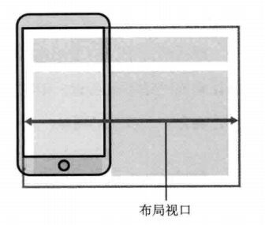

一般移动设备的浏览器都默认设置了一个 viewport 元标签，定义一个虚拟的布局视口（layout viewport），用于解决早期的页面在手机上显示的问题。iOS, Android 基本都将这个视口分辨率设置为 980px，所以 PC 上的网页基本能在手机上呈现，只不过元素看上去很小，一般默认可以通过手动缩放网页。

布局视口的宽度/高度可以通过 `document.documentElement.clientWidth / Height` 获取。布局视口使视口与移动端浏览器屏幕宽度完全独立开。CSS 布局将会根据它来进行计算，并被它约束。

- 2）视觉视口（visual viewport）

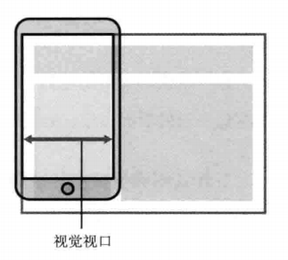

视觉视口是用户当前看到的区域，用户可以通过缩放操作视觉视口，同时不会影响布局视口。

视觉视口和缩放比例的关系为：`当前缩放值 = 理想视口宽度 / 视觉视口宽度`。所以，当用户放大时，视觉视口将会变小，一个CSS 像素将显示更多的物理像素。

- 3）理想视口（ideal viewport）

布局视口的默认宽度并不是一个理想的宽度，于是 Apple 和其他浏览器厂商引入了理想视口的概念，它对设备而言是最理想的布局视口尺寸。显示在理想视口中的网站具有最理想的宽度，用户无需进行缩放。

理想视口的值其实就是屏幕分辨率的值，它对应的像素叫做设备逻辑像素（device independent pixel, dip）。dip 和设备的物理像素无关，一个 dip 在任意像素密度的设备屏幕上都占据相同的空间。如果用户没有进行缩放，那么一个 CSS 像素就等于一个 dip。

用下面的方法可以使布局视口与理想视口的宽度一致：`<meta name="viewport" content="width=device-width">`

- 4）注意：

    - viewport 标签只对移动端浏览器有效，对 PC 端浏览器是无效的

    - 当缩放比例为 100% 时，dip 宽度 = CSS 像素宽度 = 理想视口的宽度 = 布局视口的宽度

    - 单独设置 initial-scale 或 width 都会有兼容性问题，所以设置布局视口为理想视口的最佳方法是同时设置这两个属性

    - 即使设置了 user-scalable = no，在 Android Chrome 浏览器中也可以强制启用手动缩放

##### 2. 关于多倍图

MacBook Pro 视网膜屏（Retina）显示器硬件像素是 2880px 1800px。当设置屏幕分辨率为 1920px 1200px 的时候，理想视口的宽度值是 1920px， 那么 dip 的宽度值就是 1920px。其与理想视口宽度的比值为1.5（2880/1920），这个比值叫做设备像素比：`逻辑像素宽度 * dpr = 物理像素宽度`。

设备像素比可以通过 window.devicePixelRatio 来获取，或者使用 CSS 中的 device-pixel-ratio。

下面是常见的设备像素比：

- 普通密度桌面显示屏：devicePixelRatio = 1
- 高密度桌面显示屏(Mac Retina)：devicePixelRatio = 2
- 主流手机显示屏：devicePixelRatio = 2 or 3

对于一张 100px * 100px 的图片，通过 CSS 设置其宽高：
```css
{
  width:100px;
  height:100px;
}
```

在普通显示屏的电脑中打开是正常的，但假设在手机或 Retina 屏中打开，按照逻辑分辨率来渲染，他们的 devicePixelRatio = 2，那么就相当于拿 4 个物理像素来描绘 1 个电子像素。这等于拿一个2倍的放大镜去看图片，图片就会变得模糊。这时，就需要使用 @2x 甚至 @3x 图来避免图片的失真。

### IV. 要点：Javascript
----------

#### ➣ Map/WeakMap/Set/WeakSet区别

##### 1. Set
  - 成员唯一、无序且不重复，可以为对象或基本类型
  - 属性：size
  - [value, value]，键值与键名是一致的（或者说只有键值，没有键名）
  - 操作方法：
  ```js
  add(value)：新增，相当于 array里的push
  delete(value)：存在即删除集合中value
  has(value)：判断集合中是否存在 value
  clear()：清空集合
  ```
  - 可以遍历：
  ```js
  keys()：返回一个包含集合中所有键的迭代器
  values()：返回一个包含集合中所有值得迭代器
  entries()：返回一个包含Set对象中所有元素得键值对迭代器
  forEach((v, k) => (), thisArg)：用于对集合成员执行callbackFn操作，如果提供了 thisArg 参数，回调中的this会是这个参数，没有返回值
  ```
##### 2. WeakSet
  - 成员都是对象
  - 成员都是弱引用，可以被垃圾回收机制回收，可以用来保存DOM节点，不容易造成内存泄漏
  - 不能遍历，方法有add、delete、has
##### 3. Map
  - 本质上是键值对的集合，类似集合
  - 可以遍历，方法很多可以跟各种数据格式转换
  - 属性：size
  - 操作方法：
  ```js
    set(key, value)：向字典中添加新元素
    get(key)：通过键查找特定的数值并返回
    has(key)：判断字典中是否存在键key
    delete(key)：通过键 key 从字典中移除对应的数据
    clear()：将这个字典中的所有元素删除
  ```
  - 遍历方法：
  ```js
    Keys()：将字典中包含的所有键名以迭代器形式返回
    values()：将字典中包含的所有数值以迭代器形式返回
    entries()：返回所有成员的迭代器
    forEach((v, k, map) => ())：遍历字典的所有成员

  ```
##### 4. WeakMap
  - 只接受对象作为键名（null除外），不接受其他类型的值作为键名
  - 键名是弱引用，键值可以是任意的，键名所指向的对象可以被垃圾回收，此时键名是无效的
  - 不能遍历，方法有get、set、has、delete

#### ➣ js类型的判断
```js
/*
基础类型：string/boolean/number/null/undefined/symbol
引用类型：function/object(date|regexp|obj)/array
*/
function getTypeOf(data) {
  if (data !== data) return 'nan';
  switch(Object.prototype.toString.call(data)) {
    case '[object Null]':
      return 'null';
    case '[object Array]':
      return 'array';
    case '[object Object]':
      return 'object';
    case '[object RegExp]':
      return 'regexp';
    case '[object Date]':
      return 'date';
    default:
      return (typeof data);
  }
}
```
#### ➣ 实现Call和Apply
```js
Function.prototype.myCall = function(context) {
  var args, result, symbol;

  context = Object(context) || window;
  args = Array.prototype.slice.call(arguments, 1);
  symbol = Symbol('myCall');
  context[symbol] = this;
  // 如果不使用扩展运算符的话可以将args[i]转换成逗号分隔的字符串
  // 然后通过eval('context.fn('+ argstr +')')获取结果
  result = context[symbol](...args);
  delete context[symbol];

  return result;
};

Function.prototype.myApply = function(context, args) {
  var result, symbol;

  args = args || [];
  context = Object(context) || window;
  if (!(args instanceof Array)) throw new Error('The args of apply must be an array.');

  symbol = Symbol('myApply');
  context[symbol] = this;
  result = context[symbol](...args);
  delete context[symbol];

  return result;
};

```
#### ➣ 实现对象new操作
```js
function New(func) {
  if (Object.prototype.toString.call(func) !== '[object Function]')
    throw new Error('params of theNew must be a function!');
  
  var empty, args, res;

  empty = new Object();
  args = Array.prototype.slice.call(arguments, 1);

  res = func.apply(empty, args);
  empty.__proto__ = func.prototype;

  return res || empty;
}
```

#### Js实现bind函数
```js
Function.prototype.myBind = function(context) {
  var that = this;
  var args = Array.prototype.slice.call(arguments, 1);

  return function() {
    return that.apply(context, args.concat(Array.from(arguments)));
  }
}
```

#### ➣ 二维数组扁平化

```js
function flat(array) {
  return array.reduce((total, current) => {
    return total.concat(current);
  }, []);
}

function flat(array, res=[]) {
  for (var i = 0; i < array.length; i++) {
    if (Array.isArray(array[i])) {
      flat(array[i], res);
    } else {
      res.push(array[i]);
    }
  }

  return res;
}

function flat(array) {
  const res = [];
  for (let i = 0; i < array.length; i++) {
    if (Array.isArray(array[i])) {
      res.push(...array[i]);
    } else {
      res.push(array[i]);
    }
  }
  return res;
}

function flat(array) {
  let str = JSON.stringify(array);
  str = str.replace(/[\[\]]/g, '');
  return JSON.parse(`[${str}]`);
}

console.log(flat([[1,2], [2,3], 4]))

```

#### ➣ Js如何判断一个数是不是2的N次幂
```js
function check2n(num) {
  if (!Number.isInteger(num) || num < 1) return false;

  if (num !== 1) {
    while (num > 1) {
      if (num % 2 === 0) {
        num = num / 2;
      } else {
        return false;
      }
    }
    return true;
  } else {
    return true;
  }
}
```

#### ➣ Js实现继承
```js
function Inherit (parent, child) {
  function Empty() {};
  Empty.prototype = parent.prototype;
  var empty = new Empty();
  empty.constructor = child;
  child.prototype = empty;
}

function Parent(parent) {
  this.p_attr = parent;
}

Parent.prototype.p_print = function() {
  console.log(this.p_attr);
}

function Child(attr) {
  Parent.call(this, 'parent');
  this.c_attr = attr;
  this.print = function() {
    console.log(this.c_attr);
  }
}

Inherit(Parent, Child);

var child = new Child('child');

child.print();
child.p_print();
```
#### ➣ 手写深拷贝和浅拷贝

```js
/* 深拷贝 */
function deepClone(data) {

  const map = new WeakMap();
  
  const isObjType = (obj, type) => {
    if (typeof obj !== 'object') return false;
    return Object.prototype.toString.call(obj) === `[object ${type}]`;
  };

  const _clone = (target) => {
    if (target === null) return null;
    if (target !== target) return NaN;
    if (typeof target !== 'object') return target;
    
    let base;

    // 对正则对象做特殊处理
    if (isObjType(target, 'RegExp')) return new RegExp(target.source, target.flags);
    // 对Date对象做特殊处理
    if (isObjType(target, 'Date')) return new Date(target.getTime());

    base = isObjType(target, 'Array') ? [] : {};

    // 处理循环引用
    if (map.get(target)) return map.get(target);
    map.set(target, base);
    
    for (let i in target) {
      if (Object.prototype.hasOwnProperty.call(target, i)) {
        base[i] = _clone(target[i]);
      }
    }
    
    return base;
  };

  return _clone(data);
};

/* 浅拷贝 */
function shallowClone(data) {
  let base;

  if (!data || !(typeof data === 'object')) {
    return data;
  } else {
    base = Object.prototype.toString.call(data) === '[object Array]' ? [] : {};
  }

  for (let attr in data) {
    if (Object.prototype.hasOwnProperty.call(data, attr)) {
      base[attr] = data[attr];
    }
  }

  return base;
}

```

#### ➣ 基本数据类型和引用数据类型

1. 基本数据类型：String/Boolean/Number/Null/Undefined/Symbol/BigInt(ES2020)
2. 引用数据类型：Function/Object/Array

#### ➣ ES6新增特性

1. Promise
2. let/const/块级作用域
3. Arrow Function、函数默认参数、数组、对象、函数返回值的解构
4. Map/WeakMap/Set/WeakSet
5. ES6 Class
6. 字符串方法扩展repeat/trim/includes/startsWith/endsWith/padStart/padEnd
7. 数组方法扩展find/findIndex/fill/includes
8. Array.from将类数组和实现了迭代器的对象转换成数组
9. Array.of将一个或多个值转换成数组

#### ➣ 移动端点击穿透问题
1. 问题来源  
移动浏览器提供一个特殊的功能：双击(double tap)放大，300ms的延迟就来自这里，用户碰触页面之后，需要等待一段时间来判断是不是双击动作，而不是立即响应单击（click），等待的这段时间大约是300ms。为了消除延迟，我们使用touch start / touch end 事件来模拟click事件，这便是造成点击穿透问题的原因，想象一个场景：mask蒙层有个绑定touch start事件的关闭按钮，点击之后蒙层消失，之后300ms后点击位置触发click事件，导致mask下面的元素被误触。
2. 问题解决  
1）界面统一使用touch事件替代click事件  
2）界面只click事件(会造成300ms延迟)  
3）mask隐藏后，给按钮下面元素添上`pointer-events: none`(会造成元素短时间无法响应)  
4）使用外部框架`fastclick`解决  
#### ➣ 图片懒加载具体实现方案和思路  
使用监听器IntersectionObserver来监听界面滚动，当被监听元素处于视口可见区域时，设置图片元素的src为真实的地址。如果不使用这个API的话需要手动监听页面滚动然后通过计算img元素的`offsetTop < document.documentElement.clientHeight + (document.documentElement.scrollTop || document.body.scrollTop)` 来判断元素进入视区实现，并注意配合防抖函数进行优化。
```js
(function lazyLoad(){
    const imageToLazy = document.querySelectorAll('img[data-src]');
    const loadImage = function (image) {
        image.setAttribute('src', image.getAttribute('data-src'));
        image.addEventListener('load', function() {
            image.removeAttribute("data-src");
        })
    }

    const intersectionObserver = new IntersectionObserver(function(items, observer) {
        items.forEach(function(item) {
            if(item.isIntersecting) {
                loadImage(item.target);
                observer.unobserve(item.target);
            }
        });
    });

    imageToLazy.forEach(function(image){
        intersectionObserver.observe(image);
    })
})()
```
#### ➣ 函数防抖和节流实现
```js
/* 去抖 */
function debounce(fn, time) {
  let timer;

  return function() {
    clearTimeout(timer);
    timer = setTimeout(() => {
      fn.apply(this, arguments);
    }, time);
  }
}

/* 节流 */
function throttle(fn, time) {
  let canRun = true;

  return function() {
    if (canRun) {
      canRun = false;
      setTimeout(() => {
        fn.apply(this, arguments);
        canRun = true;
      }, time)
    }
  }
}
```

#### ➣ 浏览器上的线程和进程

##### 1. 浏览器包含下面几种进程：
   - Browser 进程：浏览器的主进程（负责协调、主控），只有一个。
   - 第三方插件进程：每种类型的插件对应一个进程，仅当使用该插件时才创建。
   - GPU 进程：最多一个，用于 3D 绘制等。
   - 浏览器渲染进程（浏览器内核）（Renderer 进程，内部是多线程的）：默认每个 Tab 页面一个进程，互不影响。

##### 2. 浏览器渲染进程是多线程的，包括以下线程：

- GUI 渲染线程  
负责渲染浏览器界面，解析 HTML，CSS，构建 DOM 树和 RenderObject 树，布局和绘制等。
当界面需要重绘（Repaint）或由于某种操作引发回流(reflow)时，该线程就会执行
GUI 渲染线程与 JS 引擎线程是互斥的，当 JS 引擎执行时 GUI 线程会被挂起（相当于被冻结了），GUI 更新会被保存在一个队列中等到 JS 引擎空闲时立即被执行。

- JS 引擎线程  
也称为 JS 内核，负责处理 Javascript 脚本程序。（例如 V8 引擎）
JS 引擎线程负责解析 Javascript 脚本，运行代码。
JS 引擎一直等待着任务队列中任务的到来，然后加以处理，一个 Tab 页（renderer 进程）中无论什么时候都只有一个 JS 线程在运行 JS 程序
同样注意，GUI 渲染线程与 JS 引擎线程是互斥的，所以如果 JS 执行的时间过长，这样就会造成页面的渲染不连贯，导致页面渲染加载阻塞。

- 事件触发线程  
归属于浏览器而不是 JS 引擎，用来控制事件循环（可以理解，JS 引擎自己都忙不过来，需要浏览器另开线程协助）
当 JS 引擎执行代码块如 setTimeOut 时（也可来自浏览器内核的其他线程, 如鼠标点击、AJAX 异步请求等），会将对应任务添加到事件线程中
当对应的事件符合触发条件被触发时，该线程会把事件添加到待处理队列的队尾，等待 JS 引擎的处理
注意，由于 JS 的单线程关系，所以这些待处理队列中的事件都得排队等待 JS 引擎处理（当 JS 引擎空闲时才会去执行）

- 定时触发器线程  
传说中的 setInterval 与 setTimeout 所在线程
浏览器定时计数器并不是由 JavaScript 引擎计数的, （因为 JavaScript 引擎是单线程的, 如果处于阻塞线程状态就会影响记计时的准确）
因此通过单独线程来计时并触发定时（计时完毕后，添加到事件队列中，等待 JS 引擎空闲后执行）
注意，W3C 在 HTML 标准中规定，规定要求 setTimeout 中低于 4ms 的时间间隔算为 4ms。

- 异步 http 请求线程  
在 XMLHttpRequest 在连接后是通过浏览器新开一个线程请求
将检测到状态变更时，如果设置有回调函数，异步线程就产生状态变更事件，将这个回调再放入事件队列中。再由 JavaScript 引擎执行。

从输入 URL 到页面渲染完成发生了什么

#### ➣ Js事件循环(宏任务、微任务)
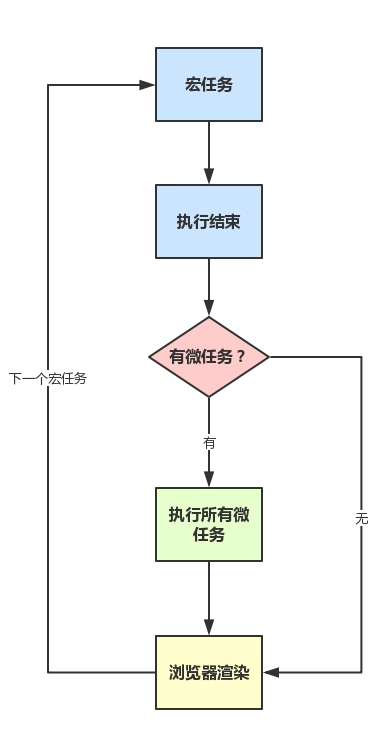

&nbsp;&nbsp;&nbsp;&nbsp; 每次执行栈执行的代码就是一个宏任务（包括每次从事件队列中获取一个事件回调并放到执行栈中执行）
再检测本次循环中是否寻在微任务，存在的话就依次从微任务的任务队列中读取执行完所有的微任务，再读取宏任务的任务队列中的任务执行，再执行所有的微任务，如此循环。JS 的执行顺序就是每次事件循环中的宏任务-微任务。

- 第一次事件循环，整段代码作为宏任务进入主线程执行
- 同步代码被直接推到执行栈执行，遇到异步代码就挂起交由其他线程执行(执行完会往事件队列塞回调)
- 同步代码执行完，读取微任务队列，若有执行所有微任务，微任务清空
- 页面渲染
- 从事件队列面里取一个宏任务塞入执行栈执行
如此反复

**一个参考题目：**
```js
const promise = new Promise((resolve, reject) => {
  console.log(1);
  resolve(5);
  console.log(2);
}).then(val => {
  console.log(val);
});

promise.then(() => {
  console.log(3);
});

console.log(4);

setTimeout(function() {
  console.log(6);
});

```
输出结果：`124536`，注意main主进程代码第一次执行时被看做宏任务。

#### ➣ 从输入URL到页面渲染完成发生了什么

- 用户输入url ，通过DNS解析成请求目的IP地址
- 浏览器与服务器建立连接（tcp 协议、三次握手），服务端处理请求返回html代码块
- 浏览器拿到返回的html，解析 html 成 dom 树、解析 css 成 cssobj
- dom 树、cssobj 结合成 render 树
- JS 根据 render 树进行计算、布局、重绘
- GPU 合成，输出到屏幕

#### ➣ tcp协议三次握手和四次挥手

##### 1. 三次握手讲解
- 客户端发送位码为syn＝1,随机产生seq确认号到服务器，服务器由SYN=1知道客户端要求建立联机（客户端：我要连接你）
- 服务器收到请求后要确认联机信息，向A发送ack number=(客户端的seq+1),syn=1,ack=1,随机产生seq=7654321的包（服务器：好的，你来连吧）
- 客户端收到后检查ack number是否正确，即第一次发送的seq number+1,以及位码ack是否为1，若正确，客户端会再发送ack number=(服务器的seq+1),ack=1，服务器收到后确认seq值与ack=1则连接建立成功。（客户端：好的，我来了）
#### 2. 为什么http建立连接需要三次握手，不是两次或四次?
答：三次握手之所以是三次是保证client和server均让对方知道自己的接收和发送能力没问题而保证的最小次数，两次不安全，四次浪费资源。

#### 3. TCP关闭连接过程
- Client向Server发送FIN包，表示Client主动要关闭连接，然后进入FIN_WAIT_1状态，等待Server返回ACK包。此后Client不能再向Server发送数据，但能读取数据。
- Server收到FIN包后向Client发送ACK包，然后进入CLOSE_WAIT状态，此后Server不能再读取数据，但可以继续向Client发送数据。
- Client收到Server返回的ACK包后进入FIN_WAIT_2状态，等待Server发送FIN包。
-Server完成数据的发送后，将FIN包发送给Client，然后进入LAST_ACK状态，等待Client返回ACK包，此后Server既不能读取数据，也不能发送数据。
- Client收到FIN包后向Server发送ACK包，然后进入TIME_WAIT状态，接着等待足够长的时间（2MSL）以确保Server接收到ACK包，最后回到CLOSED状态，释放网络资源。
- Server收到Client返回的ACK包后便回到CLOSED状态，释放网络资源。

#### 4. 为什么要四次挥手？
&nbsp;&nbsp;&nbsp;&nbsp; TCP是全双工信道，何为全双工就是客户端与服务端建立两条通道，通道1:客户端的输出连接服务端的输入；通道2:客户端的输入连接服务端的输出。两个通道可以同时工作：客户端向服务端发送信号的同时服务端也可以向客户端发送信号。所以关闭双通道的时候就是这样：
- 客户端：我要关闭输入通道了。 服务端：好的，你关闭吧，我这边也关闭这个通道。
- 服务端：我也要关闭输入通道了。 客户端：好的你关闭吧，我也把这个通道关闭。
#### ➣ 页面加载会触发哪些事件

1. document readystatechange事件  
readyState 属性描述了文档的加载状态，在整个加载过程中document.readyState会不断变化，每次变化都会触发readystatechange事件。事件使用`document.onreadystatechange`进行监听。  
readyState 有以下状态：  
  _1）loading - document仍在加载。_  
  _2）interactive - 文档结构已经完成加载，文档已被解析并且可以交互，但是诸如图像，样式表和脚本之类的外部资源仍在加载_  
  _3）complete - 文档和所有外部资源已完成加载。_  
2. document DOMContentLoaded事件  
  DOM树渲染完成时触发DOMContentLoaded事件，此时可能外部资源还在加载，事件同于jQuery中的ready事件和`readyState == 'interactive'`阶段。事件使用`document.addEventListener('DOMContentLoaded', function)`监听。
3. window load事件  
  所有的资源全部加载完成会触发window的load事件。事件使用`window.onload=function`进行监听。
```js
switch (document.readyState) {
  case "loading":
    // 表示文档还在加载中，即处于“正在加载”状态。
    break;
  case "interactive":
    // 文档已经结束了“正在加载”状态，DOM元素可以被访问
    break;
  case "complete":
    // 页面所有内容都已被完全加载.
    break;
}
/* 模拟 原生DOMContentLoaded 和 jquery ready 事件 */
document.onreadystatechange = function () {
  if (document.readyState === "interactive") {
    initApplication();
  }
}

/* 模拟 window.onload 事件 */
document.onreadystatechange = function () {
  if (document.readyState === "complete") {
    initApplication();
  }
}
```


#### ➣ document.ready和window.onload的区别  
```sh
ready事件在DOM结构绘制完成之后就会执行，这样能确保就算有大量的媒体文件没加载出来，JS代码一样可以执行。
load事件必须等到网页中所有内容全部加载完毕之后才被执行，如果一个网页中有大量的图片的话，则就会出现这种情况：网页文档已经呈现出来，但由于网页数据还没有完全加载完毕，导致load事件不能够即时被触发。
```
#### ➣ 闭包Closure  

1. 执行上下文  
函数每次执行，都会生成一个执行上下文内部对象(可理解为函数作用域)，这个上下文对象会保存函数中所有的变量值和该函数内部定义的函数的引用。函数每次执行时对应的执行上下文都是独一无二的，正常情况下函数执行完毕执行上下文就会被销毁。  
2. 内部作用域的外部引用导致作用域内变量垃圾回收不执行  
当一个函数内部作用域(注意不是单纯的变量引用)被其外层作用域引用时，函数执行完之后，其执行上下文不会被销毁，我们还能沿着作用域链访问到某个被引用的内部变量。
```js
// 外层作用域
function counterCreator() {
  // 内层作用域1
  var index = 1;
  return function () {
    // 内层作用域2，引用作用域1的变量index
    return index ++;
  };
}

// 外层作用域通过作用域链保存了内层作用域1的变量引用
var counterA = counterCreator();
// index变量不会被垃圾回收
counterA();     // 1
counterA();     // 2

```

#### ➣ 函数式编程思想的体现

#### ➣ 函数柯里化：add(1)(2)(3) == 6
```js
function add(num) {
  var sum = 0;

  function sumLogic(num) {
    sum += num;
    return sumLogic;
  }

  sumLogic.toString = function() {
    return sum;
  }

  return sumLogic;
}
```

#### ➣ 函数柯里化2：curry函数
1. 实现效果：
```js
function sum(a, b, c) {
  return a + b + c;
}

let curriedSum = curry(sum);

alert( curriedSum(1, 2, 3) ); // 6，仍然可以被正常调用
alert( curriedSum(1)(2,3) ); // 6，对第一个参数的柯里化
alert( curriedSum(1)(2)(3) ); // 6，全柯里化
```

2. 实现curry函数
```js
function curry(func) {
  return function core() {
    var args = [].slice.call(arguments);
    if (args.length >= func.length) {
      return func.apply(this, args);
    } else {
      return function() {
        return core.apply(this, args.concat(Array.from(arguments)));
      };
    }
  };
}
```

#### ➣ vue双向绑定实现原理

#### ➣ Vue2.0与Vue3.0双向绑定，proxy实现

#### ➣ 前端错误监控方法

#### ➣ 发布订阅模式和观察者模式区别
- 在观察者模式中，观察者是知道Subject的，Subject一直保持对观察者进行记录。然而，在发布订阅模式中，发布者和订阅者不知道对方的存在。它们只有通过消息代理进行通信。
- 在发布订阅模式中，组件是松散耦合的，正好和观察者模式相反。
- 可以理解为观察者模式没中间商赚差价，发布订阅模式，有中间商赚差价。
- 观察者模式大多数时候是同步的，比如当事件触发，Subject就会去调用观察者的方法。而发布-订阅模式大多数时候是异步的（使用消息队列）。
- 观察者模式需要在单个应用程序地址空间中实现，而发布-订阅更像交叉应用模式。

#### ➣ 实现一个EventEmitter类，支持事件的on,off,emit,once,setMaxListeners。

```js
function EventEmitter() {
  this.maxListeners = 100;
  this.listeners = {};
}

EventEmitter.prototype.setMaxListeners = function(num) {
  if (typeof num !== 'number' || !Number.isInteger(num) || num <= 0)
    throw new Error('setMaxListeners: param num must be a positive integer!');
  this.maxListeners = num;
}

EventEmitter.prototype.on = function(type, func) {
  if (!type || !func instanceof Function) return;
  if (this.listeners[type]) {
    if (this.listeners[type].length === this.maxListeners) 
      return console.error('The max listeners limitation: ', this.maxListeners);
    this.listeners[type].push(func);
  } else {
    this.listeners[type] = [func];
  }
}

EventEmitter.prototype.once = function(type, func) {
  if (!type || !func instanceof Function) return;
  var that = this;
  var callback = function(...args) {
    func(...args);
    that.off(type, callback);
  };
  this.on(type, callback);
}

EventEmitter.prototype.off = function(type, func) {
  if (!type || !func) return;
  if (this.listeners[type]) {
    var index = this.listeners[type].indexOf(func);
    (index !== -1) && this.listeners[type].splice(index, 1);
  }
}

EventEmitter.prototype.emit = function(type) {
  var args = [].slice.call(arguments, 1);
  (this.listeners[type] || []).forEach(function(fn) {
    fn(...args);
  });
}
```

#### ➣ 实现ajax并发请求控制
简化版：
```js
/**
  * multiAjaxRequest [批量并发异步请求]
  * @author nojsja
  * @param  {[Array]} urls [所有待请求接口地址]
  * @param  {[Array]} maxNum [最大并发数量]
  */
function multiAjaxRequest(urls=[], maxNum=0) {
  const length = urls.length;
  const result = new Array(length).fill(false);
  let index = 0;

  function sendRequest(url) {
    console.log('send');
    const ajax = new XMLHttpRequest();
    ajax.open('POST', url, true);
    ajax.send();
    return new Promise((resolve, reject) => {
      ajax.onreadystatechange((ev) => {
        if (ajax.readyState === 4) {
          if (ajax.status === 200) {
            resolve({
              code: 200,
              result: ajax.responseText
            });
          } else {
            resolve({
              code: ajax.status,
              result: ajax.responseText
            });
          }
        }
      });
    })
  }

  return new Promise((resolve, reject) => {

    function next() {
      const current = index++;
      const url = urls[current];
      console.log(current);
      
      sendRequest(url)
      .then(res => {
        result[current] = res.code === 200 ? res.result : false;
        if (current >= length - 1) {
          if (urls.includes(false)) return reject(result);
          resolve(result);
        } else {
          next();
        }
      })
    }
  
    while(index < maxNum) {
      if (urls[i]) {
        next();
      } else {
        break;
      }
    }
  });

}
```

#### ➣ 如何自己实现一个单点登录系统

#### ➣ 使用ES5实现Promise  
[链接-> 使用ES5实现ES6 Promise API](https://github.com/nojsja/promise-nojsja)

### V. 要点：React

#### ➣ React 中 setState 什么时候是同步的，什么时候是异步的？
- setState 只在合成事件和钩子函数中是“异步”的，在原生事件和 setTimeout 中都是同步的。
- setState的“异步”并不是说内部由异步代码实现，其实本身执行的过程和代码都是同步的，只是合成事件和钩子函数的调用顺序在更新之前，导致在合成事件和钩子函数中没法立马拿到更新后的值，形式了所谓的“异步”，当然可以通过第二个参数 setState(partialState, callback) 中的callback拿到更新后的结果。
- setState 的批量更新优化也是建立在“异步”（合成事件、钩子函数）之上的，在原生事件和setTimeout 中不会批量更新，在“异步”中如果对同一个值进行多次 setState ， setState 的批量更新策略会对其进行覆盖，取最后一次的执行，如果是同时 setState 多个不同的值，在更新时会对其进行合并批量更新。

#### ➣ hooks 为什么不能放在条件判断里？
以 setState 为例，在 react 内部，每个组件(Fiber)的 hooks 都是以链表的形式存在 memoizeState 属性中：

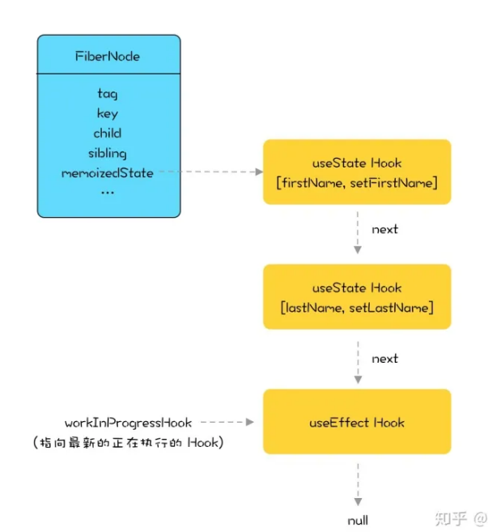

update 阶段，每次调用 setState，链表就会执行 next 向后移动一步。如果将 setState 写在条件判断中，假设条件判断不成立，没有执行里面的 setState 方法，会导致接下来所有的 setState 的取值出现偏移，从而导致异常发生。

#### ➣ React-Fiber原理和生命周期使用详解

[>> 文章链接](https://nojsja.gitee.io/blogs/2021/01/25/%E7%90%86%E8%A7%A3React%EF%BC%9AFiber%E6%9E%B6%E6%9E%84%E5%92%8C%E6%96%B0%E6%97%A7%E7%94%9F%E5%91%BD%E5%91%A8%E6%9C%9F/)

#### ➣ React虚拟dom以及diff算法

传统 diff 算法的时间复杂度是 O(n^3)，这在前端 render 中是不可接受的。为了降低时间复杂度，react 的 diff 算法做了一些妥协，放弃了最优解，最终将时间复杂度降低到了 O(n)。

那么 react diff 算法做了哪些妥协呢？，参考如下：

1、tree diff：只对比同一层的 dom 节点，忽略 dom 节点的跨层级移动

如下图，react 只会对相同颜色方框内的 DOM 节点进行比较，即同一个父节点下的所有子节点。当发现节点不存在时，则该节点及其子节点会被完全删除掉，不会用于进一步的比较。

这样只需要对树进行一次遍历，便能完成整个 DOM 树的比较。

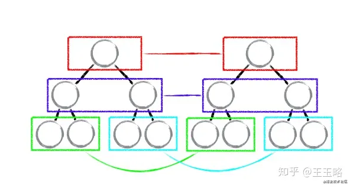

这就意味着，如果 dom 节点发生了跨层级移动，react 会删除旧的节点，生成新的节点，而不会复用。

2、component diff：如果不是同一类型的组件，会删除旧的组件，创建新的组件

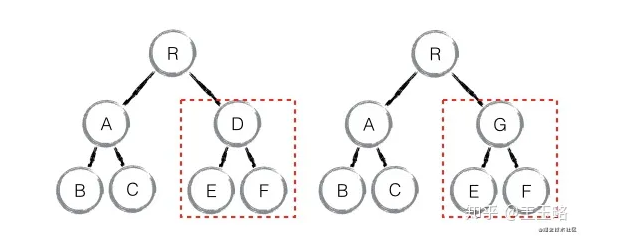

3、element diff：对于同一层级的一组子节点，需要通过唯一 id 进行来区分

如果没有 id 来进行区分，一旦有插入动作，会导致插入位置之后的列表全部重新渲染。这也是为什么渲染列表时为什么要使用唯一的 key。

#### ➣ Babel源码

#### ➣ React SetState原理


### VI. 要点：Node.js
----------

#### ➣ Node.js创建子进程方法异同

child_process 模块提供了衍生子进程的能力。 此功能主要由 child_process.spawn() 函数提供。

默认情况下， stdin、 stdout 和 stderr 的管道会在父 Node.js 进程和衍生的子进程之间建立。 这些管道具有有限的（且平台特定的）容量。 如果子进程写入 stdout 时超出该限制且没有捕获输出，则子进程会阻塞并等待管道缓冲区接受更多的数据。 这与 shell 中的管道的行为相同。 如果不消费输出，则使用 { stdio: 'ignore' } 选项。

如果 options 对象中有 options.env.PATH 环境变量，则使用它来执行命令查找。 否则，则使用 process.env.PATH。

在 Windows 上，环境变量不区分大小写。 Node.js 按字典顺序对 env 的键进行排序，并使用不区分大小写的第一个键。 只有第一个（按字典顺序）条目会被传给子流程。 当传给 env 选项的对象具有多个相同键名的变量时（例如 PATH 和 Path），在 Windows 上可能会出现问题。

child_process.spawn() 方法会异步地衍生子进程，且不阻塞 Node.js 事件循环。 child_process.spawnSync() 函数则以同步的方式提供了等效的功能，但会阻塞事件循环直到衍生的进程退出或被终止。对于某些用例，例如自动化的 shell 脚本，同步的方法可能更方便。 但是在大多数情况下，同步的方法会对性能产生重大的影响，因为会暂停事件循环直到衍生的进程完成。

为方便起见， child_process 模块提供了 child_process.spawn() 和 child_process.spawnSync() 的一些同步和异步的替代方法。 这些替代方法中的每一个都是基于 child_process.spawn() 或 child_process.spawnSync() 实现的：

- `child_process.exec(command[, options][, callback])`: 衍生 shell 并且在 shell 中运行命令，当完成时则将 stdout 和 stderr 传给回调函数。

  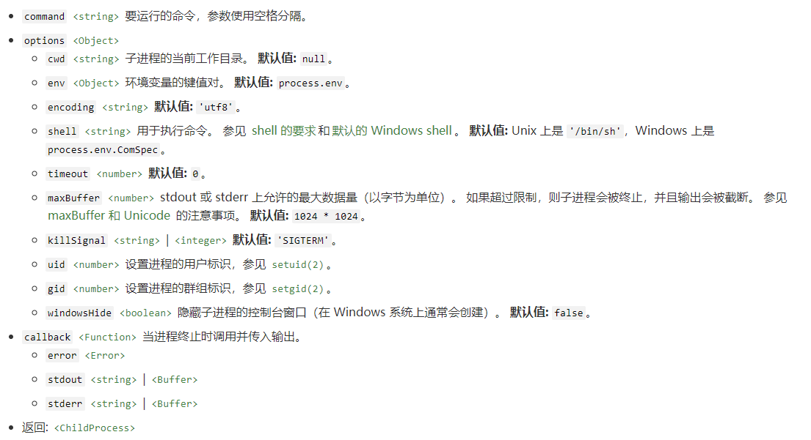

- `child_process.execFile(file[, args][, options][, callback])`: 类似于 exec()，但是默认情况下它会直接衍生命令而不先衍生shell。exec() 和 execFile() 之间区别的重要性可能因平台而异，在 Unix 类型的操作系统上，execFile() 可以更高效，因为默认情况下不会衍生 shell。但是在 Windows 上， .bat 和 .cmd 文件在没有终端的情况下不能自行执行，因此无法使用 execFile() 启动。当在 Windows 上运行时，要调用 .bat 和 .cmd 文件，可以使用设置了 shell 选项的 child_process.spawn()、child_process.exec() 或衍生 cmd.exe 并将 .bat 或 .cmd 文件作为参数传入（也就是 shell 选项和 child_process.exec() 所做的）

  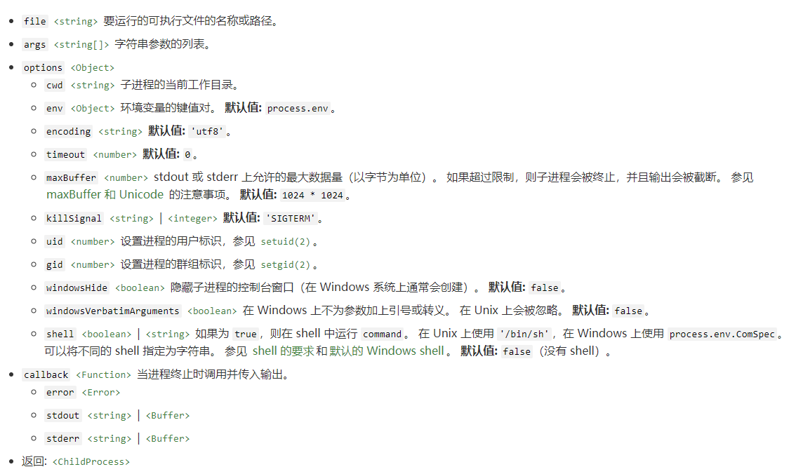

- `child_process.fork(modulePath[, args][, options])`: 衍生新的 Node.js 进程，并调用指定的模块，该模块已建立了 IPC 通信通道，可以在父进程与子进程之间发送消息。记住，衍生的 Node.js 子进程独立于父进程，但两者之间建立的 IPC 通信通道除外。 每个进程都有自己的内存，带有自己的 V8 实例。 由于需要额外的资源分配，因此不建议衍生大量的 Node.js 子进程。

  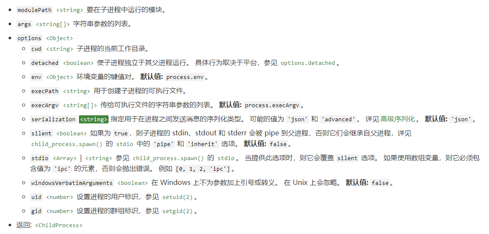

- `child_process.spawn(command[, args][, options])`：方法使用给定的 command 衍生新的进程，并传入 args 中的命令行参数，如果省略 args，则其默认为空数组。如果参数 options 选项 shell 为 true，则在 shell 中运行 command，在 Unix 上使用 '/bin/sh'，在 Windows 上使用 process.env.ComSpec。
  
  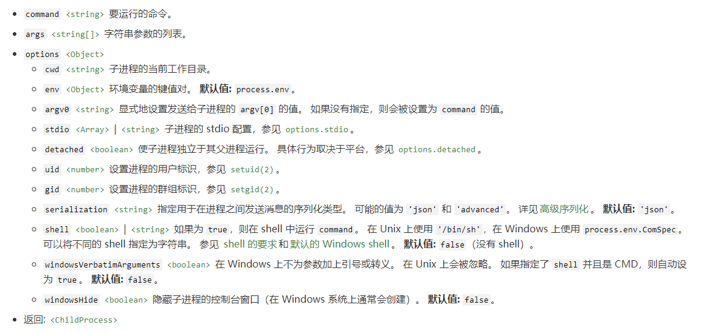

#### ➣ Node.js创建子进程参数`stdio`的理解

options.stdio 选项用于配置在父进程和子进程之间建立的管道。 默认情况下，子进程的 stdin、 stdout 和 stderr 会被重定向到 ChildProcess 对象上相应的 subprocess.stdin、subprocess.stdout 和 subprocess.stderr 流。 这相当于将 options.stdio 设置为 ['pipe', 'pipe', 'pipe']。

为方便起见， options.stdio 可以是以下字符串之一：

- 'pipe'：相当于 ['pipe', 'pipe', 'pipe']（默认值）。
- 'ignore'：相当于 ['ignore', 'ignore', 'ignore']。
- 'inherit'：相当于 ['inherit', 'inherit', 'inherit'] 或 [0, 1, 2] 或 [process.stdin, process.stdout, process.stderr]。

否则， options.stdio 的值需是数组（其中每个索引对应于子进程中的文件描述符）。 文件描述符 0、1 和 2 分别对应于 stdin、stdout 和 stderr。 其他的文件描述符可以被指定用于在父进程和子进程之间创建其他的管道。 值可以是以下之一：

1. **'pipe'**：在子进程和父进程之间创建管道。 管道的父端作为 child_process 对象上的 subprocess.stdio[fd] 属性暴露给父进程。 为文件描述符 0、1 和 2 创建的管道也可分别作为 subprocess.stdin、subprocess.stdout 和 subprocess.stderr 使用。

2. **'ipc'**：创建 IPC 通道，用于在父进程和子进程之间传递消息或文件描述符。 一个 ChildProcess 最多可以有一个 IPC stdio 文件描述符。 设置此选项会启用 subprocess.send() 方法。 如果子进程是 Node.js 进程，则 IPC 通道的存在将会启用 process.send() 和 process.disconnect() 方法、以及子进程内的 'disconnect' 和 'message' 事件。以 process.send() 以外的任何方式访问 IPC 通道的文件描述符、或者在不是 Node.js 实例的子进程中使用 IPC 通道，都是不支持的。

3. **'ignore'**：指示 Node.js 忽略子进程中的文件描述符。 虽然 Node.js 将会始终为其衍生的进程打开文件描述符 0、1 和 2，但将文件描述符设置为 'ignore' 可以使 Node.js 打开 /dev/null 并将其附加到子进程的文件描述符。

4. **'inherit'**：将相应的 stdio 流传给父进程或从父进程传入。 在前三个位置中，这分别相当于 process.stdin、 process.stdout 和 process.stderr。 在任何其他位置中，则相当于 'ignore'。

5. **`<Stream>`** 对象：与子进程共享指向 tty、文件、 socket 或管道的可读或可写流。 流的底层文件描述符在子进程中会被复制到与 stdio 数组中的索引对应的文件描述符。 该流必须具有底层的描述符（文件流直到触发 'open' 事件才有）。

6. **正整数**：整数值会被解释为当前在父进程中打开的文件描述符。 它与子进程共享，类似于共享 `<Stream>`对象的方式。 在 Windows 上不支持传入 socket。

7. **null 或 undefined**：使用默认值。 对于 stdio 的文件描述符 0、1 和 2（换句话说，stdin、stdout 和 stderr），将会创建管道。 对于文件描述符 3 及更大的值，则默认为 'ignore'。

```js
const { spawn } = require('child_process');

// 子进程使用父进程的 stdio。
spawn('prg', [], { stdio: 'inherit' });

// 衍生的子进程只共享 stderr。
spawn('prg', [], { stdio: ['pipe', 'pipe', process.stderr] });

// 打开一个额外的 fd=4，与呈现启动式界面的程序进行交互。
spawn('prg', [], { stdio: ['pipe', null, null, null, 'pipe'] });
```
当在父进程和子进程之间建立 IPC 通道，并且子进程是 Node.js 进程时，则子进程启动时不会指向 IPC 通道（使用 unref()），直到子进程为 'disconnect' 事件或 'message' 事件注册了事件句柄。 这使得子进程可以正常退出而不需要通过开放的 IPC 通道保持打开该进程。

在类 Unix 操作系统上，child_process.spawn() 方法在将事件循环与子进程解耦之前会同步地执行内存操作。 具有大内存占用的应用程序可能会发现频繁的 child_process.spawn() 调用成为瓶颈。 详见 V8 问题 7381。


#### ➣ Nodejs使用场景
Nodejs 是单线程，非阻塞 I/O，事件驱动，不适用于CPU密集运算的任务。它的特点决定了它适合做一些大量 I/O 的东西，比如，聊天室，表单提交等不需要大量计算的功能。做一些微信后端开发，或者做消息系统等。可以整个项目用， 也可以根据它的特点在某个模块使用，比如 socketio，打造一个消息系统等。

#### ➣ Nodejs 中的 Stream 和 Buffer 有什么区别?
Buffer：为数据缓冲对象，是一个类似数组结构的对象，可以通过指定开始写入的位置及写入的数据长度，往其中写入二进制数据。Stream：是对 buffer 对象的高级封装，其操作的底层还是 buffer 对象， stream 可以设置为可读、可写，或者即可读也可写，在 nodejs 中继承了 EventEmitter 接口，可以监听读入、写入的过程。具体实现有文件流，httpresponse 等。

#### ➣ Node.js流的概念

流（stream）是 Node.js 中处理流式数据的抽象接口。 Node.js 提供了多种流对象。 例如，HTTP 服务器的请求和 process.stdout 都是流的实例。流可以是可读的、可写的、或者可读可写的，所有的流都是 EventEmitter 的实例。

##### 流的类型

Node.js 中有四种基本的流类型：

- Writable - 可写入数据的流（例如 fs.createWriteStream()）。
- Readable - 可读取数据的流（例如 fs.createReadStream()）。
- Duplex - 可读又可写的流（例如 net.Socket）。
- Transform - 在读写过程中可以修改或转换数据的 Duplex 流（例如 zlib.createDeflate()）。

##### 流的缓冲区

可写流和可读流都会在内部的缓冲器中存储数据，可以分别使用的 writable.writableBuffer 或 readable.readableBuffer 来获取。

可缓冲的数据大小取决于传入流构造函数的 highWaterMark 选项。 对于普通的流， highWaterMark 指定了字节的总数。 对于对象模式的流， highWaterMark 指定了对象的总数。

当调用 stream.push(chunk) 时，数据会被缓冲在可读流中。 如果流的消费者没有调用 stream.read()，则数据会保留在内部队列中直到被消费。

一旦内部的可读缓冲的总大小达到 highWaterMark 指定的阈值时，流会暂时停止从底层资源读取数据，直到当前缓冲的数据被消费 （也就是说，流会停止调用内部的用于填充可读缓冲的 readable._read()）。

当调用 writable.write(chunk) 时，数据会被缓冲在可写流中。 当内部的可写缓冲的总大小小于 highWaterMark 设置的阈值时，调用 writable.write() 会返回 true。 一旦内部缓冲的大小达到或超过 highWaterMark 时，则会返回 false。

stream API 的主要目标，特别是 stream.pipe()，是为了限制数据的缓冲到可接受的程度，也就是读写速度不一致的源头与目的地不会压垮内存。

因为 Duplex 和 Transform 都是可读又可写的，所以它们各自维护着两个相互独立的内部缓冲器用于读取和写入， 这使得它们在维护数据流时，读取和写入两边可以各自独立地运作。 例如，net.Socket 实例是 Duplex 流，它的可读端可以消费从 socket 接收的数据，而可写端则可以将数据写入到 socket。 因为数据写入到 socket 的速度可能比接收数据的速度快或者慢，所以读写两端应该独立地进行操作（或缓冲）。

##### 可写流

可写流是对数据要被写入的目的地的一种抽象。

常见的可写流包括：
- 客户端的 HTTP 请求
- 服务器的 HTTP 响应
- fs 的写入流
- zlib 流
- crypto 流
- TCP socket
- 子进程 stdin
- process.stdout、process.stderr

使用示例：
```js
const myStream = getWritableStreamSomehow();
myStream.write('一些数据');
myStream.write('更多数据');
myStream.end('完成写入数据');
```

常见事件：
- close: 当流或其底层资源（比如文件描述符）被关闭时触发。 表明不会再触发其他事件，也不会再发生操作。
- drain: 如果调用 stream.write(chunk) 返回 false，则当可以继续写入数据到流时会触发 'drain' 事件。
- error: 如果在写入或管道数据时发生错误，则会触发 'error' 事件，在 'error' 之后，除 'close' 事件外，不应再触发其他事件。
- 调用 stream.end() 且缓冲数据都已传给底层系统之后触发。
- pipe: 可写流被`stream.pipe()`连接

常见方法：

- writable.end([chunk[, encoding]][, callback]): 调用 writable.end() 表明已没有数据要被写入可写流。 可选的 chunk 和 encoding 参数可以在关闭流之前再写入一块数据。 如果传入了 callback 函数，则会做为监听器添加到 'finish' 事件和 'error' 事件。
- writable.write(chunk[, encoding][, callback]): writable.write() 写入数据到流，并在数据被完全处理之后调用 callback。 如果发生错误，则 callback 可能被调用也可能不被调用。 为了可靠地检测错误，可以为 'error' 事件添加监听器。 callback 会在触发 'error' 之前被异步地调用。在接收了 chunk 后，如果内部的缓冲小于创建流时配置的 highWaterMark，则返回 true 。 如果返回 false ，则应该停止向流写入数据，直到 'drain' 事件被触发。

##### 可读流
可读流运作于两种模式之一：流动模式（flowing）或暂停模式（paused）。 这些模式与对象模式分开。 无论是否处于流动模式或暂停模式，可读流都可以处于对象模式：
- 在流动模式中，数据自动从底层系统读取，并通过 EventEmitter 接口的事件尽可能快地被提供给应用程序。
- 在暂停模式中，必须显式调用 stream.read() 读取数据块。

所有可读流都开始于暂停模式，可以通过以下方式切换到流动模式：
- 添加 'data' 事件句柄。
- 调用 stream.resume() 方法。
- 调用 stream.pipe() 方法将数据发送到可写流。

可读流可以通过以下方式切换回暂停模式：
- 如果没有管道目标，则调用 stream.pause()。
- 如果有管道目标，则移除所有管道目标。调用 stream.unpipe() 可以移除多个管道目标。

只有提供了消费或忽略数据的机制后，可读流才会产生数据。 如果消费的机制被禁用或移除，则可读流会停止产生数据。

为了向后兼容，移除 'data' 事件句柄不会自动地暂停流。 如果有管道目标，一旦目标变为 drain 状态并请求接收数据时，则调用 stream.pause() 也不能保证流会保持暂停模式。

如果可读流切换到流动模式，且没有可用的消费者来处理数据，则数据将会丢失。 例如，当调用 readable.resume() 时，没有监听 'data' 事件或 'data' 事件句柄已移除。

添加 'readable' 事件句柄会使流自动停止流动，并通过 readable.read() 消费数据。 如果 'readable' 事件句柄被移除，且存在 'data' 事件句柄，则流会再次开始流动。

常见事件：

- close: 当流或其底层资源（比如文件描述符）被关闭时触发 'close' 事件。 该事件表明不会再触发其他事件，也不会再发生操作。
- data: 当流将数据块传送给消费者后触发。 当调用 readable.pipe()， readable.resume() 或绑定监听器到 'data' 事件时，流会转换到流动模式。 当调用 readable.read() 且有数据块返回时，也会触发 'data' 事件。
- end: 'end' 事件只有在数据被完全消费掉后才会触发。 要想触发该事件，可以将流转换到流动模式，或反复调用 stream.read() 直到数据被消费完。
- error: 'error' 事件可能随时由 Readable 实现触发。 通常，如果底层的流由于底层内部的故障而无法生成数据，或者流的实现尝试推送无效的数据块，则可能会发生这种情况。
- pause: 当调用 stream.pause() 并且 readsFlowing 不为 false 时，就会触发 'pause' 事件。
- readable: 当有数据可从流中读取时，就会触发 'readable' 事件。 在某些情况下，为 'readable' 事件附加监听器将会导致将一些数据读入内部缓冲区。
- resume: 当调用 stream.resume() 并且 readsFlowing 不为 true 时，将会触发 'resume' 事件。

常见方法:

- readable.pause:  方法使流动模式的流停止触发 'data' 事件，并切换出流动模式。 任何可用的数据都会保留在内部缓存中。
- readable.resume:  方法将被暂停的可读流恢复触发 'data' 事件，并将流切换到流动模式。
- readable.read([size]): 从内部缓冲拉取并返回数据。 如果没有可读的数据，则返回 null。 默认情况下， readable.read() 返回的数据是 Buffer 对象，除非使用 readable.setEncoding() 指定字符编码或流处于对象模式。如果没有指定 size 参数，则返回内部缓冲中的所有数据。
- readable.setEncoding(encoding): 方法为从可读流读取的数据设置字符编码。默认情况下没有设置字符编码，流数据返回的是 Buffer 对象。 如果设置了字符编码，则流数据返回指定编码的字符串。 例如，调用 readable.setEncoding('utf-8') 会将数据解析为 UTF-8 数据，并返回字符串。

##### 可读可写双向流
双工流（Duplex）是同时实现了 Readable 和 Writable 接口的流。

Duplex 流的例子包括：
- TCP socket
- zlib 流
- crypto 流
##### 转换流
转换流（Transform）是一种 Duplex 流，但它的输出与输入是相关联的。 与 Duplex 流一样， Transform 流也同时实现了 Readable 和 Writable 接口。

Transform 流的例子包括：
- zlib 流
- crypto 流

#### ➣ Node.js和Webpack对模块循环依赖的处理

举例，A和B相互依赖，我们运行A.js：
```js
// A.js:
let b = require('./B');

module.exports = {
    A: 'this is a Object'
};


console.log('A: before log b');
console.log(b);
console.log('A: after log b');

// B.js:

let a = require('./A');

module.exports = {
    B: 'this is b Object'
};

console.log('B: before log a');
console.log(a);
console.log('B: after log a');

```

##### Node.js的处理

1. 工作方式

&nbsp;&nbsp;&nbsp;&nbsp; Node.js具有两个特性：运行时加载和缓存已加载模块。为了避免无限循环的模块依赖，在 Node.js 运行 A.js 之后，它就被缓存了，但需要注意的是，此时缓存的仅仅是一个未完工的 A.js（an unfinished copy of the a.js）。所以在 B.js require A.js 时，得到的仅仅是缓存中一个未完工的 A.js，具体来说，它并没有明确被导出的具体内容（A.js 尾端）。所以 B.js 中输出的 a 是一个空对象。之后，B.js 顺利执行完，回到 A.js 的 require 语句之后，继续执行完成。

```js
// a.js
module.exports.a = 1
var b = require('./b')
console.log(b)
module.exports.a = 2

// b.js
module.exports.b = 11
var a = require('./a')
console.log(a)
module.exports.b = 22

//main.js
var a = require('./a')
console.log(a)
```

执行过程：

- 执行 node main.js -> 第一行 require(a.js)，（node 执行也可以理解为调用了require方法，我们省略require(main.js)内容）
- 进入 require(a)方法： 判断缓存（无） -> 初始化一个 module -> 将 module 加入缓存 -> 执行模块 a.js 内容，（需要注意 是先加入缓存， 后执行模块内容）
- a.js： 第一行导出 a = 1 -> 第二行 require(b.js)（a 只执行了第一行）
- 进入 require(b) 内 同 1 -> 执行模块 b.js 内容
- b.js： 第一行 b = 11 -> 第二行 require(a.js)
- require(a) 此时 a.js 是第二次调用 require -> 判断缓存（有）-> cachedModule.exports -> 回到 b.js（因为js对象引用问题 此时的 cachedModule.exports = { a: 1 }）
- b.js：第三行 输出 { a: 1 } -> 第四行 修改 b = 22 -> 执行完毕回到 a.js
- a.js：第二行 require 完毕 获取到 b -> 第三行 输出 { b: 22 } -> 第四行 导出 a = 2 -> 执行完毕回到 main.js
- main.js：获取 a -> 第二行 输出 { a: 2 } -> 执行完毕

2. 解决方案

&nbsp;&nbsp;&nbsp;&nbsp; 想要解决这个问题有一个很简明的方法，那就是在循环依赖的每个模块中先导出自身，然后再导入其他模块（对于本文的举例来说，实际只需改动 A.js，先使用module.exports导出，然后再require B.js）。

##### Webpack的处理

1. 工作方式

&nbsp;&nbsp;&nbsp;&nbsp; ES Modules 模块输出的是值的引用，输出接口动态绑定，在编译时执行。

&nbsp;&nbsp;&nbsp;&nbsp; webpack的头部启动代码中，通过闭包中的installedModules对象，将模块名或者id作为对象的key来缓存各个模块的export的值，通过判断installedModules上是否缓存了对应模块的key来判断是否已经加载了模块。

2. 解决方案
- 1）webpack尚未解决循环依赖问题，可以使用 circular-dependency-plugin 插件进行循依赖检测，减少debug时间。
- 2）打破文件间的依赖关系的闭环
- 3）依赖关系闭环的情况下，将变量改为function导出，利用function的变量提升机制

#### ➣ Webpack怎么处理require和import语法混用的
对于es6规范和commonjs规范来说，经过babel编译以后，都会转化成commonjs规范，然后在此基础上，用__esModule区分了是属于es6模块还是commonjs模块。并切为了保证es6规范用import导入值的正确性和统一性，babel还做了一些策略去处理这两者之前的差异。

#### ➣ 前端模块化历程
模块化主要是用来抽离公共代码，隔离作用域，避免变量冲突等。

##### 1. IIFE - 立即执行函数
使用自执行函数来编写模块化，特点：在一个单独的函数作用域中执行代码，避免变量冲突。
```js
(function(){
  return {
	data:[]
  }
})()

```

##### 2. AMD - requireJs
模块依赖需要提前声明好，不支持动态设置依赖
```js
define('./index.js',function(code){
	// code 就是index.js 返回的内容
});
```

##### 3. CMD - seaJs
支持动态依赖设置
```js
define(function(require, exports, module) {  
  var indexCode = require('./index.js');
});
```

##### 4. CommonJs - Node.js模块规范
&nbsp;&nbsp;&nbsp;&nbsp; 属于动态导入规范，特点: require、module.exports、exports CommonJS 一般用在服务端或者Node用来同步加载模块，它对于模块的依赖发生在代码运行阶段，不适合在浏览器端做异步加载。 exports实际上是一个对module.exports的引用，不能给exports赋值，否则会断开与module.exports的连接：
```js
  exports.add = function add () {/* 方法 */}
    // 等同于
  module.exports.add = function add () {/* 方法 */}
```

##### 5. ES Module - 浏览器模块系统
&nbsp;&nbsp;&nbsp;&nbsp; 属于静态导入规范，import、export ES6模块化不是对象，import会在JavaScript引擎静态分析，在编译时就引入模块代码，而并非在代码运行时加载，因此也不适合异步加载。

静态的语法意味着可以在编译时确定导入和导出，更加快速的查找依赖，可以使用lint工具对模块依赖进行检查，可以对导入导出加上类型信息进行静态的类型检查

**ESModule的优势：**

- 死代码检测和排除。我们可以用静态分析工具检测出哪些模块没有被调用过。比如，在引入工具类库时，工程中往往只用到了其中一部分组件或接口，但有可能会将其代码完整地加载进来。未被调用到的模块代码永远不会被执行，也就成为了死代码。通过静态分析可以在打包时去掉这些未曾使用过的模块，以减小打包资源体积。
- 模块变量类型检查。JavaScript属于动态类型语言，不会在代码执行前检查类型错误（比如对一个字符串类型的值进行函数调用）。ES6 Module的静态模块结构有助于确保模块之间传递的值或接口类型是正确的。
- 编译器优化。在CommonJS等动态模块系统中，无论采用哪种方式，本质上导入的都是一个对象，而ES6 Module支持直接导入变量，减少了引用层级，程序效率更高。

**ESModule导出的值是引用的例子：**
```js
// es6 module 中基本类型也按引用传递
// foo.js
export let a = 1
export function count(){
  a++
}

// main.js
import { a, count } from './foo'
console.log(a) //1
count()
console.log(a) //2
```

**ESModule和CommonJs差异：**
- CommonJS模块导入后是一个值的拷贝，一旦输出之后，无论模块内部怎么变化，都无法影响之前的引用；而ESModule导入后是一个引用值的动态映射，并且这个映射是只读的。
- ESModule 是引擎会在遇到import后生成一个引用链接，在脚本真正执行时才会根据这个引用链接去模块里面取值，模块内部的原始值变了import加载的模块也会变。
- CommonJS运行时加载，ESModule编译阶段引用。CommonJS在引入时是加载整个模块，生成一个对象，然后再从这个生成的对象上读取方法和属性。
- ESModule 不是对象，而是通过export暴露出要输出的代码块，在import时使用静态命令的方法引用指定的输出代码块，并在import语句处执行这个要输出的代码，而不是直接加载整个模块。

#### ➣ 谈谈node子进程child_process和实际使用场景

#### ➣ node是IO密集型体现在哪里

### VII. 要点：设计模式
----------

1. [策略模式](https://github.com/nojsja/javascript-learning/tree/master/design-patterns#1-the-strategy-pattern%E7%AD%96%E7%95%A5%E6%A8%A1%E5%BC%8F)

2. [观察者模式](https://github.com/nojsja/javascript-learning/tree/master/design-patterns#2-the-observer-pattern%E8%A7%82%E5%AF%9F%E8%80%85%E6%A8%A1%E5%BC%8F)

3. [享元模式](https://github.com/nojsja/javascript-learning/tree/master/design-patterns#3-the-flyweight-pattern%E4%BA%AB%E5%85%83%E6%A8%A1%E5%BC%8F)

4. [装饰者模式](https://github.com/nojsja/javascript-learning/tree/master/design-patterns#4-the-decorator-pattern%E8%A3%85%E9%A5%B0%E8%80%85%E6%A8%A1%E5%BC%8F)

5. [代理模式](https://github.com/nojsja/javascript-learning/tree/master/design-patterns#5-the-proxy-pattern%E4%BB%A3%E7%90%86%E6%A8%A1%E5%BC%8F)

6. [状态模式](https://github.com/nojsja/javascript-learning/tree/master/design-patterns#6-the-state-pattern%E7%8A%B6%E6%80%81%E6%A8%A1%E5%BC%8F)

7. [责任链模式](https://github.com/nojsja/javascript-learning/tree/master/design-patterns#7-the-responsibility-chain-pattern%E8%B4%A3%E4%BB%BB%E9%93%BE%E6%A8%A1%E5%BC%8F)

8. [模板方法模式](https://github.com/nojsja/javascript-learning/tree/master/design-patterns#7-the-responsibility-chain-pattern%E8%B4%A3%E4%BB%BB%E9%93%BE%E6%A8%A1%E5%BC%8F)

### VIII. 要点：前端工具
---------

#### ➣ webpack/rollup一些区别

- webpack 不支持导出 es6 module 规范，rollup 支持导出 es6 module
- webpack 打包后代码很多冗余无法直接看，rollup 打包后的代码简洁，可读，像源码
- webpack 可以进行代码分割，静态资源处理，HRM，rollup 专注于 es module，tree-shaking更加强大的，精简

#### ➣ ts自己的看法，和应用

#### ➣ webpack loader和plugin区别
1. loader，它是一个转换器，将A文件进行编译成B文件，比如：将A.less转换为A.css，单纯的文件转换过程。
2. plugin是一个扩展器，它丰富了webpack本身，针对是loader结束后，webpack打包的整个过程，它并不直接操作文件，而是基于事件机制工作，会监听webpack打包过程中的某些节点，执行广泛的任务

### IV. 要点：前端工程化方面

#### ➣ 前端组件设计原则


#### ➣ 前端兼容

##### 1. 多屏幕自适应

\> 背景：

在不同的屏幕分辨率，浏览器页面展示差异很大。特别是屏幕分辨率较小时，容易发生布局错乱。为了解决这个问题，响应式UI框架应运而生。

\> 关于浏览器视口： 
[浏览器视口](https://segmentfault.com/a/1190000016595303#)

\> 移动设备优先和非移动设备移动优先：
```css
/* 大于等于某个像素-优先兼容移动端，选择兼容更大的屏幕 */
@media only screen and (min-width : 768px) {...}
/* 小于等于某个像素-优先兼容桌面端，选择兼容更小的屏幕 */
@media only screen and (max-width : 768px) {...}
```

\> 主流分辨率：

- 主流桌面屏幕分辨率宽度集中在1280~1920，高度集中在720~1080；

- 主流平板屏幕分辨率宽度集中在962~1280，高度集中在601~800。

- 主流移动屏幕分辨率宽度集中在360~414，高度集中在640~896。

\> 典型分辨率：

- 典型的桌面屏幕分辨率：1920x1080

- 典型的便携屏幕分辨率：1366x768

- 典型的平板屏幕分辨率：768x1024

- 典型的移动屏幕分辨率：360x640

\> Bootstrap定义（参考系是逻辑分辨率）：
```sh
>=1400px ----- xxl 超超大屏设备 桌面屏幕

>=1200px ----- xl 超大屏设备 便携屏幕

>=992px ----- lg 大屏设备 竖屏桌面屏幕、横屏平板屏幕

>=768px ----- md 中屏设备 竖屏平板屏幕

>=576px ----- sm 小屏设备 横屏移动屏幕

<576px ----- xs 超小屏设备 竖屏移动屏幕
```
> 注：Bootstrap5新增xxl，Bootstrap3中的lg>=1200px，无576px档。

\> 设备像素比：

&nbsp;&nbsp;&nbsp;&nbsp; 手机屏幕尺寸过小，使用原始分辨率会使得页面显示过小，因此使用了逻辑分辨率，用倍数放大的方法来保证兼容性。比如iOS app的UI资源区分@1x、@2x和@3x，这就是指原始分辨率对逻辑分辨率的倍数，被称为设备像素比DPR。所以大部分人的手机分辨率都是1080x1920，在分类中却被归为了360x640。这个分辨率和CSS中的PX是一致的。

\> 一些较新的自适应API：

##### 2. 兼容策略

\> 浏览器兼容策略：  

国内XP用户还有3.29%，XP用户既升级不了IE9，也无法安装新版本Chrome和Firefox 。而IE用户还有 5.65%，考虑到Windows用户为87%，所以IE9+的份额应该要少于5.65%-3.29%*87%=2.79%。也就是说IE8以下的用户要多于IE8以上的用户。所以支持单独支持IE9+ 浏览器没有实际意义，要么支持IE6，要么不支持IE，。
 

\> 兼容IE的建议：

- 建议不做任何兼容，IE6~11直接显示升级浏览器按钮。

- 如果一定要兼容，后端返回IE专用页面，至少兼容IE8。


\> 屏幕分辨率兼容策略：  

&nbsp;&nbsp;&nbsp;&nbsp; 屏幕分辨率最少要考虑兼容便携屏幕和移动屏幕两种。可以参考去哪儿网的做法，把内容分成三类：移动端主菜单与导航栏；主要内容；扩展内容。屏幕分辨率高于480，显示主要内容、扩展内容。屏幕分辨率低于480，显示移动端主菜单与导航栏、主要内容。

&nbsp;&nbsp;&nbsp;&nbsp; 如果你的应用是管理软件，则最好考虑兼容桌面屏幕、便携屏幕和移动屏幕三种。Bootstrap5新增了超超大屏幕，则就是基于这种考虑。这时候，可以加入侧边栏自动隐藏/打开，主要内容用Flex方式组织，可以在页面中并排显示多页（类似于Word的页面视图）。

\> 跨平台兼容策略：

&nbsp;&nbsp;&nbsp;&nbsp; 大型网站，手机网站与桌面网站是不同的入口，因此不存在兼容，是两个单独的应用程序。对于流量较小的网站，平台的兼容策略主要是应用响应式框架，加上移动端主菜单与导航栏即可，其次可以选用跨平台框架来实现在不同平台的差异化体验。没有这些框架对于Web网站来说不造成大的体验下降。而如果需要开发混合移动、桌面应用，则需要认真考虑这些框架，毕竟用户对本地应用的体验期待要高很多。

##### 3. 常见浏览器兼容处理方法

\> 一些常用的浏览器兼容框架：  

在前端发展的初期，大多数开发最关注的问题就是浏览器兼容问题，迫切需要兼容所有浏览器的JS和CSS框架。这阶段除了横空出世的jQuery，还有一些其它方面的兼容框架。

- normalize.css：让不同的浏览器在渲染网页元素的时候形式更统一。

- html5shiv.js：IE6~IE8识别HTML5标签，并且可以添加CSS样式。

- respond.js：使IE6~IE8浏览器支持媒体查询。

\>  常见的兼容写法：

- XHR请求创建的兼容写法(惰性载入)
```js
function createXHR(){
   if(typeof XMLHttpRequest != "undefined"){//XMLHttpRequest
       createXHR = function(){
           return new XMLHttpRequest();
       };
   }else if(typeof ActiveXObject!="undefined"){//IE ActiveXObject
       createXHR = function(){
           if(typeof arguments.callee.activeXString!="string"){
               var versions=["MSXML2.XMLHttp.6.0", "MSXML2.XMLHttp.3.0", "MSXML2.XMLHttp"],//IE
                   i,len;
                for(i=0,len=versions.length;i<len;i++){
                   try{
                       new ActiveXObject(versions[i]);
                       arguments.callee.activeXString=version[i];
                       break;
                   }catch(ex){}
                }
               
           }
           return new ActiveXObject(arguments.callee.activeXString);
       };
   }else{
       createXHR = function(){
           throw new Error("fail");
       }
   }

   return createXHR();
}
```
- 事件监听器的兼容写法
  ```js
   var eventUtil={

    addEventHandler: function (obj, eventName, handler) {
        if (document.attachEvent) {//IE
            obj.attachEvent("on" + eventName, handler);
        } else if (document.addEventListener) {//DOM2级
            obj.addEventListener(eventName, handler, false);//false- 默认。事件句柄在冒泡阶段执行
        }
        else{//DOM0级
            obj['on'+eventName]=handler;
        }
    },

    removeEventHandler:function(obj, eventName, handler){
        if (document.attachEvent) {//IE
            obj.detachEvent("on" + eventName, handler);
        } else if (document.addEventListener) {//DOM2级
            obj.removeEventListener(eventName, handler, false);
        }
        else{//DOM0级
            obj['on'+eventName]=null;
        }
    },
    //获取event对象的引用，取到事件的所有信息，确保随时能使用event；
    getEvent: function (e) {
        var ev = e || window.event;
        if (!ev) {
            var c = this.getEvent.caller;
            while (c) {
                ev = c.arguments[0];
                if (ev && Event == ev.constructor) {
                    break;
                }
                c = c.caller;
            }
        }
        return ev;
    },
    //事件类型
    getType: function (e) {
        return e.type;

    },
    //调用事件的元素
    getElement: function (e) {
        return e.target|| e.srcElement;
    },
    //阻止默认事件
    preventDefault: function (e) {
        e = this.getEvent(e);
        if(e.preventDefault){
            e.preventDefault();
        }
        else {
            return e.returnValue=false;//IE
        }
    },
    //阻止冒泡
    stopPropagation:function(e) {
      if(e.stopPropagation){
          e.stopPropagation();
      }
        else {
          e.cancelBubble=true;//IE
      }

    },
    //键盘事件键盘的编号
    getCharCode:function (e){
        if(typeof e.charCode=="number") return e.charCode;
        else return e.keyCode;
    },
    //获取剪贴板的文本
    getClipbordText:function(e){
        var clipboardData=(e.clipboardData||window.clipboardData);
        return clipboardData.getData("text");
    },
    //设置剪贴板文本
    setClipboardText:function(e,value){
        if(e.clipboardData){
            return e.clipboardData.setData("text/plain",value);
        }else if(window.clipboardData){
            return window.clipboardData.setData("text",value);
        }
    },

  }
  ```

- 浏览器事件对象的兼容
```js
   function getActivatedObject(e) {
      var obj;
      if (!e) {
          // early version of IE
          obj = window.event.srcElement;
      } else if (e.srcElement) {
          // IE 7 or later
          obj = e.srcElement;
      } else {
          // DOM Level 2 browser
          obj = e.target;
      }
      return obj;
    }
```
- requestAnimationFrame兼容写法
- 获取页面视口大小的兼容写法
   ```js
   var pageWidth=window.innerWidth,
   pageHeight=window.innerHeight;
   if(typeof pageHeight!="number"){
       if(document.compatMode=="CSS1Compat"){//标准模式
           pageHeight=window.documentElement.clientHeight;
           pageWidth=window.documentElement.clientWidth;
       }
       else {//BackCompat
           pageHeight=window.body.clientHeight;
           pageWidth=window.body.clientWidth;
       }
   }
   ```
- 获取CSS样式
   ```js
   function getStyle(obj,attr){
      if(obj.currentStyle) {//IE 浏览器
          return obj.currentStyle[attr];
      }else{//Firefox浏览器
          return getComputedStyle(obj,false)[attr];
      }
    }
   ```

### IV. 要点：前端性能优化
--------

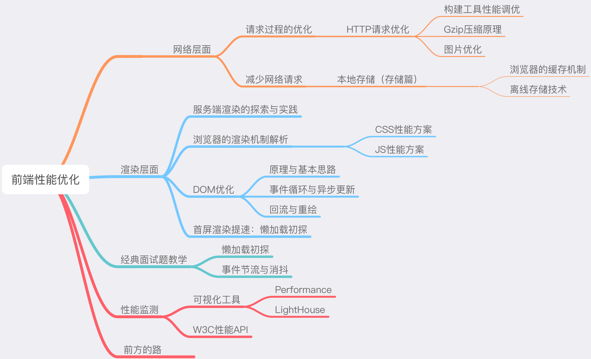

&nbsp;&nbsp;&nbsp;&nbsp; 前端性能优化是个很大的概念，涉及HTTP协议、浏览器渲染原理、操作系统和网络、前端工程化和Js底层原理等各个方面。通过建立思维导图可以让我们很好的将各个优化方面组织和联系起来。  
&nbsp;&nbsp;&nbsp;&nbsp; 按照优化原理的不同则可以将其分为`网络层面优化`和`渲染层面`的优化，网络层面的优化更多体现在资源加载时的优化，而渲染层的优化更多体现在运行时优化。  
&nbsp;&nbsp;&nbsp;&nbsp; 例如优化浏览器缓存策略以减少HTTP请求传输量、图片和其它静态资源的压缩、服务器端启用Gzip压缩、使用CDN、图片懒加载、延迟脚本Defer和异步脚本Async等属于网络层面的优化。另一方面，减少页面的回流和重绘、使用React.Fragment减少界面dom层级、使用骨架屏、函数节流和去抖、React长列表组件优化、通过事件冒泡机制实现事件委托等就属于渲染层面的优化。

[ >> 文章链接](https://nojsja.gitee.io/blogs/2021/02/07/%E5%89%8D%E7%AB%AF%E6%80%A7%E8%83%BD%E4%BC%98%E5%8C%96%E6%8C%87%E5%8D%97-1/)

#### ➣ webpack性能优化方面


#### ➣ 服务器性能优化方面

#### ➣ 弱网环境下页面首屏如何快速加载
方案：
1. 缓存的使用
2. SSR使用
3. 骨架屏使用

### X. 要点：操作系统和网络
-------------

#### ➣ 常见的网页攻击方式，如何防范

<details>
<summary>点击展开查看</summary>

##### 1. XSS：跨站脚本攻击(Cross-site scripting)
&nbsp;&nbsp;&nbsp;&nbsp; 它允许使用者恶将代码恶意注入到网页上，属于代码注入的一种攻击方式，常通过HTML和Javascript进行注入攻击成功后，攻击者可能获取网站更高的操作权限、私密网页信息、会话和cookie等各种内容。

1）常用的XSS攻击手段和目的有：

- 盗用cookie，获取敏感信息。
- 利用植入Flash，通过crossdomain权限设置进一步获取更高权限；或者利用Java等得到类似的操作。
- 利用iframe、frame、XMLHttpRequest或上述Flash等方式，以（被攻击）用户-的身份执行一些管理动作，或执行一些一般的如发微博、加好友、发私信等操作。
- 利用可被攻击的域受到其他域信任的特点，以受信任来源的身份请求一些平时不允许的操作，如进行不当的投票活动。
- 在访问量极大的一些页面上的XSS可以攻击一些小型网站，实现DoS攻击的效果。

2）防范手段：

- 将使用者所提供的内容进行过滤，许多语言都有提供对HTML的过滤：
>PHP的htmlentities()或是htmlspecialchars()；Python的cgi.escape()；
ASP的Server.HTMLEncode()；ASP.NET的Server.HtmlEncode()或功能更强的Microsoft Anti-Cross Site Scripting Library 页面存档备份，存于互联网档案馆；Java的xssprotect (Open Source Library) 页面存档备份，存于互联网档案馆；Node.js的node-validator。

- 很多时候可以使用HTTP头指定内容的类型，使得输出的内容避免被作为HTML解析。如在PH
```php
<?php
   header('Content-Type: text/javascript; charset=utf-8');
?>
```
##### 2. XSRF：跨站请求伪造(Cross-site request forgery)
&nbsp;&nbsp;&nbsp;&nbsp; 攻击者通过一些技术手段欺骗用户的浏览器去访问一个自己曾经认证过的网站并运行一些操作（如发邮件，发消息，甚至财产操作如转账和购买商品）。由于浏览器曾经认证过，所以被访问的网站会认为是真正的用户操作而去运行。

1）攻击示例：
- 假如一家银行用以运行转账操作的URL地址如下： https://bank.example.com/withdraw?account=AccoutName&amount=1000&for=PayeeName，
那么，一个恶意攻击者可以在另一个网站上放置如下代码：``。如果有账户名为Alice的用户访问了恶意站点，而她之前刚访问过银行不久，登录信息尚未过期，那么她就会损失1000资金。

2）防范措施：

- 令牌同步模式  
&nbsp;&nbsp;&nbsp;&nbsp; 令牌同步模式（英语：Synchronizer token pattern，简称STP）。原理是：当用户发送请求时，服务器端应用将令牌（英语：token，一个保密且唯一的值）嵌入HTML表格，并发送给客户端。客户端提交HTML表格时候，会将令牌发送到服务端，令牌的验证是由服务端实行的。令牌可以通过任何方式生成，只要确保随机性和唯一性。这样确保攻击者发送请求时候，由于没有该令牌而无法通过验证。  
&nbsp;&nbsp;&nbsp;&nbsp; STP能在HTML下运作顺利，但会导致服务端的复杂度升高，复杂度源于令牌的生成和验证。因为令牌是唯一且随机，如果每个表格都使用一个唯一的令牌，那么当页面过多时，服务器由于生产令牌而导致的负担也会增加。而使用session会话等级的令牌代替的话，服务器的负担将没有那么重。
Django框架默认带有STP功能：
```html
<form method="post">
    
</form>
渲染后的效果如下：
<form method="post">
    <input type="hidden" name="csrfmiddlewaretoken" value="KbyUmhTLMpYj7CD2di7JKP1P3qmLlkPt" />
</form>
```

- 检查Referer字段  
&nbsp;&nbsp;&nbsp;&nbsp; HTTP头中有一个Referer字段，这个字段用以标明请求来源于哪个地址。在处理敏感数据请求时，通常来说，Referer字段应和请求的地址位于同一域名下。以上文银行操作为例，Referer字段地址通常应该是转账按钮所在的网页地址，应该也位于bank.example.com之下。而如果是CSRF攻击传来的请求，Referer字段会是包含恶意网址的地址，不会位于bank.example.com之下，这时候服务器就能识别出恶意的访问。  
这种办法简单易行，工作量低，仅需要在关键访问处增加一步校验。但这种办法也有其局限性，因其完全依赖浏览器发送正确的Referer字段。虽然http协议对此字段的内容有明确的规定，但并无法保证来访的浏览器的具体实现，亦无法保证浏览器没有安全漏洞影响到此字段。并且也存在攻击者攻击某些浏览器，篡改其Referer字段的可能。
 
- 添加校验token  
&nbsp;&nbsp;&nbsp;&nbsp; 由于CSRF的本质在于攻击者欺骗用户去访问自己设置的地址，所以如果要求在访问敏感数据请求时，要求用户浏览器提供不保存在cookie中，并且攻击者无法伪造的数据作为校验，那么攻击者就无法再运行CSRF攻击。这种数据通常是窗体中的一个数据项。服务器将其生成并附加在窗体中，其内容是一个伪随机数。当客户端通过窗体提交请求时，这个伪随机数也一并提交上去以供校验。正常的访问时，客户端浏览器能够正确得到并传回这个伪随机数，而通过CSRF传来的欺骗性攻击中，攻击者无从事先得知这个伪随机数的值，服务端就会因为校验token的值为空或者错误，拒绝这个可疑请求。

</details>

#### ➣ 跨域的基本概念和解决方法，在项目中的实际应用

#### ➣ 强缓存和协商缓存，缓存的应用，如何用在页面性能优化上
&nbsp;&nbsp;&nbsp;&nbsp; 通过网络获取内容既速度缓慢又开销巨大。较大的响应需要在客户端与服务器之间进行多次往返通信，这会延迟浏览器获得和处理内容的时间，还会增加访问者的流量费用。因此，缓存并重复利用之前获取的资源的能力成为性能优化的一个关键方面。

[>> 文章链接](https://nojsja.gitee.io/blogs/2021/01/29/%E5%89%8D%E7%AB%AF123%EF%BC%9A%E6%B5%8F%E8%A7%88%E5%99%A8%E7%BC%93%E5%AD%98%E7%9A%84%E5%B7%A5%E4%BD%9C%E6%96%B9%E5%BC%8F/)

#### 爬虫方面问题，反爬如何实现，针对反爬的实现(IP代理等）

#### ➣ 进程和线程区别

&nbsp;&nbsp;&nbsp;&nbsp; 进程是资源分配的最小单位，线程是CPU调度的最小单位。

&nbsp;&nbsp;&nbsp;&nbsp; 做个简单的比喻：进程=火车，线程=车厢线程在进程下行进（单纯的车厢无法运行）
- 一个进程可以包含多个线程（一辆火车可以有多个车厢）
- 不同进程间数据很难共享（一辆火车上的乘客很难换到另外一辆火车，比如站点换乘）
- 同一进程下不同线程间数据很易共享（A车厢换到B车厢很容易）
- 进程要比线程消耗更多的计算机资源（采用多列火车相比多个车厢更耗资源）
- 进程间不会相互影响，一个线程挂掉将导致整个进程挂掉（一列火车不会影响到另外一列火车，但是如果一列火车上中间的一节车厢着火了，将影响到所有车厢）
- 进程可以拓展到多机，进程最多适合多核（不同火车可以开在多个轨道上，同一火车的车厢不能在行进的不同的轨道上）
- 进程使用的内存地址可以上锁，即一个线程使用某些共享内存时，其他线程必须等它结束，才能使用这一块内存。（比如火车上的洗手间）－"互斥锁"
- 进程使用的内存地址可以限定使用量（比如火车上的餐厅，最多只允许多少人进入，如果满了需要在门口等，等有人出来了才能进去）－“信号量”

#### ➣ cpu调度算法

#### ➣ 2台计算机底层之间如何通信 socket IO通信实现

#### ➣ cookie中常见的字段

#### ➣ 跨域和同源策略
&nbsp;&nbsp;&nbsp;&nbsp; 跨域是指一个域下的文档或脚本试图去请求另一个域下的资源，这里跨域是广义的，包括：
1. 资源跳转： a链接、重定向、表单提交
2. 资源嵌入： `<link>、<script>、、<frame>`等dom标签，还有样式中`background:url()、@font-face()`等外链地址
3. 脚本请求： js发起的ajax请求、dom和js对象的跨域操作等

&nbsp;&nbsp;&nbsp;&nbsp; 同源策略/SOP（Same origin policy）是一种约束，它是浏览器最核心也最基本的安全功能，如果缺少了同源策略，浏览器很容易受到XSS、CSFR等攻击。所谓同源是指当前访问页和目标请求页的"协议+域名+端口"三者相同，即便两个不同的域名指向同一个ip地址，也非同源。

\> **同源策略限制以下几种行为：**

1. Cookie、LocalStorage 和 IndexDB 无法读取
2. DOM 和 Js对象无法获得
3. AJAX 请求不能发送

\> **跨域解决方案：**
1. 通过jsonp跨域

&nbsp;&nbsp;&nbsp;&nbsp; 通常为了减轻web服务器的负载，我们把js、css，img等静态资源分离到另一台独立域名的服务器上，在html页面中再通过相应的标签从不同域名下加载静态资源，而被浏览器允许，基于此原理，我们可以通过动态创建script，再请求一个带参网址实现跨域通信。

&nbsp;&nbsp;&nbsp;&nbsp; 浏览器端：
```js
 <script>
    var script = document.createElement('script');
    script.type = 'text/javascript';

    /* 传参一个回调函数名给后端，方便后端返回时执行这个在前端定义的回调函数 */
    script.src = 'http://www.domain2.com:8080/login?user=admin&callback=handleCallback';
    document.head.appendChild(script);

    /* 回调执行函数 */
    function handleCallback(res) {
        alert(JSON.stringify(res));
    }

    /* jquery ajax 跨域 */
    $.ajax({
      url: 'http://www.domain2.com:8080/login',
      type: 'get',
      dataType: 'jsonp',  // 请求方式为jsonp
      jsonpCallback: "handleCallback",    // 自定义回调函数名
      data: {}
    });
 </script>
```
&nbsp;&nbsp;&nbsp;&nbsp; Node中间层：
```js
var querystring = require('querystring');
var http = require('http');
var server = http.createServer();

server.on('request', function(req, res) {
    var params = qs.parse(req.url.split('?')[1]);
    var fn = params.callback;

    // jsonp返回设置
    res.writeHead(200, { 'Content-Type': 'text/javascript' });
    res.write(fn + '(' + JSON.stringify(params) + ')');

    res.end();
});

server.listen('8080');
console.log('Server is running at port 8080...');
```

2. postMessage跨域

&nbsp;&nbsp;&nbsp;&nbsp; postMessage是HTML5 XMLHttpRequest Level 2中的API，且是为数不多可以跨域操作的window属性之一，它可用于解决以下方面的问题：

- 页面和其打开的新窗口的数据传递
- 多窗口之间消息传递
-  页面与嵌套的iframe消息传递

&nbsp;&nbsp;&nbsp;&nbsp; 用法：postMessage(data,origin)方法接受两个参数：
- 1）data： html5规范支持任意基本类型或可复制的对象，但部分浏览器只支持字符串，所以传参时最好用JSON.stringify()序列化。
- 2）origin： 协议+主机+端口号，也可以设置为"*"，表示可以传递给任意窗口，如果要指定和当前窗口同源的话设置为"/"。

1.）a.html：(http://www.domain1.com/a.html)
```js
<iframe id="iframe" src="http://www.domain2.com/b.html" style="display:none;"></iframe>
<script>       
    var iframe = document.getElementById('iframe');
    iframe.onload = function() {
        var data = {
            name: 'aym'
        };
        // 向domain2传送跨域数据
        iframe.contentWindow.postMessage(JSON.stringify(data), 'http://www.domain2.com');
    };

    // 接受domain2返回数据
    window.addEventListener('message', function(e) {
        alert('data from domain2 ---> ' + e.data);
    }, false);
</script>
```

2.）b.html：(http://www.domain2.com/b.html)
```js
<script>
    // 接收domain1的数据
    window.addEventListener('message', function(e) {
        alert('data from domain1 ---> ' + e.data);

        var data = JSON.parse(e.data);
        if (data) {
            data.number = 16;

            // 处理后再发回domain1
            window.parent.postMessage(JSON.stringify(data), 'http://www.domain1.com');
        }
    }, false);
</script>
```
3. 跨域资源共享（CORS

&nbsp;&nbsp;&nbsp;&nbsp; 普通跨域请求：只服务端设置Access-Control-Allow-Origin即可，前端无须设置，若要带cookie请求：前后端都需要设置。

&nbsp;&nbsp;&nbsp;&nbsp; 需注意的是：由于同源策略的限制，所读取的cookie为跨域请求接口所在域的cookie，而非当前页。

&nbsp;&nbsp;&nbsp;&nbsp; 目前，所有浏览器都支持该功能(IE8+：IE8/9需要使用XDomainRequest对象来支持CORS）)，CORS也已经成为主流的跨域解决方案。

4. nginx代理跨域
5. nodejs中间件代理跨域
6. WebSocket协议跨域

#### ➣ http中一些常见的响应头和请求头，有什么应用

#### ➣ 简单请求和非简单请求区别

#### ➣ http2.0 http3.0作了哪些优化

#### ➣ https建立连接过程

#### ➣ 计算机网络中，http地址，在7层协议中，如何一步步向下解析，从应用层到最底层的物理层，每一层处理的事情

### ＸI. 产品、项目和工程化

#### ➣ 项目怎么复盘？
&nbsp;&nbsp;&nbsp;&nbsp; 通俗地讲，就是对你所做事情的反思，可以是优点也可以是缺点。笔者进行复盘的出发点，一方面是想在一个项目中，有什么东西可以沉淀下来，下次做事情的时候可以直接用；二是这次有哪些地方做得不够好的地方下次有更大的进步空间。朝着这两个方向去提高自己。

&nbsp;&nbsp;&nbsp;&nbsp; 在项目结束一个星期左右的时候开始第一次的复盘比较合适。这个时候因为刚做完项目，很多实操的做法和过程都是清晰的，方便自己回忆起来。而且这个时候，头脑也会自动处于一种整理的状态，一般手上的活也不会很多，效率是最高的时候。

`复盘`-最普遍也是最通用的做法：回顾目标 -> 评估结果 —> 分析原因 —> 总结经验：
1. 回顾目标
   
- 1）当初行动的意图是什么？
- 2）事件想要达到的目标是什么？
- 3）预先制定的计划是什么？
- 4）事先设想要发生的事情是什么？

2. 评估结果
  - 1）实际发生了什么事？
  - 2）在什么情况下，是怎么发生的？
  - 3）与目标相比，哪些地方做得好？哪些未达预期？

3. 分析原因
  - 1）实际情况与预期有无差异？
  - 2）如果实际情况与预期有差异，那么，为什么会出现这些差异？是由哪些因素造成？根本原因是什么？
  - 3）如果实际情况与预期无差异，那么，成功的关键因素是什么？

4. 总结经验
  - 1）我们从过程中学到了什么新东西？
  - 2）如果有人进行同样的行动，我会给他什么建议？
  - 3）接下来我们该做什么？哪些是可以直接行动的？哪些是其他层级才能处理的？是否要向上级呈报？

### XII. 要点：Leetcode算法刷题
--------------

#### ➣ 考察重点

1. 各种算法考察概率

> 统计不是绝对的，请理性看待

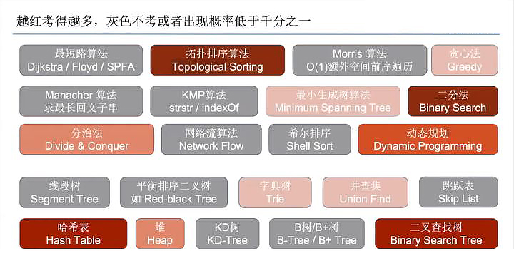

2. 公司考察频率

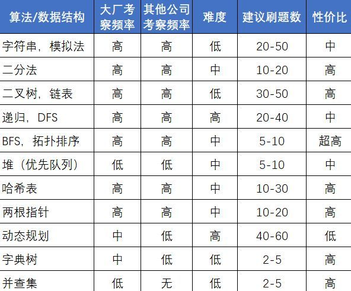

3. leetcode高频考题


- 2）哈希表


- 3）二分查找


- 4）回溯


- 5）字符串


- 6）贪心


- 7）动态规划


- 8）位运算
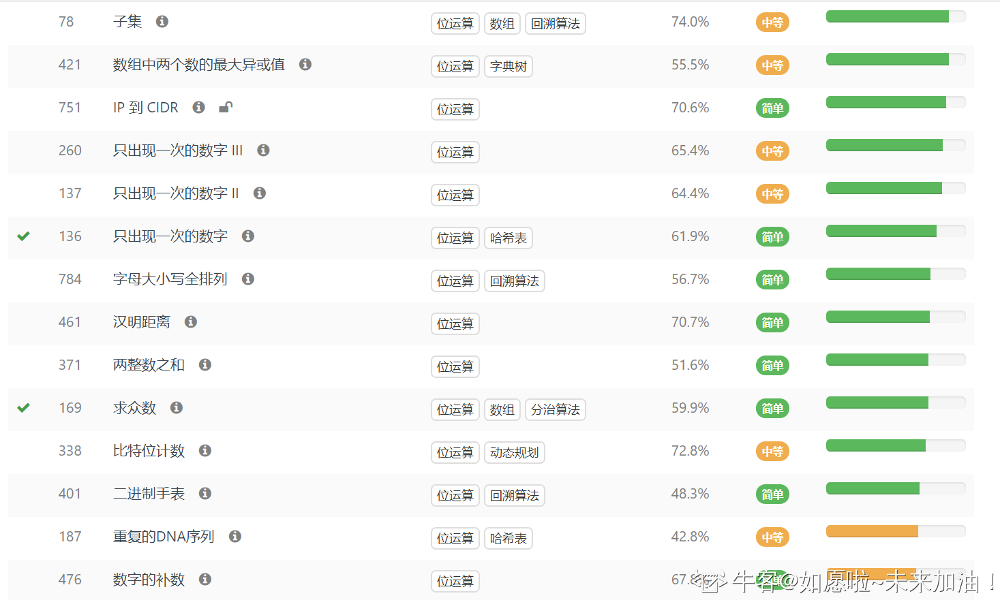

- 9）数学
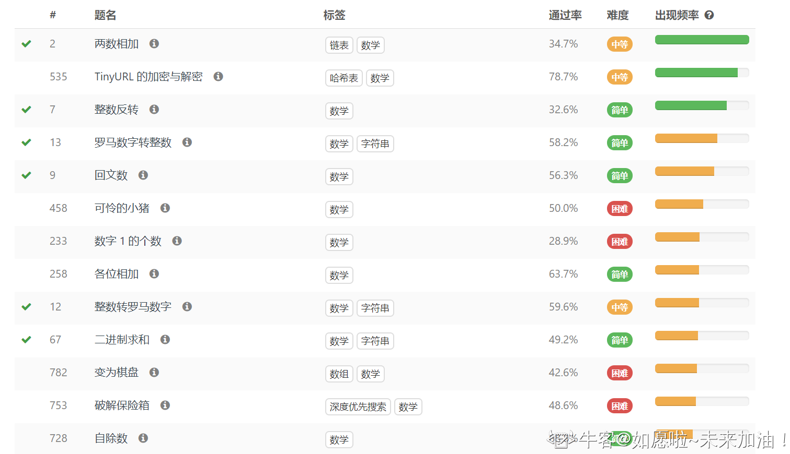

- 10）广度优先
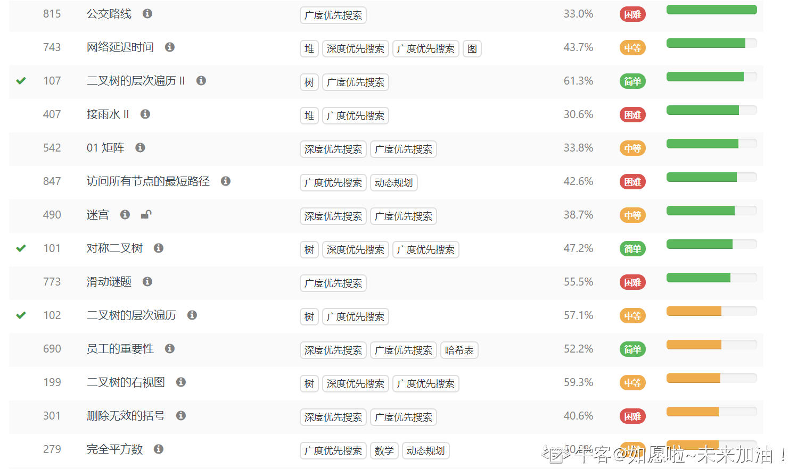

- 11）二分查找


- 12）深度优先
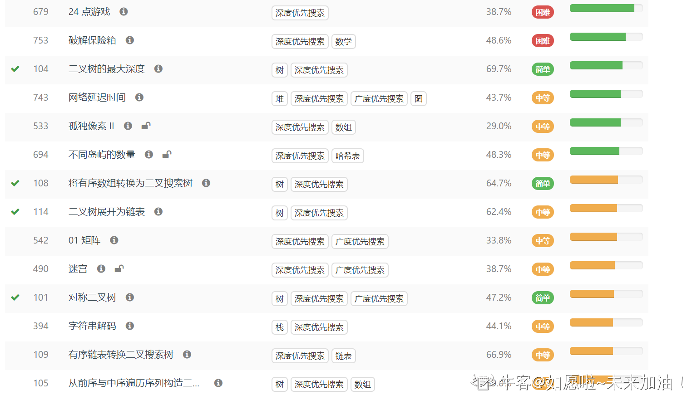

- 12）二叉树


#### ➣ 推荐作者和资源

1. [力扣加加算法题解](https://leetcode-solution-leetcode-pp.gitbook.io/leetcode-solution/thinkings)

2. [labuladong 的算法小抄](https://labuladong.gitee.io/algo/)