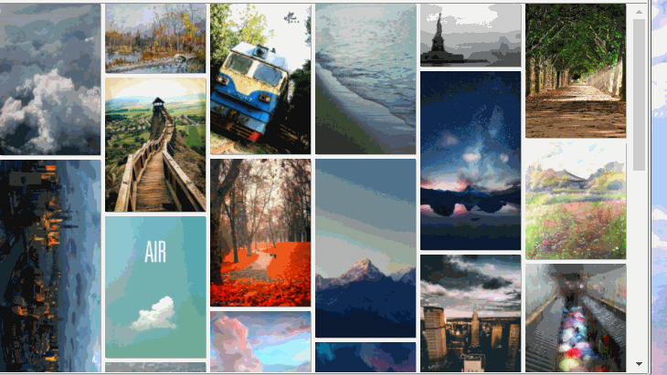
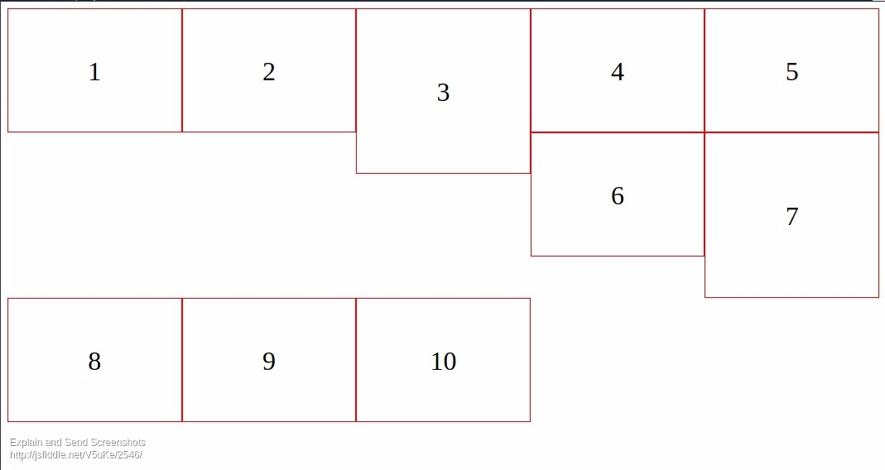

### 原生Js实现瀑布流效果
---------------------

#### 盗用的效果图


#### 效果分析
瀑布流中图片的宽度都是固定的，但是高度需要设置为auto以使图片不变形，高度不固定。首先想到能不能用float属性让图片流动，想象中很美好，实际效果如下，可以看到因为第三个元素的高度问题，第二行元素流动时被第三个元素挡住，导致了布局错乱。

  

看看百度图片是怎么实现图片布局的，如下图，可以看出百度用了讨巧的办法，图片跟我们这个瀑布流的图片的宽高设定正好相反，百度图片的列数同样固定，但是高度也固定，而宽度不固定，这样处理的话正好能避免上面那个float流动的问题，这个... 好吧 最后我们还是来说说怎样实现我们效果图中那样的瀑布流布局。

  

#### 解决方法

##### 先贴代码

* html结构如下，需要说明的是container元素是相对定位，每个item元素都是绝对定位，这样我们通过设置item元素的top和left值就能改变它们的位置了，图片的宽度是100%(这儿思考一下为什么img的父级需要设置box-sizing: border-box)。

```html
<!-- 页面结构 -->
<div class="water-fall-container">
  <div class="water-fall-item">
    
  </div>
  ...
  <div class="water-fall-item">
    
  </div>
</div>

```

* 我把主要逻辑写成了构造函数的形式，这样一个页面中通过传入不同的参数就能创建多个瀑布流实例。构造函数中我们依次需要传入容器元素本身、子元素的选择器(.water-fall-item)、
每一列自定义的宽度(单位是px)、图片之间间隔的距离(实际上是padding-right 和 padding-bottom 的值，单位px)，通过这些指标我们首先能够计算出容器元素的宽度，
(容器宽度 / 列宽) === 总共的列数，最后在step函数里就是布局的代码了，step做的事儿就是遍历容器元素下的每个item元素，设置它们的宽度、高度、top值、left值以及padding值，
其中第一行元素top值固定为零，left值依次根据数组下标再乘以列宽，到了第二行之后的元素就省事儿了，直接设置当前元素的top值为 对应的那个上一排元素的top值+上一排元素的高度值(clientHeight)，而left值每一排都相同，因为列宽和列数是固定的。

```javascript

/**
 * [WaterFall 图片瀑布流构造函数]
 * @param  {DomElement} father   [瀑布流的容器元素]
 * @param  {String} childClass   [瀑布流子元素类名选择器 如: .water-fall-item]
 * @param  {Number} columnWidth  [设定每一列的宽度，单位: px]
 * @param  {Number} paddingWidth [设定图片之间的间隔距离， 单位: px]
 */
function WaterFall(father, childClass, columnWidth, paddingWidth) {
  this.$container = father;  // 容器
  this.childSelector = childClass;  // 子代img选择器
  this.children = [];  // 子代img
  this.columnWidth = columnWidth;  // 单列宽度
  this.paddingWidth = paddingWidth + 'px';  // 图片之间的间隔距离

  this.totalWidth = this.$container.clientWidth;  // 容器宽度
  this.columnNum = ~~(this.totalWidth / this.columnWidth);  // 列数

  // 调用多次
  this.step = function () {
    this.totalWidth = this.$container.clientWidth;
    this.columnNum = ~~(this.totalWidth / this.columnWidth);
    this.children = this.$container.querySelectorAll(this.childSelector);
    for (var i = 0; i < this.children.length; i++) {
      this.children[i].style.width = this.columnWidth + 'px';
      this.children[i].style.height = 'auto';
      this.children[i].style.paddingRight = this.paddingWidth;
      this.children[i].style.paddingBottom = this.paddingWidth;

      // 每行第一个设置左padding
      if (i % this.columnNum === 0) {
        this.children[i].style.paddingLeft = this.paddingWidth;
      }

      // 第一行 和 其它行的不同处理
      if (i < this.columnNum) {
        this.children[i].style.left = (i) * this.columnWidth + 'px';
        this.children[i].style.top = (i) * 0 + 'px';
      }else {
        this.children[i].style.left = this.children[i - this.columnNum].style.left;
        this.children[i].style.top = +this.children[i - this.columnNum].style.top.replace('px', '') +
                                      this.children[i - this.columnNum].clientHeight + 'px';
      }
    }
  };
};

```

* 再看看从页面图片加载到生成瀑布流实例我是怎样处理的，前面部分先通过一组图片url地址将所有图片加载到页面上，中间设定参数后生成一个瀑布流实例，最后重点是
弄清楚我们需要在什么时候调用waterfall.step()函数来处理页面中item元素的重排。我可能用了个比价笨的办法：在所有图片加载完成之前 使用定时器 轮询每个图片的加载情况，并进行布局，所有图片加载完后就取消定时器。最后别忘记 窗口拖动后也要重新布局，在这儿我用了一个函数节流的思想，防止resize短时间内多次触发，改善页面性能，至于节流函数怎么写，大家可以看看相关概念然后自己实现一个，so easy !

```javascript

/**
 * [waterFallInit 瀑布流初始化]
 * @param  {String} wData [图片url的数组]
 */
var waterFallInit = function (wData) {
  var fragment = document.createDocumentFragment();
  var div, img, timer, $imgs, length, index = 0;
  // 载入图片
  for (var i = 0; i < wData.length; i++) {
    div = document.createElement('div');
    img = document.createElement('img');
    div.setAttribute('class', 'water-fall-item');
    img.setAttribute('src', wData[i]);
    div.appendChild(img);
    fragment.appendChild(div);
    if (i === wData.length - 1) {
      domMap.$waterFall.appendChild(fragment);
    }
  }

  // 一个瀑布流实例
  var waterfall = new WaterFall(domMap.$waterFall, '.water-fall-item', 200, 5);

  // 轮询所有图片的加载状态
  timer = setInterval(function () {
    index=0;
    $imgs = domMap.$waterFall.querySelectorAll('.water-fall-item > img');
    length = $imgs.length;
    // 统计图片加载完成的数量
    for (var i = 0; i < $imgs.length; i++) {
      if ($imgs[i].complete) {
        if (++index === length) clearInterval(timer);
      }
    }
    waterfall.step();
  }, 250);

  // 窗口拖动
   window.onresize =  function () {
     Utils.FnDelay(function () {
       waterfall.step();
     }, 800);
   }
};

```

##### 感谢阅读
_代码存放在github：[nojsja](https://github.com/NoJsJa/javascript-learning/tree/master/normal/water-fall-layout)_
