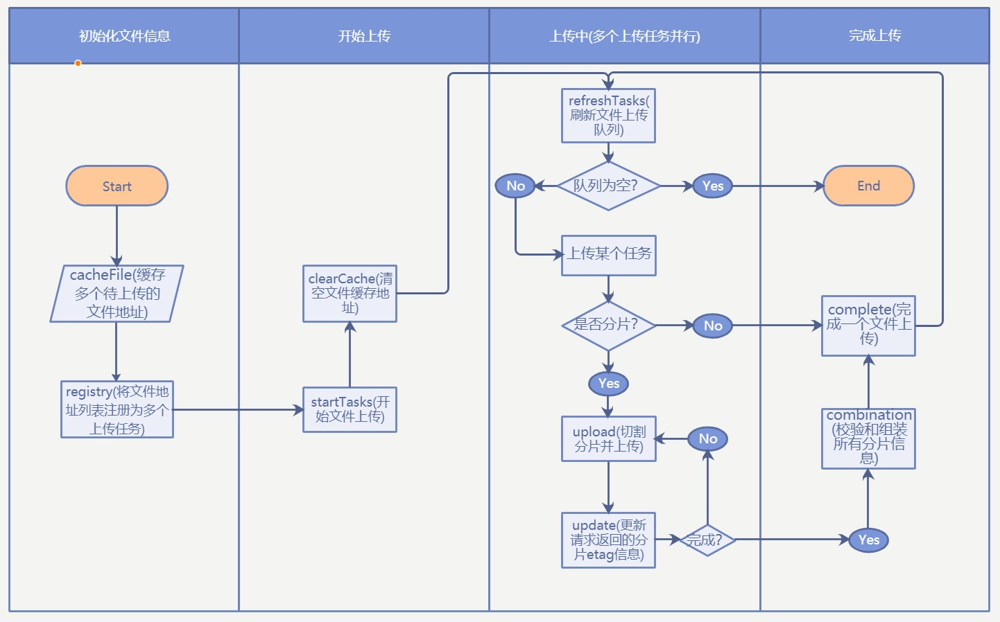

#

## 基于s3对象存储多文件分片上传的Javascript实现

### Contents

1. 概述

2. 浏览器文件操作限制

3. 前端多文件分片上传的原理和实现

### 预览


### 概述

Amazon S3 提供了一个简单 Web 服务接口，可用于随时在 Web 上的任何位置存储和检索任何数量的数据。此服务让所有开发人员都能访问同一个具备高扩展性、可靠性、安全性和快速价廉的数据存储基础设施， Amazon 用它来运行其全球的网站网络。此服务旨在为开发人员带来最大化的规模效益。  
本文主要针对兼容aws-s3接口的第三方存储服务，在不使用官方sdk的情况下直接使用Restful接口进行存储桶多文件分片上传，主要包含浏览器端的多文件分片上传逻辑的Javascript代码实现。

### 浏览器文件操作限制

* HTML5新特性`input[type=file]`支持调用浏览器文件访问窗口来获取文件数据，实际上JS代码使用此特性访问本地文件系统后拿到的是一个指向文件的引用地址，且如果页面刷新了那么这个地址不可复用，JS代码并没有实际操作文件本身。前端上传数据时根据这个指向文件的地址把文件的一小块分片数据载入到内存并通过Ajax请求发送到中间件进行处理。
* 浏览器JS代码没有文件系统操作权限，不能任意存储和读取文件，因此不支持刷新浏览器后上传进度断点恢复，刷新之后断点恢复的前提是能拿到文件数据，但是JS代码没权限访问之前拿到的文件引用地址，并且存储之前上传过的文件分片数据这一做法也不合理。 
* 相对于文件上传，文件下载则完全不可控，由于文件操作权限，所以整个下载文件操作都是由浏览器自带的的下载任务管理器控制的，没有浏览器接口能拿到这些下载任务进度，所以下载任务进度也是不能获取的。

### 前端多文件分片上传的原理和实现

_完整Github[源码](https://github.com/NoJsJa/javascript-learning/tree/master/file-slice-upload)_

> 使用了React16/Webpack4/Mobx状态管理库

* 支持批量文件分割并行上传
* 多文件操作：暂停/恢复/终止/续传/重传
* 自定义上传任务数目、单个分片大小

#### 运行流程图



#### 主要流程

1. cacheFile  
前端通过input组件拿到所有文件地址并缓存起来。
```js
 /**
   * [cacheFile 缓存即将注册的文件]
   */
  @action
  cacheFile = (files, bucket) => {
    const symbolArr = this.filesCache.map(file => this.getSymbol(file));
    const filtedFiles = [];
    let uploadingFileFound = false;
    files.forEach((file) => {
      if (!symbolArr.includes(this.getSymbol(file))) {
        if (this.findIsUploading(this.getSymbol(file), bucket)) {
          uploadingFileFound = true;
          filtedFiles.push(file.name);
        } else {
          this.filesCache.push(file);
          symbolArr.push(this.getSymbol(file));
        }
      }
    });
    if (!files.length) openNotification('warning', null, this.lang.lang.noFilCanBeUploaded);
    if (uploadingFileFound) openNotification('warning', null, this.lang.lang.uploadingFileReuploadTips + filtedFiles.join(', '));
  }
```

2. registry  
根据上一步拿到的文件地址数组创建多个Mobx observable对象跟踪每个上传对象的基本识别信息，包括文件名、文件大小、类型、分片信息(分片大小和总分片数)、上传状态信息：uninitial(未初始化)/pending(准备)/uploading(上传中)/pause(暂停)/error(错误)/break(上传完成)、上传开始时间、上传完成时间，为了便于访问这些Mobx observable对象，建立一个weakMap存储file对象和observable对象的弱映射关系。
```js
/**
   * [registry 注册上传文件信息]
   * @param {[Object]} file [文件对象]
   * @param {[String]} uploadId [文件上传进程id]
   * @param {[Object]} state [文件初始化状态]
   */
  @action registry = (files, region, prefix) => {
    let fileObj = null;
    this.loading = true;
    files.forEach((file) => {
      if (this.files.includes(file)) {
        return;
      }
      this.files.push(file);
      fileObj = {
        name: file.webkitRelativePath || file.name,
        prefix: prefix || '',
        size: file.size,
        type: file.type || mapMimeType((file.webkitRelativePath || file.name).split('.').pop()).type,
        state: 'uninitial',
        creationTime: '',
        completionTime: '',
        index: 0,
        file,
        initialized: false,
        partEtags: [],
        region,
        blockSize: this.blockSize,
        total: Math.ceil(file.size / this.blockSize),
        activePoint: new Date(),
        speed: '0 MB/S',
        id: encodeURIComponent(new Date() + file.name + file.type + file.size),
      };
      this.taskType.uninitial.push(file);
      this.taskType.series.push(file);
      const obj = observable(fileObj);
      if (!this.fileStorage.get(region)) {
        this.fileStorage.set(region, [obj]);
      } else {
        this.fileStorage.get(region).push(obj);
      }
      this.fileStorageMap.set(file, obj);
    });
    this.loading = false;
  }
```

3. startTasks  
获取文件队列中可用于上传的文件对象，根据文件状态对其做初始化或切割文件上传的操作，同时实时修改对应的Mobx observable上传对象的元数据标识，包括当前上传文件的分片索引(单个文件上传进度=分片索引/总分片数目)、已上传完成的分片etag信息(由服务器返回，可用于完成分片上传时校验已上传的所有分片数据是否匹配)、当前上传对象4的上传状态(uninitial/pending/uploading/pause/eror/break)、当前上传对象的上传速度(速度=单个分片大小/单个分片上传所用时间)。
```js
/**
   * [startTasks 开启上传任务队列]
   * @param  {[String]} region [桶名]
   */
  startTasks = (region) => {
    // 根据空闲任务类型和空闲任务并发限制开启空闲任务
    this.refreshTasks(region);
    if (this.isUploadListEmpty(region)) return;

    const maxLength = this.multiTaskCount - this.taskType.uploading.length;
    const taskSeries = [];
    for (let i = 0; i < (maxLength) && this.taskType.series[i]; i += 1) {
      // const file = this.taskType.series.shift();
      const file = this.taskType.series[i];
      const storageObject = this.fileStorageMap.get(file);
      if (storageObject.state === 'uploading') continue; // 上传中
      if (storageObject.state === 'pause') continue;
      taskSeries.push(storageObject);
    }

    let index;
    taskSeries.forEach((storageObject) => {
      index = this.taskType.series.indexOf(storageObject.file);
      index !== -1 && this.taskType.series.splice(index, 1);
      if (this.taskType.uninitial.includes(storageObject.file)) {
        this.initRequest(
          storageObject.file,
          {
            bucket: region,
            object: storageObject.name,
            prefix: storageObject.prefix,
          }
        ).then(({ err, init }) => {
          if (!err && init) {
            this.upload(storageObject.file, {
              bucket: region,
              object: storageObject.name,
              prefix: storageObject.prefix,
              uploadId: storageObject.uploadId,
            });
          }
        });
      } else {
        this.upload(storageObject.file, {
          bucket: region,
          object: storageObject.name,
          prefix: storageObject.prefix,
          uploadId: storageObject.uploadId,
        });
      }
    });
  }
```

4. refreshTasks  
根据当前设置的并行上传任务数目和正在上传的任务数目及时从文件预备上传队列提取文件放入上传可调用文件队列。
```js
/* 刷线任务列表 */
  @action
  refreshTasks = (region) => {
    // 统计空闲任务
    const storageObject = this.fileStorage.get(region);
    if (!storageObject) return;
    for (let i = 0; i < storageObject.length; i += 1) {
      if (
        storageObject[i].index !== storageObject[i].total
        && (storageObject[i].state === 'pending'
        || storageObject[i].state === 'uninitial')
      ) {
        const { file } = storageObject[i];
        if (!this.taskType.series.includes(file)) {
          this.taskType.series.push(file);
        }
      }
    }
  }
```

5. upload & update  
根据当前文件对象的上传分片索引对文件进行切割并更新索引，然后把切割下来的数据通过Ajax请求发送给中间件处理，中间件发送到后台后返回得到的当前分片的etag信息，前端拿到etag信息并存储到当前上传对象分片etag信息数组里面。
```js
/**
   * [upload 分割文件发起上传请求]
   * @param  {[Object]} file    [description]
   * @param  {[Object]} _params [...]
   * @param  {[String]}   _params.bucket [bucket name]
   * @param  {[String]}   _params.object [object name]
   * @param  {[String]}   _params.uploadId [upload id]
   */
  @action
  upload = (file, _params) => {
    const storageObject = this.fileStorageMap.get(file);
    let single = false; // 不分片
    /* 异常状态退出 */
    if (!this.isValidUploadingTask(storageObject)) return;

    if (storageObject.state === 'pending') {
      this.taskType.pending.splice(this.taskType.pending.indexOf(file), 1);
      this.taskType.uploading.push(file);
      storageObject.state = 'uploading';
    }


    const num = storageObject.index;

    if (num === 0 && file.size <= storageObject.blockSize) {
      // 不用分片的情况
      single = true;
    } else if (num === storageObject.total) {
      // 所有分片都已经发出
      return;
    }
    const nextSize = Math.min((num + 1) * storageObject.blockSize, file.size);
    const fileData = file.slice(num * storageObject.blockSize, nextSize);
    const params = Object.assign(_params, {
      partNumber: num + 1,
    });
    storageObject.activePoint = new Date();
    this.uploadRequest({ params, data: fileData, single }).then((rsp) => {
      if (rsp.code !== 200) {
        openNotification('error', null, (rsp.result.data ? rsp.result.data.Code : this.lang.lang.uploadError));
        this.markError(file);
        this.startTasks(params.bucket);
        return;
      }
      const { completed, etags } = this.update({
        region: params.bucket,
        etag: rsp.result.etag,
        size: fileData.size,
        id: storageObject.id,
        index: params.partNumber,
      });
      if (completed) {
        (single ?
          () => {
            this.complete(file, params.bucket);
          } :
          (partEtags) => {
            this.completeRequest({
              bucket: params.bucket,
              uploadId: params.uploadId,
              object: params.object,
              prefix: params.prefix,
              partEtags,
            }, file);
          })(etags);
      } else {
        this.upload(file, {
          bucket: params.bucket,
          object: params.object,
          uploadId: params.uploadId,
          partNumber: params.partNumber,
          prefix: params.prefix,
        });
      }
    }).catch((error) => {
      this.markError(file);
      this.startTasks(params.bucket);
      console.log(`${params.bucket}_${params.object} upload error: ${error}`);
    });
    storageObject.index += 1;
  }

```

7. complete  
当最后一个分片上传请求完成返回后，我们就拿到了服务端返回的这个文件的所有分片etag信息，前端需要校验当前上传对象etag数组的长度是否匹配，数组内每个etag元素的索引和etag值是否匹配，校验完成后发送最后一个请求到后端进行校验和组装分片，最终完成一个文件的分片上传过程。
```js
/**
   * [completeRequest 完成所有分片数据上传]
   * @param  {[Object]} _params [...]
   * @param  {[String]}   _params.bucket [bucket name]
   * @param  {[String]}   _params.object [object name]
   * @param  {[String]}   _params.uploadId [upload id]
   * @param  {[String]}   _params.partEtags [upload id]
   * @param  {[Object]} file [文件对象]
   */
  @action completeRequest = (params, file) => {
    postDataPro(
      {
        ...{
          ...params,
          ...{
            object: params.prefix + params.object,
          },
        },
        partEtags: {
          CompleteMultipartUpload: {
            Part: params.partEtags.map(info => ({
              PartNumber: info.number,
              ETag: info.etag,
            })),
          },
        },
      },
      objectResourceApi.object.completeFragmentUpload
    ).then((data) => {
      this.complete(file, params.bucket);
    }).catch((error) => {
      this.startTasks(params.bucket);
      this.markError(file);
    });
  }

  /**
   * [complete 完成上传]
   * @param {[Object]} file [文件对象]
   * @param {[String]} bucket [桶名]
   */
  @action
  complete = (file, bucket) => {
    const index = this.taskType.uploading.indexOf(file);
    this.taskType.uploading.splice(index, 1);
    this.taskType.break.push(file);
    const storageObject = this.fileStorageMap.get(file);
    storageObject.completionTime = (new Date().toTimeString()).split(' ')[0];
    storageObject.state = 'break';
    storageObject.index = storageObject.total;

    this.startTasks(bucket);
  };

```

#### 其它操作

1. 暂停文件上传  
将上传对象的状态从uploading置为pause，然后把该对象对应的文件从可调用上传文件队列移除。

2. 开始暂停的上传任务  
将上传对象的状态从pause置为pending，然后把该对象对应的文件放入可调用上传文件队列，等待下一次刷新文件上传任务队列。

3. 续传上传错误的任务
将上传对象的状态从error置为pending，然后把该对象对应的文件放入可调用上传文件队列，保持文件的已上传分片索引记录，等待下一次刷新文件上传任务队列，直接调用上传函数进行切割并上传。

4. 重传上传错误的任务
将上传对象的状态从error置为pending，然后把该对象对应的文件放入可调用上传文件队列，并将文件已上传分片索引记录置为初始状态，等待下一次刷新文件上传任务队列，从文件初始位置重新开始切割文件并上传。

#### 一些关键代码

1. 一个分片上传完成后将后台返回的etag信息更新到本地的上传对象属性，并判断此文件是否上传完成。
```js
/**
   * [update 更新本地上传记录]
   * @param {[String]} region [桶名]
   * @param {[String]} etag [分片标志]
   */
  @action
  update = ({
    region, etag, size, id, index,
  }) => {
    const target = this.fileStorage.get(region);
    for (let i = 0; i < target.length; i += 1) {
      if (target[i].id === id) {
        target[i].speed = `${(size / 1024 / 1024 / (((new Date() - target[i].activePoint) / 1000))).toFixed(2)} MB/S`;
        if (target[i].speed === '0.00 MB/S') {
          target[i].speed = `${formatSizeStr(size)}/S`;
        }
        target[i].partEtags = target[i].partEtags.filter(etagItem => etagItem.number !== index);
        target[i].partEtags.push({
          number: index,
          etag,
        });
        // 最后一个分片恰好又暂停的情况
        if (index === target[i].total) {
          if (target[i].state === 'pause') {
            index -= 1;
          }
        }
        // 判断上传是否完成
        if (target[i].total === 0 || target[i].partEtags.toJS().length === target[i].total) {
          return {
            completed: true,
            etags: target[i].partEtags,
          };
        }
        return {
          completed: false,
        };
      }
    }
  }
```