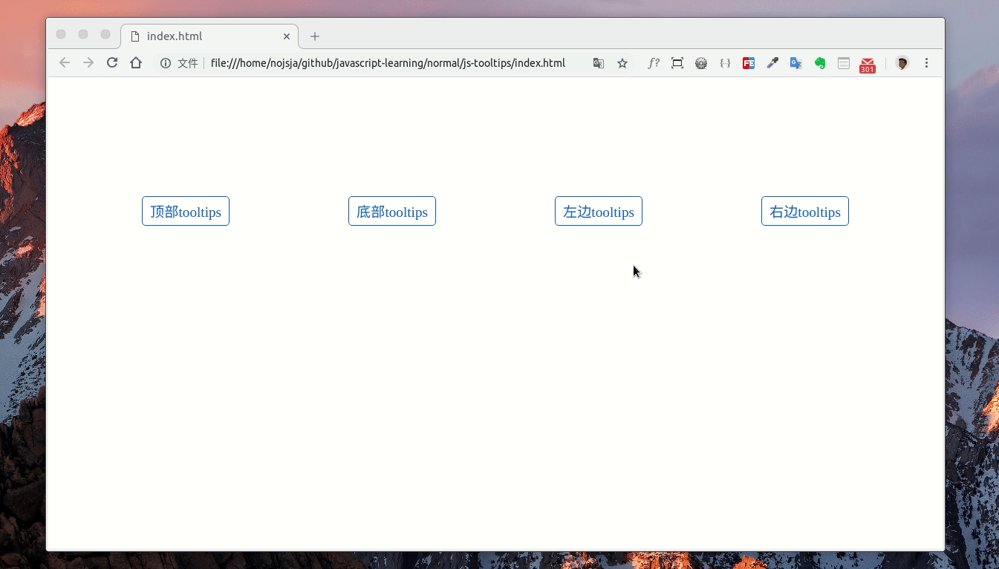

### 用Javascript实现一个可自定义样式的tootips组件

#### 前言

> 最近做的一个jQuery老项目经常会用tootips组件在一个html元素周围显示提示信息，虽然有现成的组件可以使用，但是很多tootips组件处理起来并不灵活，不能够自定义tootips样式和显示的内容及布局等等，而且tootips组件本身的样式可能会被目标组件的样式影响，所以想自己实现一个tootips组件：可以自定义显示内容，并且tootips的位置和布局完全不受页面元素影响。

#### 预览图
----------------

[=> 源代码](https://github.com/NoJsJa/javascript-learning/tree/master/normal/js-tooltips)



#### 代码实现
------------

##### 组件结构
```js
 var Tootips = (function () {

   /**
    * [renderPage 构造html]
    */
   function renderPage($selector) {
     ...
     return $wrapper;
   };

   /**
    * [renderHtml 使用html字符串进行初始化]
    */
   function init(_$selector, _options) {
     ...
     eventListen($selector, trigger);
   }

   /**
    * [eventListen 进行事件监听]
    */
   function eventListen($selector, trigger) {
     // 显示
     var showTootips = function ($selector) {
     };
     // 隐藏
     var hideTooTips = function ($selector) {
     };
     // click事件监听
     (trigger === 'click') &&  $selector.on(trigger, function () {
       if (!$selector.data('isActivated')) {
         showTootips($selector);
       }else {
         hideTooTips($selector);
       }
     });
     // 鼠标事件监听
     (trigger === 'mouseover') &&
        $selector.on('mouseout', function () {
          hideTooTips($selector);
        }).on('mouseover', function () {
          showTootips($selector);
     });
   }

   return {
     init: init,
   }
 })();

```

##### 初始化一个元素
> 对一个html元素进行初始化，在元素上绑定数据和设置事件监听器

```js
/**
 * [renderHtml 使用html字符串进行初始化]
 * @param  {[$Object]} $selector [一个页面元素]
 * @param  {[String]} htmlstr   [html字符串]
 * @param  {[Object]} options   [自定义参数]
 */
function init(_$selector, _options) {

  var $selector = (typeof _$selector === 'object') ? _$selector : $(_$selector);
  var trigger = _options['trigger'] ? _options['trigger'] : 'mouseover'; // click | hover
  $selector
   .data('tootip-target', _options.value)
   .data('tootip-type', _options.type)
   .data('tootip-options', _options)
   .css('cursor', 'pointer');

  eventListen($selector, trigger);
}
```

##### 根据传入属性创建tootips组件
* 使用`getBoundingClientRect()`方法获取目标组件的位置和宽高
* tootips组件根据获取的位置和宽高进行窗口定位(`position: fixed`)
* 根据传入的属性设置tootips组件的样式
* 返回一个jQuery元素

```js
/**
 * [renderPage 构造html]
 * @param  {[Object]} options   [自定义参数]
 * @param  {[String]} type   [渲染类型 -> text | html]
 * @param  {[String]} target   [渲染字符串]
 */
function renderPage($selector) {
  var type = $selector.data('tootip-type'),
     options = $selector.data('tootip-options'),
     target = $selector.data('tootip-target');
  // 提取属性
  var randomKey = String(Math.random() + Math.random()).split('.').pop();
  var $wrapper = $('<div></div>');
  var cssStyle = options.style || {};
  var styleSheet = options.css || '';
  var direction = options.direction || 'top';
  var rect = $selector[0].getBoundingClientRect();

  // 根据宿主元素第一次计算横坐标和纵坐标
  var renderX = function (r, d) {
    if (d === 'top' || d === 'bottom')
      return (r.x + r.width / 2 + 'px');
    if (d === 'left')
      return (r.x - 6 + 'px');
    if (d === 'right')
      return (r.x + r.width + 6 + 'px');
  };

  var renderY = function (r, d) {
    if (d === 'top')
      return (r.y - 6 + 'px');
    if (d === 'left' || d === 'right')
      return (r.y + r.height / 2 + 'px');
    if (d === 'bottom')
      return (r.y + r.height + 6 + 'px');
  };

  $wrapper
   .css('position', 'fixed')
   .css('left', renderX(rect, direction))
   .css('top', renderY(rect, direction))
   .attr('key', randomKey)
   .addClass(styleSheet);
  $selector.attr('key', randomKey);

  Object.keys(cssStyle).forEach(function (attr) {
    $wrapper.css(attr, cssStyle[attr]);
  });

  $wrapper.append(type === 'html' ? $(target) : $('<span>' + target +'</span>'));

  return $wrapper;
};
```

##### 绑定事件监听器
> 对一个元素进行初始化后需要给tooltips组件绑定监听器(`click`或`mouse`事件)，让tootips组件能够响应鼠标的点击或是划过

* 实现showTootips方法  
在tootips组件中可以自定义显示html内容或text内容，tootips组件被添加到页面之前，tootips组件的宽度和高度是不可获取的，所以在show方法中需要对tootips元素进行二次定位，同样使用`getBoundingClientRect()`方法获取tootips元素坐标和宽高。

* 实现hideTootips方法  
hide方法的作用是将当前元素对应的tootips组件从页面移出，之前初始化的时候在目标元素和生成的tootips元素上设置了同一个`key`属性，现在可以根据`key`来移除每个目标元素对应的tootips元素。

```js
/**
 * [eventListen 进行事件监听]
 * @param  {[$Object]} $selector [一个页面元素]
 * @param  {[String]} trigger [触发事件监听类型]
 */
function eventListen($selector, trigger) {

  // 显示
  var showTootips = function ($selector) {
    var $dom = renderPage($selector);
    $('body').append($dom[0]);
    $selector.data('isActivated', true);

    // 根据生成的tootips元素第二次计算横坐标和纵坐标
    var options = $selector.data('tootip-options');
    var rect = $dom[0].getBoundingClientRect();

    var renderX = function (r, d) {
      if (d === 'top' || d === 'bottom')
        return (r.x - r.width / 2 + 'px');
      if (d === 'left')
        return (r.x - r.width + 'px');
      if (d === 'right')
        return (r.x + 'px');
    };

    var renderY = function (r, d) {
      if (d === 'top')
        return (r.y - r.height + 'px');
      if (d === 'left' || d === 'right')
        return (r.y - r.height / 2 + 'px');
      if (d === 'bottom')
        return (r.y + 'px');
    };

    $dom.css('top', renderY(rect, options.direction));
    $dom.css('left', renderX(rect, options.direction));
  };

  // 隐藏
  var hideTooTips = function ($selector) {
    var key = $selector.attr('key');
    $('div[key='+key+']').remove();
    $selector.data('isActivated', '');
  };

  // click事件监听
  (trigger === 'click') &&  $selector.on(trigger, function () {
    if (!$selector.data('isActivated')) {
      showTootips($selector);
    }else {
      hideTooTips($selector);
    }
  });

  // 鼠标事件监听
  (trigger === 'mouseover') &&
     $selector.on('mouseout', function () {
       hideTooTips($selector);
     }).on('mouseover', function () {
       showTootips($selector);
  });
}
```

##### 使用方式
> 设置tootips方向、显示内容字符串(可以是html字符串)、触发方式(click / mouseover)、自定义css属性、自定义样式表。

```js
Tootips.init($('#t1'), {
  trigger: 'mouseover', // 触发方式
  type: 'html', // 内容显示类型
  value: '<h3>header</h3><p>body</p>', // 内容显示值
  direction: 'top', // 显示方向
  style: { // tootips组件自定义样式
    'font-size': '1rem',
    'color': 'red',
    'min-width': '5rem',
    'border': 'solid 1px grey',
    'padding': '5px 10px',
    'border-radius': '5px',
    'background-color': 'white',
  },
  css: 'triangle-bottom', // tootips组件自定义样式表
});
```

#### 总结
--------
* tootips组件的坐标完全使用javasript来获取和设置
* tootips组件的定位类型为`position: fixed`，不受页面布局影响
* `getBoundingClientRect()`方法可以获取目标元素的坐标、宽高等数据
* tootips组件支持传入自定义样式
* tootips组件支持显示含有html标签的字符串和普通字符串
* tootips组件支持设置触发方式(`click` / `mouseover`)

实现方式可能还需要优化，但暂时能够满足项目需求 ...

##### 感谢阅读...
