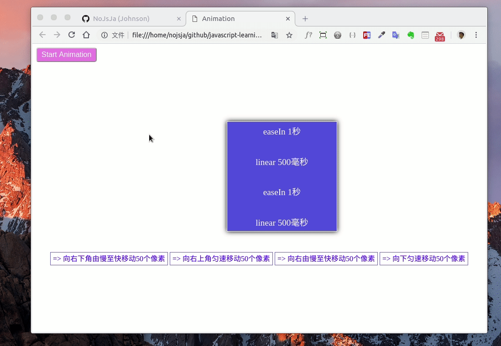

### 简单实现一个Javascript动画处理类

#### 预览图
----------------
> Gif预览图录制时帧数较低，实际浏览器上运行时会更流畅 ~  

[=> 源代码](https://github.com/NoJsJa/javascript-learning/tree/master/js-animation)



#### 代码实现
-------------------

##### 缓动函数
> 涉及一些数学原理，感兴趣的可以单独了解一下。
```js
/**
 * [tween 缓动算法]
 * @param {[Number]}  t [动画已经消耗的时间]
 * @param {[String]}  b [目标开始的位置]
 * @param {[String]}  c [目标开始位置和结束位置的距离]
 * @param {[Number]}  d [动画总持续时间]
 */
var tween = {
  linear: function( time, start, distance, duration ) { return distance*time/duration + start; },
  easeIn: function( time, start, distance, duration ) { return distance * ( time /= duration ) * time + start; },
  strongEaseIn: function(time, start, distance, duration) { return distance * ( time /= duration ) * time * time * time * time + start; },
  strongEaseOut: function(time, start, distance, duration) { return distance * ( ( time = time / duration - 1) * time * time * time * time + 1 ) + start; },
  sinEaseIn: function( time, start, distance, duration ) { return distance * ( time /= duration) * time * time + start; },
  sinEaseOut: function(time,start,distance,duration){ return distance * ( ( time = time / duration - 1) * time * time + 1 ) + start; },
};
```

##### 帧请求函数兼容写法
> requestAnimationFrame是浏览器用于定时循环操作的一个接口，类似于setTimeout，主要用途是按帧对网页进行重绘。设置这个API的目的是为了让各种网页动画效果（DOM动画、Canvas动画、SVG动画、WebGL动画）能够有一个统一的刷新机制，从而节省系统资源，提高系统性能，改善视觉效果。代码中使用这个API，就是告诉浏览器希望执行一个动画，让浏览器在下一个动画帧安排一次网页重绘。
```js
// 动画帧请求函数兼容写法
window.requestAnimationFrame = (function(){
  return  window.requestAnimationFrame       ||
          window.webkitRequestAnimationFrame ||
          window.mozRequestAnimationFrame    ||
          window.oRequestAnimationFrame      ||
          window.msRequestAnimationFrame     ||
          function( callback ){
            return window.setTimeout(callback, 1000 / 60);
          };
})();
```

##### 编写Animation动画类
> 使用了了ES5语法，为了直接兼容浏览器，ES6的语法会更简洁，代码零散度更低。  

* 初始化执行动画的某个dom元素

```js
/* ------------------- 动画控制类 ------------------- */
var Animation = function () {
  this.store = { // status store
  };
};

/* ------------------- 初始化处理元素 ------------------- */
Animation.prototype.setTarget = function (selector) {
  var element = document.querySelector(selector);
  if (element) {
    this.store[selector] = {
      selector: selector,
      element: document.querySelector(selector),
      status: 'pending',
      queue: [
      ],
      timeStart: '',
      positionStart: {
        x: '',
        y: '',
      },
      positionEnd: {
        x: '',
        y: '',
      },
    };
  }
};
```
* 动画调用主要函数`update`的编写

> 运用了设计模式中`享元模式`的思想来分离变化(`Animation.store属性`)和不变的部分。  

```js
/**
 * [start 开始动画]
 * @param  {[String]} selector [选择器]
 * @param  {[type]} func     [缓动动画]
 */
Animation.prototype.start = function (selector, func) {
  var that = this;
  var target = this.store[selector];
  target.status = 'running';

  // 帧调用函数
  that.update({x: 0, y: 0}, selector);
};

/**
 * [update 更新位置]
 * @param  {[type]} selector [description]
 */
Animation.prototype.update =  function (position, selector) {
  var target = this.store[selector],
    that = this,
    timeUsed,
    positionX, positionY;
  //
  if (!target || !target.queue.length) {
    target.status = 'pending';
    return;
  };

  // reset position
  target.element.style.left = position.x + 'px';
  target.element.style.top = position.y + 'px';

  // position
  target.positionStart = {
    x: position.x,
    y: position.y,
  };
  target.positionEnd = {
    x: position.x + target.queue[0].x,
    y: position.y + target.queue[0].y,
  };
  // time
  target.timeStart = new Date().getTime();

  // 递归调用
  var callback = function () {
    timeUsed = new Date().getTime() - target.timeStart;
    // 当前动画完成
    if (timeUsed >= target.queue[0].duration) {
      target.queue.shift();
      // 误差矫正
      that.step(target.element, target.positionEnd.x, target.positionEnd.y);
      target.status = 'running';
      // var position = target.element.getBoundingClientRect();
      var position = {
        x: parseInt(target.element.style.left),
        y: parseInt(target.element.style.top),
      };
      // 下一个动画
      that.update(position, selector);
      return;
    }
    // 计算元素坐标
    positionX = target.queue[0].func(
      timeUsed,
      target.positionStart.x,
      target.positionEnd.x - target.positionStart.x,
      target.queue[0].duration,
    );
    positionY = target.queue[0].func(
      timeUsed,
      target.positionStart.y,
      target.positionEnd.y - target.positionStart.y,
      target.queue[0].duration,
    );
    that.step(target.element, positionX, positionY);

    // 递归帧函数调用
    requestAnimationFrame(callback);
  };

  requestAnimationFrame(callback);
};
```

* 其它一些方法(部分暂未实现)

```js
/**
 * [step dom操作]
 * @param  {[DOM]} element [dom 元素]
 * @param  {[Number]} x        [x坐标]
 * @param  {[Number]} y        [y坐标]
 */
Animation.prototype.step = function (element, x, y) {
  element.style.left = x + 'px';
  element.style.top = y + 'px';
};

/* ------------------- 暂停动画 ------------------- */
Animation.prototype.pause = function (selector) {
  // 尚待实现
};

/* ------------------- 结束动画 ------------------- */
Animation.prototype.stop = function (selector) {
    // 尚待实现
};

/**
 * [push 加入动画队列]
 * @param  {[String]} selector [dom选择器]
 * @param  {[Object]} conf     [相对位置数据]
 */
Animation.prototype.push = function (selector, conf) {
  if (this.store[selector]) {
    this.store[selector].queue.push({
      x: conf.x,
      y: conf.y,
      duration: conf.duration || 1000,
      func: tween[conf.func] || tween['linear'],
    });
  }
};

/* ------------------- 动画出队列 ------------------- */
Animation.prototype.pop = function (selector) {
  if (this.store[selector]) {
    this.store[selector].queue.pop();
  }
};

/* ------------------- 清空动画队列 ------------------- */
Animation.prototype.clear = function (selector) {
  if (this.store[selector]) {
    this.store[selector].queue.length = 1;
  }
};
```
##### Animation调用方式
1. 初始化元素
2. 插入多个动画数据(坐标相对值、动画执行时间、缓动方式)
3. 开始执行动画

```js
var anime = new Animation();
anime.setTarget('#animationTarget');
// 右下角移动50px
anime.push('#animationTarget', { x: 50, y: 50, duration: 1000, func: 'easeIn' });
// 右上角移动50px
anime.push('#animationTarget', { x: -50, y: -50, duration: 500, func: 'linear' });
// 横向移动50px
anime.push('#animationTarget', { x: 50, y: 0, duration: 1000, func: 'easeIn' });
// 纵向移动50px
anime.push('#animationTarget', { x: 0, y: 50, duration: 500, func: 'linear' });
// 开始执行动画
anime.start('#animationTarget');
```

#### 总结
-------------
JavaScript动画的性能比CSS动画低很多，平时实际做页面时应该尽量使用CSS3和Canvas来实现动画效果，但是一名合格的JSER，也应该对Js的动画实现原理熟知，知道怎样优化动画性能，以及运用适合的设计模式优化代码结构。
##### 感谢阅读...
