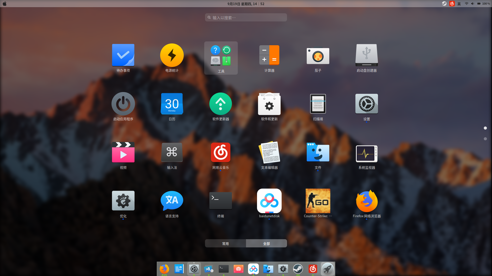
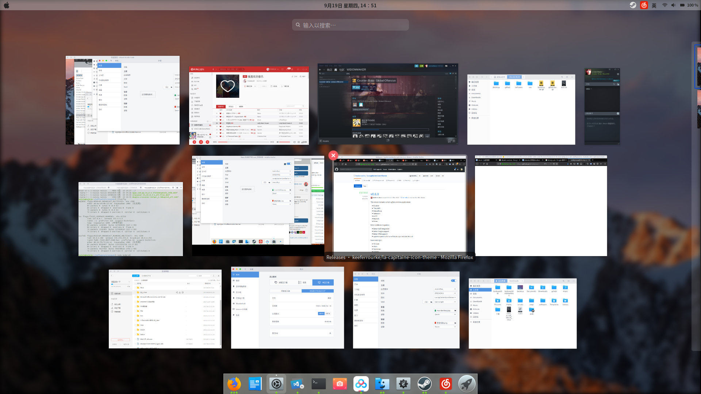
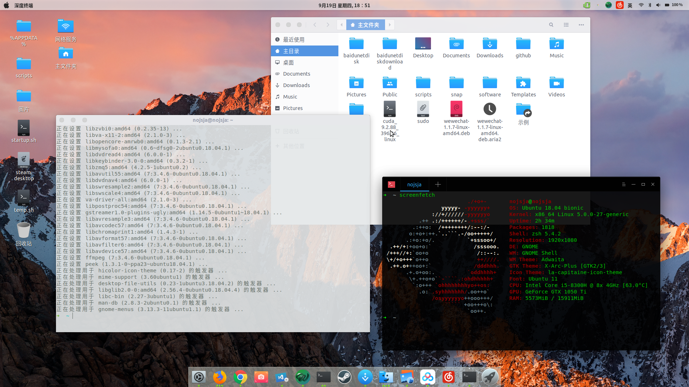

# 

## 联想y7000安装ubuntu18.04显卡驱动解决方案





### Contents

1. 笔记本配置和操作系统版本

2. 安装Ubuntu18.04-3后出现的异常

3. 解决方案

### 笔记本配置

* CPU : Intel® Core™ i5-8300H CPU @ 2.30GHz × 8

* GPU: Nvidia GeForce GTX 1050 Ti/PCIe/SSE2 和 Intel 集显

* 操作系统: Ubuntu 18.04.3 bionic

* 内核版本: Linux 5.0.0-27-generic

* 内存: 16G

* 分区:  GPT磁盘分区 + UEFI引导方案 ，创建`efi`系统分区和`/`根分区

### 安装Ubuntu18.04-3后出现的异常

* 开机卡死或登录卡死

* 登录后不能检测到无线网卡

* 屏幕亮度不可调节

* HDMI外接屏幕不可用

### 解决方案

卡死的原因基本都是显卡驱动的原因，集成显卡勉强能用，但是不支持外接屏幕和亮度调节，屏幕滚动的时候也会
出现画面撕裂的情况，属于不能忍受的情况，当开机卡死的时候我们需要先强制让Ubuntu使用集成显卡，然后才能
进入系统，进入系统之后再禁用系统自带的Nvidia驱动，然后安装新的推荐使用的驱动即可，具体操作流程如下：

#### 1.  强制使用集显

在开机grub界面，按e，编辑启动 选项
修改参数`“quiet splash”`为`“quiet splash nomodeset”`，之后F10，重新启动正常进入Ubuntu系统
进入系统后让这个设置一直有效的方法是：

```sh
$: sudo gedit /etc/default/grub
```

跟开机时一样的参数修改，完成后保存文件并关闭，输入以下指令使其生效：

```sh
$: sudo update-grub
```

#### 2. 重新安装Nvidia显卡驱动

禁用ubuntu默认显卡(集显)驱动

```sh
$: sudo vi /etc/modprobe.d/blacklist.conf
```

在文件最末尾添加如下参数加入黑名单：

```sh
blacklist vga16fb
blacklist nouveau
blacklist rivafb
blacklist rivatv
blacklist nvidiafb
```

卸载干净所有安装过的nvidia驱动：

```sh
$: sudo apt-get remove  --purge nvidia-*
```

查看驱动状态，无输出则说明已经被屏蔽掉

```sh
$: lsmod | grep nouveau
```

添加驱动源：

```sh
$: sudo add-apt-repository ppa:graphics-drivers/ppa
$: sudo apt-get update
```

查看合适驱动版本：

```sh
ubuntu-drivers devices
```

这里推荐直接使用`nvidia-driver-390`或`nvidia-driver-430`驱动

```sh
$: sudo apt-get install nvidia-driver-430 nvidia-settings nvidia-prime
```

重启

```sh
$: sudo update-initramfs -u
$: sudo reboot
```

重启时，在开机grub界面，按e，编辑启动 选项
修改参数`“quiet splash nomodeset”`为`“quiet splash acpi_osi=linux”`，之后F10，重新启动正常进入Ubuntu系统

开机后查看驱动安装状态：

```sh
$: sudo nvidia-smi
```

编辑grab文件执行上一步相同的参数修改，最后更新：

```sh
$: sudo gedit /etc/default/grub
$: sudo update-grub
```

#### 3. 解决无线网络不能使用的问题

原因： 联想自家的驱动和Ubuntu的驱动产生了冲突，禁用联想自带的驱动即可

将联想驱动加入黑名单:

```sh
$: sudo gedit /etc/modprobe.d/blacklist.conf
```

在文件中添加：

```sh
blacklist ideapad_laptop
```

即时生效：

```sh
$: sudo modprobe -r ideapad_laptop
```

_关于Ubuntu主题美化和其它问题解决请移步：[Ubuntu 18.04 踩坑记录](https://www.jianshu.com/p/23b0d3015db8)_